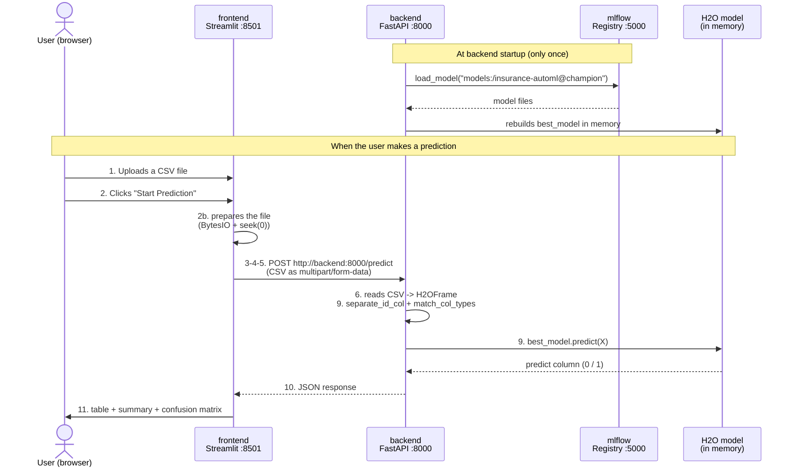
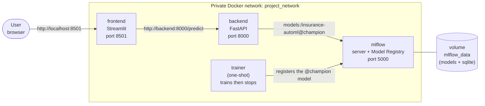
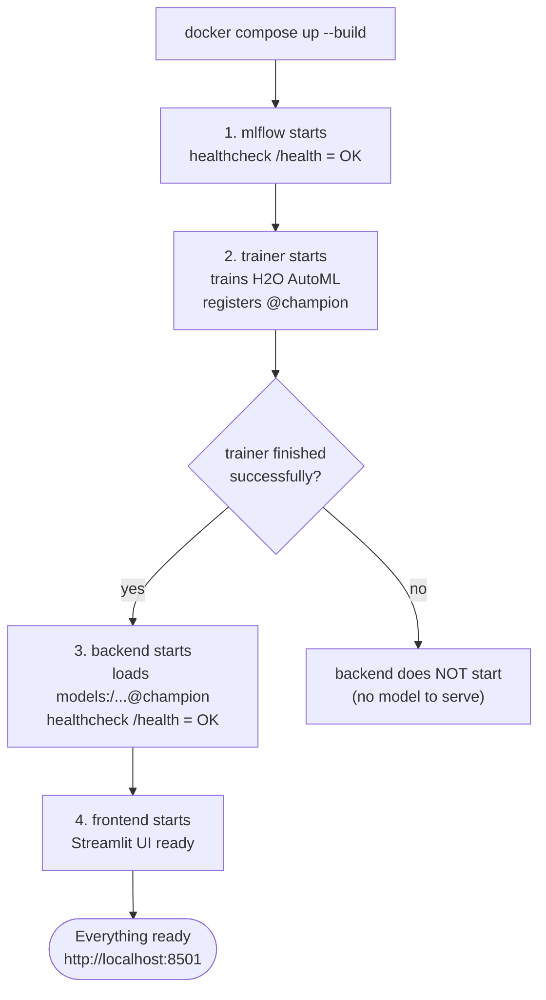
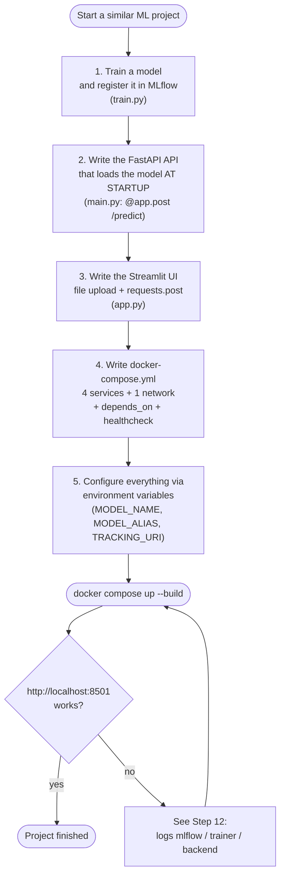

# The Complete Prediction Workflow, Explained Step by Step

> Teaching document for absolute beginners.
> Goal: understand **exactly** what happens, from the moment the user uploads a CSV file in the
> Streamlit interface until the results are displayed.
> For each step, we point to **the folder**, **the file**, **the exact line numbers**, and **the code**,
> so that you can reproduce the same architecture on another project.

---

## 0. The big picture: 4 Docker containers talking to each other

This project is not a single program: it is **4 small programs** (called *services* or
*containers*) that run at the same time and communicate over the network. Docker Compose is
what starts them all together.

| Container | Role | Port | File that defines it |
|---|---|---|---|
| `mlflow` | Server that **stores and serves** the trained models (the models' "safe") | 5000 | `docker-compose.yml` (lines 14–35) |
| `trainer` | **Trains** the model once, then stops | — | `docker-compose.yml` (lines 38–56) |
| `backend` | **FastAPI** API: receives a CSV, runs the model, returns the result | 8000 | `docker-compose.yml` (lines 59–81) |
| `frontend` | **Streamlit** interface: the web page where the user uploads the CSV | 8501 | `docker-compose.yml` (lines 84–95) |

Flow diagram (this document follows this order):

```text
USER (browser)
      |  (1) uploads a CSV, (2) clicks "Start Prediction"
      v
[ frontend ]  Streamlit  (container, port 8501)
      |  (3-4-5) HTTP POST request  ->  http://backend:8000/predict
      v
[ backend ]   FastAPI   (container, port 8000)
      |  (7-8) loads the model from MLflow:  models:/insurance-automl@champion
      v
[ mlflow ]    Server + Model Registry (container, port 5000)
      ^
      |  (9) the H2O model predicts 0/1 for each row
      |
[ backend ]  returns a JSON  ->  (10)
      v
[ frontend ]  (11) shows table, summary, confusion matrix
```

> Key idea for beginners: **each container is a separate machine**. To talk to each other, they
> use **network addresses** (URLs), not file paths.

### Sequence diagram (visual view)

The same scenario, as a sequence diagram (who talks to whom, and in what order):



> How to read this diagram: each **vertical column** is an actor or a container. Each **arrow** is
> a message. `-->>` (dashed) = a **response**. The numbers map to the detailed steps below.

> **How do you SEE these diagrams?** They are "mermaid" blocks. In Cursor / VS Code, open the
> **Markdown preview** (`Ctrl+Shift+V`): the code turns into a drawing. On GitHub it's automatic.
> In raw text you only see the code — that's normal.

### Architecture diagram (containers, network, ports)

Who runs where, and how they are connected:



> Takeaway: the user enters through `localhost` (published ports). **Inside** the network,
> containers call each other by their **service name** (`backend`, `mlflow`). The **volume**
> `mlflow_data` keeps the models even after a restart.

### Startup (boot) order diagram

`docker compose up` does not start everything at once: it follows an order (via `depends_on`
+ `healthcheck`):



> This is why, if training fails, the backend won't start: it would have no model to serve. The
> order is **guaranteed**, not left to chance.

### "Build YOUR project" diagram (action plan)

The 5 main steps, in order, to redo the same thing with another model:



---

## Step 1 — The user uploads a CSV file in Streamlit

**Where?** Folder `frontend/`, file `frontend/app.py`, **line 67**.

```python
test_csv = st.file_uploader('Upload test dataset (CSV)', type=['csv'], accept_multiple_files=False)
```

**What happens:**
- `st.file_uploader(...)` is a Streamlit component that shows a "Browse files" button.
- `type=['csv']` prevents the user from uploading anything other than a `.csv`.
- As long as nothing is uploaded, the variable `test_csv` is `None` (empty). As soon as a file
  is uploaded, `test_csv` holds the file in memory.

**Right after**, line 84, the code only runs **if** a file is present:

```python
if test_csv:
    test_df = pd.read_csv(test_csv)          # line 85: read the CSV into a pandas table
    st.subheader('Sample of Uploaded Dataset')
    st.write(test_df.head())                  # line 87: show the first 5 rows
```

- `pd.read_csv(...)` (line 85) turns the file into a **DataFrame** (an in-memory table, like an
  Excel sheet).
- `test_df.head()` (line 87) shows a preview to reassure the user ("my file was read correctly").

**Automatic label detection** (lines 88–92):

```python
has_labels = TARGET_COL in test_df.columns    # line 88; TARGET_COL = 'Response' (defined line 24)
```

- If the CSV contains the `Response` column (the "correct answer"), `has_labels` becomes `True`
  and the app will be able to **evaluate** the model (confusion matrix). Otherwise, it only makes
  predictions. This is what distinguishes `sample_test.csv` from `sample_test_labeled.csv`.

---

## Step 2 — Streamlit prepares the file before sending it

**Where?** `frontend/app.py`, **lines 95–99**.

```python
test_bytes_obj = io.BytesIO()                 # line 95: a "virtual file" in memory
test_df.to_csv(test_bytes_obj, index=False)   # line 96: rewrite the table into it, as CSV
test_bytes_obj.seek(0)                         # line 97: move the cursor back to the start (VERY important)

files = {"file": ('test_dataset.csv', test_bytes_obj, "multipart/form-data")}   # line 99
```

**Why this step (in plain terms):**
- The backend does not expect a "pandas DataFrame": it expects a **real file** sent over HTTP.
- `io.BytesIO()` creates a file **in RAM** (not on disk). We write the CSV into it.
- `seek(0)` (line 97): after writing, the "read cursor" is at the end of the file. If we sent it
  as-is, the backend would read **0 bytes** ("empty file" error). So we move it back to the start.
- `files = {...}` (line 99): this is the format the `requests` library expects to send a file.
  The `"multipart/form-data"` is the **standard encoding type** to upload a file over HTTP (the
  same as classic web forms).

---

## Step 3 — The user clicks "Start Prediction"

**Where?** `frontend/app.py`, **lines 101–108**.

```python
if st.button('Start Prediction'):             # line 101
    if len(test_df) == 0:                      # line 102: guard against an empty table
        st.warning("Please upload a non-empty test dataset!")
    else:
        try:
            with st.spinner('Prediction in progress. Please wait...'):   # line 106: waiting animation
                response = requests.post(ENDPOINT, files=files, timeout=8000)   # line 107: THE SEND
            response.raise_for_status()         # line 108: raise an error if the backend replied KO
```

**What happens:**
- `st.button(...)` returns `True` **only at the moment of the click**. So the whole block below
  runs only on click.
- Line 102: a small guard (we don't send an empty file).
- Line 106: `st.spinner` shows "Prediction in progress..." during the wait.
- **Line 107: this is THE moment the frontend calls the backend** (see Step 4).
- `timeout=8000`: we wait up to 8000 seconds (the first load of the H2O model can be slow).

---

## Step 4 — How the request travels from the frontend container to the backend container

**Where?** `frontend/app.py`, **line 107** (the call) and **line 22** (the address).

```python
ENDPOINT = os.getenv('BACKEND_URL', 'http://backend:8000/predict')   # line 22
...
response = requests.post(ENDPOINT, files=files, timeout=8000)        # line 107
```

**Let's break down `requests.post(ENDPOINT, files=files)`:**
- `requests` is the Python library for making **HTTP calls** (like a browser, but in code).
- `.post(...)` sends a **POST** request (= "I'm sending you some data").
- `ENDPOINT` is the backend address: `http://backend:8000/predict`.
- `files=files` attaches the CSV file prepared in Step 2.

**Where does `http://backend:8000/predict` come from?** It is set in `docker-compose.yml`,
service `frontend`, **line 88**:

```yaml
    environment:
      BACKEND_URL: http://backend:8000/predict     # docker-compose.yml, line 88
```

- This value is injected into the container as an **environment variable**.
- On the Python side, `os.getenv('BACKEND_URL', '...')` (line 22) reads this variable. The second
  argument is a **default** value used if the variable does not exist.

---

## Step 5 — Why the internal URL `http://backend:8000/predict`?

This is **the single most important point to understand** for beginners.

- `backend` is **not** an Internet domain name. It is the **service name** declared in
  `docker-compose.yml` (line 59: `backend:`).
- Docker Compose creates a **private network** shared between the containers. See
  `docker-compose.yml`, **lines 100–101**:

```yaml
networks:
  project_network:        # docker-compose.yml, lines 100-101
```

  Each service joins this network (e.g. frontend lines 94–95, backend lines 80–81).
- On this network, **the service name becomes a hostname (internal DNS)**. So `backend` is
  automatically resolved to the IP address of the backend container. Docker handles this.
- `:8000` is the **internal port** FastAPI listens on (see the backend command,
  `docker-compose.yml` line 62: `--port 8000`).
- `/predict` is the API **route** that performs predictions (defined on the backend side, see Step 6).

**Crucial difference `localhost` vs `backend`:**
- In **your browser** (on your machine), you open `http://localhost:8501` and `http://localhost:8000`.
  This works thanks to the published `ports:` (e.g. `"8000:8000"`, line 68) which expose the
  container to your machine.
- But **from inside the frontend container**, `localhost` would mean the frontend itself, not the
  backend! To reach another container, you use **its service name**: `backend`.
- That's why the code uses `http://backend:8000/...` and **not** `http://localhost:8000/...`.

---

## Step 6 — What the FastAPI backend receives

**Where?** Folder `backend/`, file `backend/main.py`, **lines 38–43**.

```python
@app.post("/predict")                          # line 38: declares the POST /predict route
async def predict(file: bytes = File(...)):    # line 39: receives the file (raw bytes)
    print('[+] Initiate Prediction')
    file_obj = io.BytesIO(file)                 # line 41: put the bytes back into a "memory file"
    test_df = pd.read_csv(file_obj)             # line 42: re-read the CSV into a pandas DataFrame
    test_h2o = h2o.H2OFrame(test_df)            # line 43: convert to an "H2OFrame" (format H2O understands)
```

**What happens:**
- `@app.post("/predict")` (line 38): this **decorator** tells FastAPI "when a POST request arrives
  at the URL `/predict`, run the function just below". This is exactly the URL the frontend called
  (`http://backend:8000/predict`).
- `file: bytes = File(...)` (line 39): FastAPI **extracts the file** sent as multipart and gives it
  as **bytes**. The `File(...)` indicates it comes from an upload.
- Line 41: we wrap those bytes in `io.BytesIO` so we can read them like a file.
- Line 42: pandas re-reads the CSV → DataFrame.
- Line 43: we convert to an `H2OFrame`, the table format **specific to the H2O library** (the model
  can only work with that).

> Link between the steps: the **same file** leaves the frontend (Step 2) and arrives here (Step 6),
> carried by HTTP. Both sides use CSV → it's the "common language".

---

## Step 7 — How the backend loads / uses the registered MLflow model

**Where?** `backend/main.py`, **lines 26–35** (at container startup, only once).

```python
h2o.init()                                      # line 27: start the H2O engine
if TRACKING_URI:                                # line 28
    mlflow.set_tracking_uri(TRACKING_URI)       # line 29: tell MLflow where the server is

model_uri = f"models:/{MODEL_NAME}@{MODEL_ALIAS}"   # line 32: e.g. "models:/insurance-automl@champion"
print(f"Loading model from registry: {model_uri}")
best_model = mlflow.h2o.load_model(model_uri)   # line 34: DOWNLOADS and LOADS the model
print("Model loaded successfully")
```

**What happens (very important):**
- These lines are **NOT inside the `predict` function**: they are at module level, so they run
  **once, at startup** of the backend container. The model then stays in memory, ready for all
  requests (fast).
- Line 27: `h2o.init()` starts the H2O compute engine inside the container.
- Line 29: we configure the MLflow server address (see Step 8).
- Line 32: we build a special **model address**: `models:/<name>@<alias>`. This is not a file, it's
  a **reference in MLflow's Model Registry**.
- Line 34: `mlflow.h2o.load_model(...)` asks the MLflow server "give me the model with this alias",
  downloads its files, and rebuilds it in memory as `best_model`.

**And the prediction uses this already-loaded model**, `backend/main.py` **line 52**:

```python
preds = best_model.predict(X_h2o)              # line 52: the model predicts on the received data
```

---

## Step 8 — The role of `MODEL_NAME`, `MODEL_ALIAS`, and `MLFLOW_TRACKING_URI`

**Where are they read?** `backend/main.py`, **lines 20–22**:

```python
MODEL_NAME = os.getenv("MODEL_NAME", "insurance-automl")   # line 20
MODEL_ALIAS = os.getenv("MODEL_ALIAS", "champion")         # line 21
TRACKING_URI = os.getenv("MLFLOW_TRACKING_URI")            # line 22
```

**Where are they set?** `docker-compose.yml`, service `backend`, **lines 63–66**:

```yaml
    environment:
      MLFLOW_TRACKING_URI: http://mlflow:5000     # line 64
      MODEL_NAME: insurance-automl                # line 65
      MODEL_ALIAS: champion                       # line 66
```

**What each one is for (simple analogy):**

| Variable | Role | Analogy |
|---|---|---|
| `MLFLOW_TRACKING_URI` | **Address of the MLflow server** (`http://mlflow:5000`). Without it, the backend doesn't know where to fetch models. | The **library's address**. |
| `MODEL_NAME` | **Name** of the registered model (`insurance-automl`). | The **book's title**. |
| `MODEL_ALIAS` | **Label** pointing to a specific version (`champion`). | The **bookmark** "edition to use in production". |

- Together, they form the URI `models:/insurance-automl@champion` (Step 7, line 32).
- The benefit of the **alias** `champion`: you can train a v2, v3... and move the `champion` alias
  to the best version, **without changing the backend code**. The backend always asks for
  `@champion` and automatically gets the right version.
- `http://mlflow:5000`: again an **internal Docker URL** (service name `mlflow`, port 5000), exactly
  the same principle as in Step 5.

> Where does this `champion` model come from? From the `trainer` container. In `backend/train.py`,
> **lines 126–128**:
> ```python
> registered = mlflow.register_model(model_uri=f"runs:/{run.info.run_id}/model", name=model_name)  # 126
> client.set_registered_model_alias(name=model_name, alias=model_alias, version=registered.version) # 127
> ```
> That is where the model gets its name (`insurance-automl`) and its alias (`champion`).

---

## Step 9 — How the model makes predictions on the CSV data

**Where?** `backend/main.py`, **lines 45–60**, which rely on `backend/utils/data_processing.py`.

```python
id_name, X_id, X_h2o = separate_id_col(test_h2o)   # line 46: set aside a possible ID column
X_h2o = match_col_types(X_h2o)                      # line 49: align the column types
preds = best_model.predict(X_h2o)                   # line 52: THE prediction (0 or 1 per row)
```

**Why these 2 cleanup steps before predicting:**

1. **`separate_id_col`** (`backend/utils/data_processing.py`, **lines 4–28**): if the CSV has an
   `ID`/`Id`/`id` column, we set it aside. A customer ID must **not** be used to predict; we keep
   it to re-attach the result to each customer.

2. **`match_col_types`** (`backend/utils/data_processing.py`, **lines 31–60**): the model was
   trained with **precise column types** (number, category...). If the test CSV has different
   types, the prediction fails or becomes wrong. This function re-reads the reference types file,
   **line 41**:

   ```python
   with open('data/processed/train_col_types.json') as f:   # data_processing.py, line 41
       train_col_types = json.load(f)
   ```

   then converts each test column so it **matches exactly** the training set.

   > This `train_col_types.json` file is produced during training, in `backend/train.py`,
   > **lines 82–83**:
   > ```python
   > with open('data/processed/train_col_types.json', 'w') as fp:   # train.py, line 82
   >     json.dump(main_frame.types, fp)                            # train.py, line 83
   > ```

3. **`best_model.predict(X_h2o)`** (line 52): the model goes through each row of the table and
   returns a `predict` column containing **0** (not interested) or **1** (interested).

**Formatting the result** (lines 55–60):

```python
if id_name is not None:                         # line 55: if there was an ID column
    preds_list = preds.as_data_frame()['predict'].tolist()
    id_list = X_id.as_data_frame()[id_name].tolist()
    preds_final = dict(zip(id_list, preds_list))   # -> { customer_id: prediction }
else:
    preds_final = preds.as_data_frame()['predict'].tolist()   # -> [0, 1, 1, 0, ...]
```

- With ID → a **dictionary** `{id: prediction}`.
- Without ID → a **list** of 0/1 in row order.

---

## Step 10 — The backend returns the prediction results to Streamlit

**Where?** `backend/main.py`, **lines 62–63**.

```python
json_compatible_item_data = jsonable_encoder(preds_final)   # line 62: make the object "serializable"
return JSONResponse(content=json_compatible_item_data)      # line 63: HTTP response in JSON format
```

**What happens:**
- `jsonable_encoder(...)` (line 62) turns Python objects (lists, dictionaries, numpy types) into
  types **convertible to JSON** (the universal text format for exchanging data).
- `JSONResponse(...)` (line 63) returns the HTTP response. FastAPI automatically adds the
  `Content-Type: application/json` header.
- This response travels back over the Docker network and lands in the frontend's `response`
  variable (remember: `frontend/app.py`, line 107).

> Loop closed: the request sent in **Step 4** (frontend line 107) receives its **response** here.

---

## Step 11 — How Streamlit displays the results to the user

**Where?** `frontend/app.py`, starting at **line 109**.

**(a) Read the JSON response** (lines 109–122):

```python
result = response.json()                        # line 109: turn the received JSON into a Python object
...
if isinstance(result, dict):                    # line 112: "with ID" case -> dictionary
    results_df = pd.DataFrame({'Customer ID': list(result.keys()),
                               'Prediction': list(result.values())})
else:                                            # "without ID" case -> list
    results_df = pd.DataFrame({'Customer #': range(1, len(result) + 1),
                               'Prediction': result})

results_df['Prediction'] = results_df['Prediction'].astype(int)             # line 121
results_df['Result'] = results_df['Prediction'].map(lambda v: LABELS.get(v, str(v)))   # line 122
```

- Line 109: `response.json()` rebuilds the list/dictionary sent by the backend.
- Lines 112–119: we build a readable table, whether the response is a list or a dictionary.
- Line 122: we translate `0/1` into text using `LABELS` (defined line 25:
  `{1: 'Interested in vehicle insurance', 0: 'Not interested'}`). The user sees words, not raw numbers.

**(b) Numeric summary** (lines 129–142): number of customers, how many are "interested", a
percentage, and a small `st.bar_chart` (line 142).

**(c) Evaluation + confusion matrix** — ONLY if the CSV contained `Response` (lines 144–178):

```python
if has_labels:                                  # line 145
    y_true = test_df[TARGET_COL].astype(int).tolist()      # true answers
    y_pred = results_df['Prediction'].tolist()             # model predictions
    tp, tn, fp, fn, acc, prec, rec, f1 = compute_metrics(y_true, y_pred)   # line 148
    ...
    cm = pd.DataFrame([[tn, fp], [fn, tp]], ...)           # lines 158-162: the matrix
    st.table(cm)                                            # line 163
```

- `compute_metrics(...)` is a small function defined above (lines 70–81) that computes by hand:
  **true positives (TP)**, **true negatives (TN)**, **false positives (FP)**, **false negatives
  (FN)**, then **accuracy, precision, recall, F1** — with no external dependency.
- The **confusion matrix** (lines 158–163) summarizes at a glance the good and bad predictions.
  The help text (lines 165–178) explains how to read it.

**(d) Detailed table + downloads** (lines 180–205): a per-customer table (prediction, true value,
✓/✗) and two buttons to download the result as CSV (line 194) or raw JSON (line 200).

---

## Step 12 — What could go wrong (and how to diagnose it)

Understanding the failures means understanding the architecture. Here are the most common cases.

### A) The MLflow server is not working
- **Symptom:** the **backend does not start**. At startup, `backend/main.py` line 34
  (`mlflow.h2o.load_model(...)`) tries to load the model; if MLflow (`http://mlflow:5000`) is
  unreachable or if no `@champion` model exists, the backend crashes immediately.
- **Why:** no MLflow → no model → no prediction API.
- **Protections in place:**
  - `docker-compose.yml` lines 69–73: the backend `depends_on` `mlflow` (must be *healthy*) **and**
    `trainer` (must complete successfully). So the backend only starts **after** the model has
    been trained and registered.
  - `docker-compose.yml` lines 28–33: a *healthcheck* verifies MLflow answers on `/health`.
- **How to check:** open `http://localhost:5000` (MLflow UI); look at `docker compose logs mlflow`
  and `docker compose logs trainer`.

### B) The backend is not working (or not ready yet)
- **Symptom for the user:** on clicking "Start Prediction", a red error message "Could not reach
  the prediction backend...". This is handled in `frontend/app.py`, **lines 206–208**:

  ```python
  except requests.exceptions.RequestException as exc:    # line 206
      st.error(f"Could not reach the prediction backend at {ENDPOINT}.")   # line 207
      st.exception(exc)                                   # line 208
  ```
- **Possible causes:** the backend is still loading the model (the first H2O load is slow), it has
  crashed, or port 8000 is not exposed.
- **Protections:** `docker-compose.yml` lines 74–79 (backend *healthcheck*) and lines 91–93 (the
  frontend `depends_on` a *healthy* backend).
- **How to check:** `http://localhost:8000/health` must return `OK` (route defined in
  `backend/main.py`, lines 66–68); otherwise `docker compose logs backend`.

### C) The Docker network is not working / wrong URL
- **Symptom:** errors like "Name or service not known", "Connection refused", timeouts.
- **Typical beginner mistakes:**
  - Using `http://localhost:8000` **inside** the frontend container instead of `http://backend:8000`
    (reminder Step 5: `localhost` = itself, not the other container).
  - A service that is **not** on the `project_network` network (lines 100–101) → the names
    `backend`/`mlflow` are then not resolved.
  - A typo in `BACKEND_URL` (`docker-compose.yml` line 88).
- **How to check:** `docker compose ps` (everything must be *Up*), then test from the inside:
  `docker compose exec frontend python -c "import requests; print(requests.get('http://backend:8000/health').text)"`.

### D) Data-related errors
- **Empty CSV file:** handled by `frontend/app.py` line 102.
- **Wrong column format:** the model expects the *one-hot* (already encoded) format like in
  `backend/data/`. If the types don't match, `match_col_types`
  (`backend/utils/data_processing.py`, lines 31–60) tries to fix them, but missing columns can
  still make the prediction fail.

---

## Recap: who calls whom (file by file)

| # | Step | File | Lines |
|---|---|---|---|
| 1 | CSV upload | `frontend/app.py` | 67, 84–92 |
| 2 | File preparation | `frontend/app.py` | 95–99 |
| 3 | "Start Prediction" click | `frontend/app.py` | 101–108 |
| 4 | HTTP POST send | `frontend/app.py` (+ `docker-compose.yml` 88) | 22, 107 |
| 5 | Internal URL `backend:8000` | `docker-compose.yml` | 59, 80–81, 88, 100–101 |
| 6 | File reception | `backend/main.py` | 38–43 |
| 7 | Loading the MLflow model | `backend/main.py` | 26–35, 52 |
| 8 | `MODEL_NAME`/`ALIAS`/`TRACKING_URI` | `backend/main.py` (+ `docker-compose.yml` 64–66) | 20–22 |
| 9 | Prediction + cleanup | `backend/main.py`, `backend/utils/data_processing.py` | 45–60 ; 4–60 |
| 10 | JSON response | `backend/main.py` | 62–63 |
| 11 | Displaying the results | `frontend/app.py` | 109–205 |
| 12 | Failure handling | `frontend/app.py`, `docker-compose.yml` | 206–208 ; 28–33, 69–79, 91–93 |

---

## To reproduce this pattern on YOUR project

The architecture is reusable. The 5 "building blocks" to copy:

1. **A UI that sends a file**: `requests.post(URL, files={...})` after putting it in `io.BytesIO`
   and calling `seek(0)` (see Steps 2–4).
2. **An API that receives the file**: an `@app.post(...)` route with `file: bytes = File(...)` in
   FastAPI (Step 6).
3. **A model loaded once at startup**, not on every request (Step 7), for speed.
4. **Communication by Docker service name** (`http://<service>:<port>`), never `localhost` between
   containers (Step 5), with a shared `network` and `depends_on` + `healthcheck` for startup order
   (Step 12).
5. **Configuration via environment variables** (`environment:` in Compose, `os.getenv` in Python),
   so you don't hard-code addresses and model names (Step 8).

> Golden rule: **data files travel as CSV/JSON over HTTP**, and **containers find each other by
> their service name**. If you keep these two ideas, you can adapt this project to any other
> Machine Learning model.

---

## Appendix A — Glossary for absolute beginners

Every technical word in this document, explained simply.

| Term | Plain explanation |
|---|---|
| **Container** | A small isolated mini-machine holding an app and everything it needs to run. Here: 4 containers (`mlflow`, `trainer`, `backend`, `frontend`). |
| **Image** | The "frozen template" a container is created from (like a cake mold). Built by the `Dockerfile`. |
| **Docker Compose** | The tool that starts **several** containers together, described in `docker-compose.yml`. |
| **Service** | A container declared in `docker-compose.yml` (e.g. `backend:`). Its **name** acts as a network address. |
| **Port** | A numbered "door" on a machine. E.g. `8000` = FastAPI's door. `"8000:8000"` links your machine's door to the container's door. |
| **Volume** | A storage space that **survives** container restarts. Here `mlflow_data` keeps the models and the SQLite database. |
| **Docker network** | A private network between containers. On it, the **service name** becomes a hostname (internal DNS). |
| **Environment variable** | A setting passed to a program **without changing its code** (e.g. `MODEL_NAME=insurance-automl`). Read in Python with `os.getenv(...)`. |
| **HTTP / POST request** | The language of the web. **POST** = "I'm sending you data" (≠ GET = "give me data"). |
| **multipart/form-data** | The standard format to **upload a file** over HTTP (like web forms). |
| **JSON** | A universal text format to exchange data: lists `[...]` and dictionaries `{key: value}`. |
| **DataFrame (pandas)** | An in-memory table (rows/columns), like an Excel sheet you manipulate in Python. |
| **H2OFrame** | The DataFrame equivalent, but in the format the **H2O** Machine Learning library understands. |
| **MLflow** | A tool that **tracks training runs** and **stores models** (Model Registry). |
| **Model Registry** | The "catalog" of models in MLflow: each model has a **name** and **versions**. |
| **Alias** | A movable label (e.g. `champion`) pointing to **one specific version** of the model. |
| **`models:/name@alias`** | The special address of a model in the registry (e.g. `models:/insurance-automl@champion`). |
| **healthcheck** | An automatic test Docker repeats to know if a container is "healthy" (ready to serve). |
| **depends_on** | An ordering rule: "only start this service **after** that other one is ready". |
| **FastAPI** | A Python library to quickly build **web APIs** (the `backend`). |
| **Streamlit** | A Python library to build **web interfaces** without HTML/JS (the `frontend`). |
| **AutoML** | "Automatic Machine Learning": the tool tries several models and keeps the best one, here via **H2O AutoML**. |

---

## Appendix B — Hands-on tutorial step by step (the real commands)

Run these in a terminal, **at the project root** (the folder containing `docker-compose.yml`).

### B.1 — Start the whole project

```bash
docker compose up --build
```

- `--build` (re)builds the images from the `Dockerfile`s. Keep it the first time or after a code change.
- **What you see scrolling by** (in this order — it's normal):
  1. `mlflow` starts (server logs on port 5000);
  2. `trainer` trains (H2O AutoML logs, a model "leaderboard") then **stops** with `exited (0)` —
     **0 = success**, this is NOT an error;
  3. `backend` prints `Loading model from registry...` then `Model loaded successfully`;
  4. `frontend` prints a Streamlit URL.

### B.2 — Open the 3 interfaces in the browser

| Interface | URL | What it's for |
|---|---|---|
| **Streamlit (UI)** | http://localhost:8501 | Upload a CSV and run a prediction |
| **FastAPI (docs)** | http://localhost:8000/docs | Test the API by hand (interactive page) |
| **MLflow (UI)** | http://localhost:5000 | See the training runs and the registered models |

### B.3 — Make a first prediction (without knowing the answer)

1. Open http://localhost:8501
2. Click **Browse files** and choose `backend/data/sample_test.csv`
3. Click **Start Prediction**
4. You get: a summary (how many "interested" customers), a chart, a detailed table.

### B.4 — Make a prediction WITH evaluation (confusion matrix)

1. Same thing, but choose `backend/data/sample_test_labeled.csv` (this file contains the `Response`
   column, i.e. the true answer).
2. In addition to predictions, the app shows **accuracy, precision, recall, F1** and a **confusion
   matrix** (see Step 11).

### B.5 — Stop the project

```bash
docker compose down            # stops and removes the containers (keeps the volume/models)
docker compose down -v         # same BUT also removes the volume (start from scratch)
```

### B.6 — Useful commands to observe / debug

```bash
docker compose ps              # list containers and their state (Up / healthy / exited)
docker compose logs backend    # view logs of one specific service
docker compose logs -f backend # same, live (follow) ; Ctrl+C to quit
docker compose logs trainer    # check that training finished correctly
```

---

## Appendix C — FAQ: concrete error messages and fixes

The errors beginners **actually** hit, with the cause and the fix.

### "port is already allocated" / "Bind for 0.0.0.0:8501 failed"
- **Cause:** another program (or an old container) already uses port 8501/8000/5000.
- **Fix:** `docker compose down` to clean up; or change the published port in `docker-compose.yml`
  (e.g. `"8502:8501"`) then open `http://localhost:8502`.

### The `trainer` shows `exited (0)` — is that an error?
- **No.** `0` = **success**. The `trainer` is a "one-shot" service: it trains, registers the model,
  then stops on purpose. A code **other than 0** (e.g. `exited (1)`) would be a real error → check
  `docker compose logs trainer`.

### "Could not reach the prediction backend" (in Streamlit)
- **Cause:** the backend is not (yet) ready, or the URL is wrong.
- **Fixes:**
  - Wait for the backend to be *healthy*: `docker compose ps`.
  - Test `http://localhost:8000/health` → should show `OK`.
  - Check `BACKEND_URL` in `docker-compose.yml` (must be `http://backend:8000/predict`).

### "RegisteredModelAlias ... not found" / the backend crashes at startup
- **Cause:** the `@champion` model does not exist yet in MLflow (training did not succeed).
- **Fixes:** check `docker compose logs trainer`. If needed, restart cleanly:
  `docker compose down -v` then `docker compose up --build` (the `-v` starts from an empty volume).

### `pip install` fails during `docker compose build`
- **Common cause:** a `requirements*.txt` file with wrong encoding (e.g. UTF-16) or a non-existent version.
- **Fix:** make sure the file is **UTF-8** and the versions exist.

### "EmptyDataError" / the CSV looks empty on the backend side
- **Cause:** `seek(0)` was forgotten after writing into `io.BytesIO` (the cursor stayed at the end).
- **Fix:** see Step 2, line 97 — `test_bytes_obj.seek(0)` is mandatory before sending.

### The prediction fails with a column/type error
- **Cause:** the CSV is not in the expected format (one-hot / same columns as training).
- **Fix:** use a file in the same format as `backend/data/`; `match_col_types` (Step 9) fixes the
  **types** but not **missing columns**.

### The Mermaid diagrams don't show
- **Cause:** you are looking at **raw text**.
- **Fix:** open the **Markdown preview** (`Ctrl+Shift+V`) in Cursor/VS Code, or view the file
  **on GitHub** (automatic rendering).

---

## Appendix D — Checklist to adapt this project to YOUR model

Tick each box when done. (Follows the order of the "build YOUR project" diagram.)

**1. Data**
- [ ] My training data is in a clear folder (e.g. `data/processed/train.csv`).
- [ ] I save the **column format** after training (like `train_col_types.json`, `train.py` lines
      82–83) so I can align the test data later.

**2. Training + registration (`train.py`)**
- [ ] I train a model (AutoML or other).
- [ ] I register it in MLflow with a **name** (`register_model`, line 126).
- [ ] I set a `champion` **alias** (`set_registered_model_alias`, line 127).

**3. Inference API (`main.py`)**
- [ ] I load the model **once at startup** via `models:/<name>@<alias>` (lines 32–34).
- [ ] I expose a `@app.post("/predict")` route receiving `file: bytes = File(...)` (lines 38–39).
- [ ] I add a `GET /health` route (lines 66–68) for the healthcheck.

**4. Interface (`app.py`)**
- [ ] An `st.file_uploader(...)` to upload the file (line 67).
- [ ] Preparation `io.BytesIO` + `seek(0)` + the `files` dict (lines 95–99).
- [ ] `requests.post(ENDPOINT, files=files)` where `ENDPOINT` comes from `os.getenv('BACKEND_URL')`
      (lines 22 and 107).
- [ ] Readable display of the results (Step 11).

**5. Orchestration (`docker-compose.yml`)**
- [ ] 4 services: `mlflow`, `trainer`, `backend`, `frontend`.
- [ ] **1 shared network** (`project_network`) so service names resolve (lines 100–101).
- [ ] `depends_on` + `healthcheck` for the startup order (mlflow → trainer → backend → frontend).
- [ ] **1 volume** (`mlflow_data`) to keep the models.
- [ ] All the "changing" values passed as **environment variables** (`MODEL_NAME`, `MODEL_ALIAS`,
      `MLFLOW_TRACKING_URI`, `BACKEND_URL`).

**6. Launch**
- [ ] `docker compose up --build`
- [ ] The 3 UIs respond: 8501 (Streamlit), 8000/docs (FastAPI), 5000 (MLflow).
- [ ] An end-to-end prediction works with a sample file.

> If all boxes are ticked, you have **reproduced the complete architecture** on your own Machine
> Learning project.

