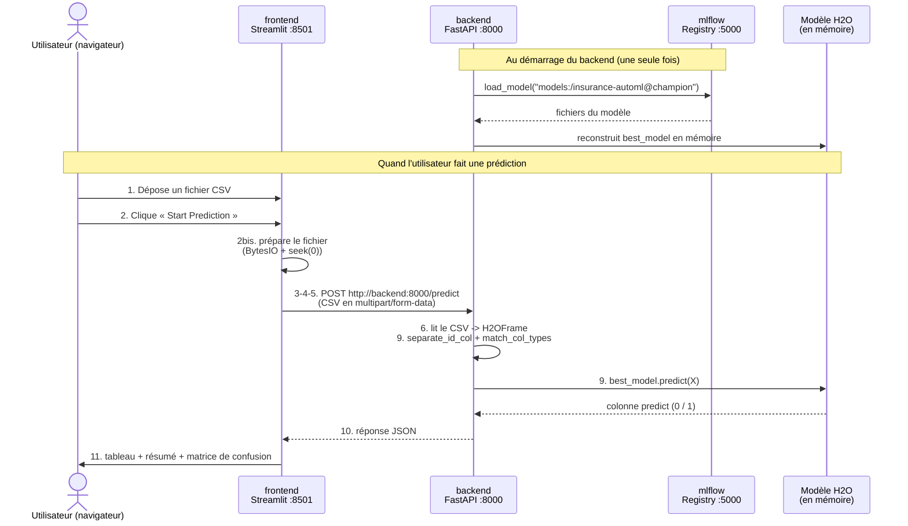

# Le parcours complet d'une prédiction, expliqué pas à pas

> Document pédagogique pour grands débutants.
> Objectif : comprendre **exactement** ce qui se passe, depuis le moment où l'utilisateur
> dépose un fichier CSV dans l'interface Streamlit jusqu'à l'affichage des résultats.
> Pour chaque étape, on indique **le dossier**, **le fichier**, **les lignes exactes** et **le code**,
> afin que vous puissiez reproduire la même architecture sur un autre projet.

---

## 0. La grande image : 4 conteneurs Docker qui se parlent

Ce projet n'est pas un seul programme : c'est **4 petits programmes** (appelés *services* ou
*conteneurs*) qui tournent en même temps et communiquent par le réseau. C'est Docker Compose
qui les démarre tous ensemble.

| Conteneur | Rôle | Port | Fichier qui le définit |
|---|---|---|---|
| `mlflow` | Serveur qui **stocke et sert les modèles** entraînés (le « coffre-fort » des modèles) | 5000 | `docker-compose.yml` (lignes 14–35) |
| `trainer` | **Entraîne** le modèle une seule fois, puis s'arrête | — | `docker-compose.yml` (lignes 38–56) |
| `backend` | API **FastAPI** : reçoit un CSV, fait prédire le modèle, renvoie le résultat | 8000 | `docker-compose.yml` (lignes 59–81) |
| `frontend` | Interface **Streamlit** : la page web où l'utilisateur dépose son CSV | 8501 | `docker-compose.yml` (lignes 84–95) |

Schéma du flux (ce document suit cet ordre) :

```text
UTILISATEUR (navigateur)
      |  (1) dépose un CSV, (2) clique "Start Prediction"
      v
[ frontend ]  Streamlit  (conteneur, port 8501)
      |  (3-4-5) requête HTTP POST  ->  http://backend:8000/predict
      v
[ backend ]   FastAPI   (conteneur, port 8000)
      |  (7-8) charge le modèle depuis MLflow :  models:/insurance-automl@champion
      v
[ mlflow ]    Serveur + Model Registry (conteneur, port 5000)
      ^
      |  (9) le modèle H2O prédit 0/1 pour chaque ligne
      |
[ backend ]  renvoie un JSON  ->  (10)
      v
[ frontend ]  (11) affiche tableau, résumé, matrice de confusion
```

> Idée clé pour débutants : **chaque conteneur est une machine séparée**. Pour qu'ils se
> parlent, ils utilisent des **adresses réseau** (des URL), pas des chemins de fichiers.

### Diagramme de séquence (vue visuelle)

Le même scénario, sous forme de diagramme de séquence (qui parle à qui, et dans quel ordre) :



> Comment lire ce diagramme : chaque **colonne verticale** est un acteur ou un conteneur.
> Chaque **flèche** est un message. `-->>` (pointillés) = une **réponse**. Les numéros
> renvoient aux étapes détaillées plus bas.

---

## Étape 1 — L'utilisateur dépose un fichier CSV dans Streamlit

**Où ?** Dossier `frontend/`, fichier `frontend/app.py`, **ligne 67**.

```python
test_csv = st.file_uploader('Upload test dataset (CSV)', type=['csv'], accept_multiple_files=False)
```

**Ce qui se passe :**
- `st.file_uploader(...)` est un composant Streamlit qui affiche un bouton « Browse files ».
- `type=['csv']` empêche l'utilisateur de déposer autre chose qu'un `.csv`.
- Tant que rien n'est déposé, la variable `test_csv` vaut `None` (vide). Dès qu'un fichier est
  déposé, `test_csv` contient le fichier en mémoire.

**Juste après**, ligne 84, le code ne s'exécute QUE si un fichier est présent :

```python
if test_csv:
    test_df = pd.read_csv(test_csv)          # ligne 85 : lit le CSV en tableau pandas
    st.subheader('Sample of Uploaded Dataset')
    st.write(test_df.head())                  # ligne 87 : montre les 5 premières lignes
```

- `pd.read_csv(...)` (ligne 85) transforme le fichier en **DataFrame** (un tableau en mémoire,
  comme une feuille Excel).
- `test_df.head()` (ligne 87) affiche un aperçu pour rassurer l'utilisateur (« mon fichier est bien lu »).

**Détection automatique des étiquettes** (lignes 88–92) :

```python
has_labels = TARGET_COL in test_df.columns    # ligne 88 ; TARGET_COL = 'Response' (défini ligne 24)
```

- Si le CSV contient la colonne `Response` (la « bonne réponse »), `has_labels` devient `True`
  et l'application pourra **évaluer** le modèle (matrice de confusion). Sinon, elle fera
  seulement des prédictions. C'est ce qui distingue `sample_test.csv` de `sample_test_labeled.csv`.

---

## Étape 2 — Streamlit prépare le fichier avant de l'envoyer

**Où ?** `frontend/app.py`, **lignes 95–99**.

```python
test_bytes_obj = io.BytesIO()                 # ligne 95 : un "fichier virtuel" en mémoire
test_df.to_csv(test_bytes_obj, index=False)   # ligne 96 : on ré-écrit le tableau dedans, au format CSV
test_bytes_obj.seek(0)                         # ligne 97 : on remet le curseur au début (TRÈS important)

files = {"file": ('test_dataset.csv', test_bytes_obj, "multipart/form-data")}   # ligne 99
```

**Pourquoi cette étape (expliqué simplement) :**
- Le backend n'attend pas un « DataFrame pandas » : il attend un **vrai fichier** envoyé par HTTP.
- `io.BytesIO()` crée un fichier **en mémoire vive** (pas sur le disque). On y écrit le CSV.
- `seek(0)` (ligne 97) : après avoir écrit, le « curseur de lecture » est à la fin du fichier.
  Si on l'envoyait tel quel, le backend lirait **0 octet** (erreur « fichier vide »). On le
  remet donc au début.
- `files = {...}` (ligne 99) : c'est le format qu'attend la librairie `requests` pour envoyer
  un fichier. Le `"multipart/form-data"` est le **type d'encodage standard** pour téléverser
  un fichier par HTTP (le même que les formulaires web classiques).

---

## Étape 3 — L'utilisateur clique sur « Start Prediction »

**Où ?** `frontend/app.py`, **lignes 101–108**.

```python
if st.button('Start Prediction'):             # ligne 101
    if len(test_df) == 0:                      # ligne 102 : garde-fou si tableau vide
        st.warning("Please upload a non-empty test dataset!")
    else:
        try:
            with st.spinner('Prediction in progress. Please wait...'):   # ligne 106 : animation d'attente
                response = requests.post(ENDPOINT, files=files, timeout=8000)   # ligne 107 : L'ENVOI
            response.raise_for_status()         # ligne 108 : lève une erreur si le backend a répondu KO
```

**Ce qui se passe :**
- `st.button(...)` renvoie `True` **uniquement au moment du clic**. Tout le bloc en dessous ne
  s'exécute donc qu'au clic.
- Ligne 102 : petit garde-fou (on n'envoie pas un fichier vide).
- Ligne 106 : `st.spinner` affiche « Prediction in progress... » pendant l'attente.
- **Ligne 107 : c'est LE moment où le frontend appelle le backend** (voir étape 4).
- `timeout=8000` : on attend jusqu'à 8000 secondes (le 1er chargement du modèle H2O peut être lent).

---

## Étape 4 — Comment la requête part du conteneur frontend vers le conteneur backend

**Où ?** `frontend/app.py`, **ligne 107** (l'appel) et **ligne 22** (l'adresse).

```python
ENDPOINT = os.getenv('BACKEND_URL', 'http://backend:8000/predict')   # ligne 22
...
response = requests.post(ENDPOINT, files=files, timeout=8000)        # ligne 107
```

**Décortiquons `requests.post(ENDPOINT, files=files)` :**
- `requests` est la librairie Python pour faire des **appels HTTP** (comme un navigateur, mais en code).
- `.post(...)` envoie une requête de type **POST** (= « je t'envoie des données »).
- `ENDPOINT` est l'adresse du backend : `http://backend:8000/predict`.
- `files=files` joint le fichier CSV préparé à l'étape 2.

**D'où vient l'adresse `http://backend:8000/predict` ?** Elle est fixée dans le `docker-compose.yml`,
service `frontend`, **ligne 88** :

```yaml
    environment:
      BACKEND_URL: http://backend:8000/predict     # docker-compose.yml, ligne 88
```

- Cette valeur est injectée dans le conteneur sous forme de **variable d'environnement**.
- Côté Python, `os.getenv('BACKEND_URL', '...')` (ligne 22) lit cette variable. Le 2e argument
  est une valeur **par défaut** si la variable n'existe pas.

---

## Étape 5 — Pourquoi l'URL interne `http://backend:8000/predict` ?

C'est **le point le plus important à comprendre** pour des débutants.

- `backend` n'est **pas** un nom de domaine Internet. C'est le **nom du service** déclaré dans
  `docker-compose.yml` (ligne 59 : `backend:`).
- Docker Compose crée un **réseau privé** partagé entre les conteneurs. Voir `docker-compose.yml`,
  **lignes 100–101** :

```yaml
networks:
  project_network:        # docker-compose.yml, lignes 100-101
```

  Chaque service rejoint ce réseau (ex. frontend lignes 94–95, backend lignes 80–81).
- Sur ce réseau, **le nom du service devient un nom d'hôte (DNS interne)**. Donc `backend`
  est automatiquement résolu vers l'adresse IP du conteneur backend. C'est Docker qui gère ça.
- `:8000` est le **port interne** sur lequel FastAPI écoute (voir la commande du backend,
  `docker-compose.yml` ligne 62 : `--port 8000`).
- `/predict` est la **route** de l'API qui fait les prédictions (définie côté backend, voir étape 6).

**Différence cruciale `localhost` vs `backend` :**
- Dans **ton navigateur** (sur ta machine), tu ouvres `http://localhost:8501` et `http://localhost:8000`.
  Ça marche grâce aux `ports:` publiés (ex. `"8000:8000"`, ligne 68) qui exposent le conteneur vers ta machine.
- Mais **de l'intérieur du conteneur frontend**, `localhost` désignerait le frontend lui-même,
  pas le backend ! Pour joindre un autre conteneur, on utilise **son nom de service** : `backend`.
- C'est pour ça que le code utilise `http://backend:8000/...` et **non** `http://localhost:8000/...`.

---

## Étape 6 — Ce que le backend FastAPI reçoit

**Où ?** Dossier `backend/`, fichier `backend/main.py`, **lignes 38–43**.

```python
@app.post("/predict")                          # ligne 38 : déclare la route POST /predict
async def predict(file: bytes = File(...)):    # ligne 39 : reçoit le fichier (octets bruts)
    print('[+] Initiate Prediction')
    file_obj = io.BytesIO(file)                 # ligne 41 : on remet les octets dans un "fichier mémoire"
    test_df = pd.read_csv(file_obj)             # ligne 42 : on relit le CSV en DataFrame pandas
    test_h2o = h2o.H2OFrame(test_df)            # ligne 43 : on convertit en "H2OFrame" (format compris par H2O)
```

**Ce qui se passe :**
- `@app.post("/predict")` (ligne 38) : ce **décorateur** dit à FastAPI « quand une requête POST
  arrive sur l'URL `/predict`, exécute la fonction juste en dessous ». C'est exactement l'URL
  que le frontend a appelée (`http://backend:8000/predict`).
- `file: bytes = File(...)` (ligne 39) : FastAPI **extrait le fichier** envoyé en multipart et
  le donne sous forme d'**octets** (`bytes`). Le `File(...)` indique que ça vient d'un upload.
- Ligne 41 : on enveloppe ces octets dans `io.BytesIO` pour pouvoir les lire comme un fichier.
- Ligne 42 : pandas relit le CSV → DataFrame.
- Ligne 43 : on convertit en `H2OFrame`, le format de tableau **propre à la librairie H2O**
  (le modèle ne sait travailler qu'avec ça).

> Lien entre les étapes : le **même fichier** part du frontend (étape 2) et arrive ici (étape 6),
> transporté par HTTP. Les deux côtés utilisent CSV → c'est la « langue commune ».

---

## Étape 7 — Comment le backend charge / utilise le modèle MLflow

**Où ?** `backend/main.py`, **lignes 26–35** (au démarrage du conteneur, une seule fois).

```python
h2o.init()                                      # ligne 27 : démarre le moteur H2O
if TRACKING_URI:                                # ligne 28
    mlflow.set_tracking_uri(TRACKING_URI)       # ligne 29 : on dit à MLflow où est le serveur

model_uri = f"models:/{MODEL_NAME}@{MODEL_ALIAS}"   # ligne 32 : ex. "models:/insurance-automl@champion"
print(f"Loading model from registry: {model_uri}")
best_model = mlflow.h2o.load_model(model_uri)   # ligne 34 : TÉLÉCHARGE et CHARGE le modèle
print("Model loaded successfully")
```

**Ce qui se passe (très important) :**
- Ces lignes **ne sont PAS dans la fonction `predict`** : elles sont au niveau du module, donc
  exécutées **une seule fois, au démarrage** du conteneur backend. Le modèle reste ensuite en
  mémoire, prêt pour toutes les requêtes (rapide).
- Ligne 27 : `h2o.init()` démarre le moteur de calcul H2O à l'intérieur du conteneur.
- Ligne 29 : on configure l'adresse du serveur MLflow (voir étape 8).
- Ligne 32 : on construit une **adresse de modèle** spéciale : `models:/<nom>@<alias>`.
  Ce n'est pas un fichier, c'est une **référence dans le Model Registry** de MLflow.
- Ligne 34 : `mlflow.h2o.load_model(...)` va demander au serveur MLflow « donne-moi le modèle
  qui porte cet alias », télécharge ses fichiers et le reconstruit en mémoire dans `best_model`.

**Et la prédiction utilise ce modèle déjà chargé**, `backend/main.py` **ligne 52** :

```python
preds = best_model.predict(X_h2o)              # ligne 52 : le modèle prédit sur les données reçues
```

---

## Étape 8 — Le rôle de `MODEL_NAME`, `MODEL_ALIAS` et `MLFLOW_TRACKING_URI`

**Où sont-ils lus ?** `backend/main.py`, **lignes 20–22** :

```python
MODEL_NAME = os.getenv("MODEL_NAME", "insurance-automl")   # ligne 20
MODEL_ALIAS = os.getenv("MODEL_ALIAS", "champion")         # ligne 21
TRACKING_URI = os.getenv("MLFLOW_TRACKING_URI")            # ligne 22
```

**Où sont-ils fixés ?** `docker-compose.yml`, service `backend`, **lignes 63–66** :

```yaml
    environment:
      MLFLOW_TRACKING_URI: http://mlflow:5000     # ligne 64
      MODEL_NAME: insurance-automl                # ligne 65
      MODEL_ALIAS: champion                       # ligne 66
```

**À quoi sert chacun (analogie simple) :**

| Variable | Rôle | Analogie |
|---|---|---|
| `MLFLOW_TRACKING_URI` | **Adresse du serveur MLflow** (`http://mlflow:5000`). Sans ça, le backend ne sait pas où aller chercher les modèles. | L'adresse de la **bibliothèque**. |
| `MODEL_NAME` | **Nom** du modèle enregistré (`insurance-automl`). | Le **titre du livre**. |
| `MODEL_ALIAS` | **Étiquette** qui pointe vers une version précise (`champion`). | Le **marque-page** « édition à utiliser en production ». |

- Ensemble, ils forment l'URI `models:/insurance-automl@champion` (étape 7, ligne 32).
- L'intérêt de l'**alias** `champion` : on peut entraîner une v2, v3... et déplacer l'alias
  `champion` vers la meilleure version, **sans changer le code du backend**. Le backend demande
  toujours `@champion` et obtient automatiquement la bonne version.
- `http://mlflow:5000` : encore une **URL interne Docker** (nom de service `mlflow`, port 5000),
  exactement le même principe qu'à l'étape 5.

> D'où vient ce modèle `champion` ? Du conteneur `trainer`. Dans `backend/train.py`, **lignes 126–128** :
> ```python
> registered = mlflow.register_model(model_uri=f"runs:/{run.info.run_id}/model", name=model_name)  # 126
> client.set_registered_model_alias(name=model_name, alias=model_alias, version=registered.version) # 127
> ```
> C'est là que le modèle reçoit son nom (`insurance-automl`) et son alias (`champion`).

---

## Étape 9 — Comment le modèle fait les prédictions sur le CSV

**Où ?** `backend/main.py`, **lignes 45–60**, qui s'appuient sur `backend/utils/data_processing.py`.

```python
id_name, X_id, X_h2o = separate_id_col(test_h2o)   # ligne 46 : retire une éventuelle colonne ID
X_h2o = match_col_types(X_h2o)                      # ligne 49 : aligne les types de colonnes
preds = best_model.predict(X_h2o)                   # ligne 52 : LA prédiction (0 ou 1 par ligne)
```

**Pourquoi ces 2 étapes de nettoyage avant de prédire :**

1. **`separate_id_col`** (`backend/utils/data_processing.py`, **lignes 4–28**) : si le CSV a une
   colonne `ID`/`Id`/`id`, on la met de côté. Un identifiant client ne doit **pas** servir à
   prédire ; on le garde pour ré-attacher le résultat à chaque client.

2. **`match_col_types`** (`backend/utils/data_processing.py`, **lignes 31–60**) : le modèle a été
   entraîné avec des **types de colonnes précis** (nombre, catégorie...). Si le CSV de test a des
   types différents, la prédiction échoue ou devient fausse. Cette fonction relit le fichier de
   référence des types, **ligne 41** :

   ```python
   with open('data/processed/train_col_types.json') as f:   # data_processing.py, ligne 41
       train_col_types = json.load(f)
   ```

   puis convertit chaque colonne du test pour qu'elle **corresponde exactement** au jeu d'entraînement.

   > Ce fichier `train_col_types.json` est produit pendant l'entraînement, dans
   > `backend/train.py`, **lignes 82–83** :
   > ```python
   > with open('data/processed/train_col_types.json', 'w') as fp:   # train.py, ligne 82
   >     json.dump(main_frame.types, fp)                            # train.py, ligne 83
   > ```

3. **`best_model.predict(X_h2o)`** (ligne 52) : le modèle parcourt chaque ligne du tableau et
   renvoie une colonne `predict` contenant **0** (pas intéressé) ou **1** (intéressé).

**Mise en forme du résultat** (lignes 55–60) :

```python
if id_name is not None:                         # ligne 55 : s'il y avait une colonne ID
    preds_list = preds.as_data_frame()['predict'].tolist()
    id_list = X_id.as_data_frame()[id_name].tolist()
    preds_final = dict(zip(id_list, preds_list))   # -> { id_client: prediction }
else:
    preds_final = preds.as_data_frame()['predict'].tolist()   # -> [0, 1, 1, 0, ...]
```

- Avec ID → un **dictionnaire** `{identifiant: prédiction}`.
- Sans ID → une **liste** de 0/1 dans l'ordre des lignes.

---

## Étape 10 — Le backend renvoie les résultats à Streamlit

**Où ?** `backend/main.py`, **lignes 62–63**.

```python
json_compatible_item_data = jsonable_encoder(preds_final)   # ligne 62 : rend l'objet "sérialisable"
return JSONResponse(content=json_compatible_item_data)      # ligne 63 : réponse HTTP au format JSON
```

**Ce qui se passe :**
- `jsonable_encoder(...)` (ligne 62) transforme les objets Python (listes, dictionnaires, types
  numpy) en types **convertibles en JSON** (le format texte universel pour échanger des données).
- `JSONResponse(...)` (ligne 63) renvoie la réponse HTTP. FastAPI ajoute automatiquement
  l'en-tête `Content-Type: application/json`.
- Cette réponse repart par le réseau Docker et arrive dans la variable `response` du frontend
  (souviens-toi : `frontend/app.py`, ligne 107).

> Boucle bouclée : la requête partie à l'**étape 4** (frontend ligne 107) reçoit ici sa **réponse**.

---

## Étape 11 — Streamlit affiche les résultats à l'utilisateur

**Où ?** `frontend/app.py`, à partir de la **ligne 109**.

**(a) Lire la réponse JSON** (lignes 109–122) :

```python
result = response.json()                        # ligne 109 : transforme le JSON reçu en objet Python
...
if isinstance(result, dict):                    # ligne 112 : cas "avec ID" -> dictionnaire
    results_df = pd.DataFrame({'Customer ID': list(result.keys()),
                               'Prediction': list(result.values())})
else:                                            # cas "sans ID" -> liste
    results_df = pd.DataFrame({'Customer #': range(1, len(result) + 1),
                               'Prediction': result})

results_df['Prediction'] = results_df['Prediction'].astype(int)             # ligne 121
results_df['Result'] = results_df['Prediction'].map(lambda v: LABELS.get(v, str(v)))   # ligne 122
```

- Ligne 109 : `response.json()` reconstruit la liste/dictionnaire envoyé par le backend.
- Lignes 112–119 : on construit un tableau lisible, que la réponse soit une liste ou un dictionnaire.
- Ligne 122 : on traduit `0/1` en texte grâce à `LABELS` (défini ligne 25 :
  `{1: 'Interested in vehicle insurance', 0: 'Not interested'}`). L'utilisateur voit des mots,
  pas des chiffres bruts.

**(b) Résumé chiffré** (lignes 129–142) : nombre de clients, combien sont « intéressés », un
pourcentage, et un petit graphique `st.bar_chart` (ligne 142).

**(c) Évaluation + matrice de confusion** — UNIQUEMENT si le CSV contenait `Response`
(lignes 144–178) :

```python
if has_labels:                                  # ligne 145
    y_true = test_df[TARGET_COL].astype(int).tolist()      # vraies réponses
    y_pred = results_df['Prediction'].tolist()             # prédictions du modèle
    tp, tn, fp, fn, acc, prec, rec, f1 = compute_metrics(y_true, y_pred)   # ligne 148
    ...
    cm = pd.DataFrame([[tn, fp], [fn, tp]], ...)           # lignes 158-162 : la matrice
    st.table(cm)                                            # ligne 163
```

- `compute_metrics(...)` est une petite fonction définie plus haut (lignes 70–81) qui calcule
  à la main : **vrais positifs (TP)**, **vrais négatifs (TN)**, **faux positifs (FP)**,
  **faux négatifs (FN)**, puis **accuracy, precision, recall, F1** — sans dépendance externe.
- La **matrice de confusion** (lignes 158–163) résume en un coup d'œil les bonnes et mauvaises
  prédictions. Le texte d'aide (lignes 165–178) explique comment la lire.

**(d) Tableau détaillé + téléchargements** (lignes 180–205) : un tableau par client (prédiction,
vraie valeur, ✓/✗) et deux boutons pour télécharger le résultat en CSV (ligne 194) ou en JSON brut (ligne 200).

---

## Étape 12 — Ce qui peut mal tourner (et comment le diagnostiquer)

Comprendre les pannes, c'est comprendre l'architecture. Voici les cas les plus fréquents.

### A) Le serveur MLflow ne fonctionne pas
- **Symptôme :** le **backend ne démarre pas**. Au démarrage, `backend/main.py` ligne 34
  (`mlflow.h2o.load_model(...)`) essaie de charger le modèle ; si MLflow (`http://mlflow:5000`)
  est injoignable ou si aucun modèle `@champion` n'existe, le backend plante immédiatement.
- **Pourquoi :** sans MLflow, pas de modèle → pas d'API de prédiction.
- **Protections en place :**
  - `docker-compose.yml` lignes 69–73 : le backend `depends_on` `mlflow` (doit être *healthy*) **et**
    `trainer` (doit s'être terminé avec succès). Le backend ne démarre donc qu'**après** que le
    modèle a été entraîné et enregistré.
  - `docker-compose.yml` lignes 28–33 : un *healthcheck* vérifie que MLflow répond sur `/health`.
- **Comment vérifier :** ouvrir `http://localhost:5000` (UI MLflow) ; regarder
  `docker compose logs mlflow` et `docker compose logs trainer`.

### B) Le backend ne fonctionne pas (ou pas encore prêt)
- **Symptôme côté utilisateur :** au clic sur « Start Prediction », message d'erreur rouge
  « Could not reach the prediction backend... ». C'est géré dans `frontend/app.py`, **lignes 206–208** :

  ```python
  except requests.exceptions.RequestException as exc:    # ligne 206
      st.error(f"Could not reach the prediction backend at {ENDPOINT}.")   # ligne 207
      st.exception(exc)                                   # ligne 208
  ```
- **Causes possibles :** le backend est encore en train de charger le modèle (le 1er chargement
  H2O est lent), il a planté, ou le port 8000 n'est pas exposé.
- **Protections :** `docker-compose.yml` lignes 74–79 (*healthcheck* du backend) et lignes 91–93
  (le frontend `depends_on` un backend *healthy*).
- **Comment vérifier :** `http://localhost:8000/health` doit renvoyer `OK`
  (route définie dans `backend/main.py`, lignes 66–68) ; sinon `docker compose logs backend`.

### C) Le réseau Docker ne fonctionne pas / mauvaise URL
- **Symptôme :** erreurs « Name or service not known », « Connection refused », timeouts.
- **Causes typiques pour débutants :**
  - Utiliser `http://localhost:8000` **dans** le conteneur frontend au lieu de
    `http://backend:8000` (rappel étape 5 : `localhost` = soi-même, pas l'autre conteneur).
  - Un service qui n'est **pas** sur le réseau `project_network` (lignes 100–101) → les noms
    `backend`/`mlflow` ne sont alors pas résolus.
  - Une faute de frappe dans `BACKEND_URL` (`docker-compose.yml` ligne 88).
- **Comment vérifier :** `docker compose ps` (tout doit être *Up*), puis tester depuis l'intérieur :
  `docker compose exec frontend python -c "import requests; print(requests.get('http://backend:8000/health').text)"`.

### D) Erreurs liées aux données
- **Fichier CSV vide** : géré par `frontend/app.py` ligne 102.
- **Mauvais format de colonnes** : le modèle attend le format *one-hot* (déjà encodé) comme dans
  `backend/data/`. Si les types ne correspondent pas, `match_col_types`
  (`backend/utils/data_processing.py`, lignes 31–60) tente de corriger, mais des colonnes
  manquantes peuvent quand même faire échouer la prédiction.

---

## Récapitulatif : qui appelle qui (fichier par fichier)

| # | Étape | Fichier | Lignes |
|---|---|---|---|
| 1 | Upload du CSV | `frontend/app.py` | 67, 84–92 |
| 2 | Préparation du fichier | `frontend/app.py` | 95–99 |
| 3 | Clic « Start Prediction » | `frontend/app.py` | 101–108 |
| 4 | Envoi HTTP POST | `frontend/app.py` (+ `docker-compose.yml` 88) | 22, 107 |
| 5 | URL interne `backend:8000` | `docker-compose.yml` | 59, 80–81, 88, 100–101 |
| 6 | Réception du fichier | `backend/main.py` | 38–43 |
| 7 | Chargement du modèle MLflow | `backend/main.py` | 26–35, 52 |
| 8 | `MODEL_NAME`/`ALIAS`/`TRACKING_URI` | `backend/main.py` (+ `docker-compose.yml` 64–66) | 20–22 |
| 9 | Prédiction + nettoyage | `backend/main.py`, `backend/utils/data_processing.py` | 45–60 ; 4–60 |
| 10 | Réponse JSON | `backend/main.py` | 62–63 |
| 11 | Affichage des résultats | `frontend/app.py` | 109–205 |
| 12 | Gestion des pannes | `frontend/app.py`, `docker-compose.yml` | 206–208 ; 28–33, 69–79, 91–93 |

---

## Pour reproduire ce schéma sur VOTRE projet

L'architecture est réutilisable. Les 5 « briques » à recopier :

1. **Une UI qui envoie un fichier** : `requests.post(URL, files={...})` après l'avoir mis en
   `io.BytesIO` et fait `seek(0)` (voir étapes 2–4).
2. **Une API qui reçoit le fichier** : route `@app.post(...)` avec `file: bytes = File(...)`
   en FastAPI (étape 6).
3. **Un modèle chargé une fois au démarrage**, pas à chaque requête (étape 7), pour la rapidité.
4. **Communication par nom de service Docker** (`http://<service>:<port>`), jamais `localhost`
   entre conteneurs (étape 5), avec un `network` commun et des `depends_on` + `healthcheck`
   pour l'ordre de démarrage (étape 12).
5. **Configuration par variables d'environnement** (`environment:` dans Compose, `os.getenv` en
   Python), pour ne pas coder « en dur » les adresses et les noms de modèle (étape 8).

> Règle d'or : **les fichiers de données circulent en CSV/JSON par HTTP**, et **les conteneurs
> se trouvent par leur nom de service**. Si vous gardez ces deux idées, vous pouvez adapter ce
> projet à n'importe quel autre modèle de Machine Learning.

