<a id="top"></a>

# Complete Prediction Workflow

## Table of Contents

- [1. Introduction](#1-introduction)
- [2. Global Architecture of the Application](#2-global-architecture-of-the-application)
  - [2.1 High-Level Architecture Diagram](#2-1-high-level-architecture-diagram)
- [3. Role of Each Folder in the Project](#3-role-of-each-folder-in-the-project)
  - [3.1 The `backend/` Folder](#3-1-the-backend-folder)
  - [`backend/main.py`](#backend-main-py)
  - [`backend/train.py`](#backend-train-py)
  - [`backend/utils/`](#backend-utils)
  - [`backend/data/`](#backend-data)
  - [`backend/Dockerfile`](#backend-dockerfile)
  - [3.2 The `frontend/` Folder](#3-2-the-frontend-folder)
  - [`frontend/app.py`](#frontend-app-py)
  - [`frontend/Dockerfile`](#frontend-dockerfile)
  - [3.3 The `demo/` Folder](#3-3-the-demo-folder)
  - [3.4 The `notebooks/` Folder](#3-4-the-notebooks-folder)
  - [3.5 The `docker-compose.yml` File](#3-5-the-docker-compose-yml-file)
  - [3.6 The `README.md` File](#3-6-the-readme-md-file)
  - [3.7 The `INSTRUCTIONS.txt` File](#3-7-the-instructions-txt-file)
  - [3.8 The `start.ps1` File](#3-8-the-start-ps1-file)
- [4. Docker Compose Runtime Architecture](#4-docker-compose-runtime-architecture)
  - [4.1 Docker Compose Architecture Diagram](#4-1-docker-compose-architecture-diagram)
- [5. Startup Order of the Services](#5-startup-order-of-the-services)
  - [5.1 Startup Order Diagram](#5-1-startup-order-diagram)
- [6. Before the User Clicks Start Prediction](#6-before-the-user-clicks-start-prediction)
  - [6.1 MLflow Is Running](#6-1-mlflow-is-running)
  - [6.2 The Trainer Has Already Registered the Model](#6-2-the-trainer-has-already-registered-the-model)
  - [6.3 The Backend Has Already Loaded the Model](#6-3-the-backend-has-already-loaded-the-model)
  - [6.4 The Frontend Is Ready](#6-4-the-frontend-is-ready)
- [7. Complete User Prediction Scenario](#7-complete-user-prediction-scenario)
  - [7.1 Complete Sequence Diagram](#7-1-complete-sequence-diagram)
- [8. Step 1 — The User Uploads a CSV File in Streamlit](#8-step-1-the-user-uploads-a-csv-file-in-streamlit)
  - [8.1 Upload Step Diagram](#8-1-upload-step-diagram)
- [9. Step 2 — Streamlit Reads and Prepares the File](#9-step-2-streamlit-reads-and-prepares-the-file)
  - [9.1 File Preparation Diagram](#9-1-file-preparation-diagram)
- [10. Step 3 — The User Clicks Start Prediction](#10-step-3-the-user-clicks-start-prediction)
  - [10.1 Button Click Diagram](#10-1-button-click-diagram)
- [11. Step 4 — Streamlit Sends the Request to FastAPI](#11-step-4-streamlit-sends-the-request-to-fastapi)
- [12. Step 5 — Why the URL Is `http://backend:8000/predict`](#12-step-5-why-the-url-is-http-backend-8000-predict)
  - [12.1 Why Not `localhost`?](#12-1-why-not-localhost)
  - [12.2 Localhost vs Docker Service Name Diagram](#12-2-localhost-vs-docker-service-name-diagram)
- [13. Step 6 — The FastAPI Backend Receives the CSV File](#13-step-6-the-fastapi-backend-receives-the-csv-file)
  - [13.1 Backend Reception Diagram](#13-1-backend-reception-diagram)
- [14. Step 7 — Backend Data Preparation](#14-step-7-backend-data-preparation)
  - [14.1 Separating an ID Column](#14-1-separating-an-id-column)
  - [14.2 Matching Column Types](#14-2-matching-column-types)
  - [14.3 Data Preparation Diagram](#14-3-data-preparation-diagram)
- [15. Step 8 — How the Backend Uses the MLflow Registered Model](#15-step-8-how-the-backend-uses-the-mlflow-registered-model)
  - [15.1 MLflow Model Loading Diagram](#15-1-mlflow-model-loading-diagram)
- [16. Step 9 — Role of Environment Variables](#16-step-9-role-of-environment-variables)
  - [16.1 `MLFLOW_TRACKING_URI`](#16-1-mlflow-tracking-uri)
  - [16.2 `MODEL_NAME`](#16-2-model-name)
  - [16.3 `MODEL_ALIAS`](#16-3-model-alias)
  - [16.4 `BACKEND_URL`](#16-4-backend-url)
  - [16.5 Environment Variables Diagram](#16-5-environment-variables-diagram)
- [17. Step 10 — The Model Performs Predictions](#17-step-10-the-model-performs-predictions)
  - [17.1 Prediction Diagram](#17-1-prediction-diagram)
- [18. Step 11 — Backend Returns JSON to Streamlit](#18-step-11-backend-returns-json-to-streamlit)
  - [18.1 Response Flow Diagram](#18-1-response-flow-diagram)
- [19. Step 12 — Streamlit Displays the Results](#19-step-12-streamlit-displays-the-results)
  - [19.1 Display Results Diagram](#19-1-display-results-diagram)
- [20. Optional Case — If the CSV Contains True Labels](#20-optional-case-if-the-csv-contains-true-labels)
  - [20.1 Confusion Matrix Explanation](#20-1-confusion-matrix-explanation)
  - [20.2 Confusion Matrix Diagram](#20-2-confusion-matrix-diagram)
- [21. Complete Background Workflow in One Diagram](#21-complete-background-workflow-in-one-diagram)
- [22. What Could Go Wrong?](#22-what-could-go-wrong)
  - [22.1 MLflow Is Not Healthy](#22-1-mlflow-is-not-healthy)
  - [22.2 Trainer Failed](#22-2-trainer-failed)
  - [22.3 Backend Is Not Working](#22-3-backend-is-not-working)
  - [22.4 Frontend Cannot Reach Backend](#22-4-frontend-cannot-reach-backend)
  - [22.5 Docker Network Problem](#22-5-docker-network-problem)
  - [22.6 Invalid CSV File](#22-6-invalid-csv-file)
- [23. Failure Handling Diagram](#23-failure-handling-diagram)
- [24. Detailed End-to-End Explanation in Paragraph Form](#24-detailed-end-to-end-explanation-in-paragraph-form)
- [25. Final Mermaid Summary](#25-final-mermaid-summary)

[Back to top](#top)

---


<a id="1-introduction"></a>
## 1. Introduction

This document explains the complete end-to-end workflow of the AutoML application, starting from the moment the user uploads a CSV file in the Streamlit interface until the prediction results are displayed in the browser.

The objective is to understand not only what the user sees, but also what happens in the background between the Docker containers, the Streamlit frontend, the FastAPI backend, the MLflow Model Registry, and the trained H2O AutoML model.

This application is a complete MLOps pipeline because it includes:

* a frontend interface for user interaction;
* a backend API for prediction;
* a training service for model creation;
* MLflow for model tracking, storage, and registry;
* Docker Compose for orchestration;
* a shared Docker network for service-to-service communication;
* a Docker volume for persistent MLflow storage.

---


<div align="right"><a href="#top">Back to top</a></div>

---

<a id="2-global-architecture-of-the-application"></a>
## 2. Global Architecture of the Application

The project is not a single Python script. It is a multi-service application composed of several containers.

Each container has a clear responsibility:

| Service        | Technology          | Main Role                                            |
| -------------- | ------------------- | ---------------------------------------------------- |
| `mlflow`       | MLflow Server       | Stores experiments, artifacts, and registered models |
| `trainer`      | Python + H2O AutoML | Trains the model and registers it in MLflow          |
| `backend`      | FastAPI             | Receives CSV files and returns predictions           |
| `frontend`     | Streamlit           | Provides the web interface for the user              |
| Docker Compose | Docker              | Starts and connects all services together            |

The user interacts only with the Streamlit interface, but many internal operations happen in the background.

---

<a id="2-1-high-level-architecture-diagram"></a>
### 2.1 High-Level Architecture Diagram

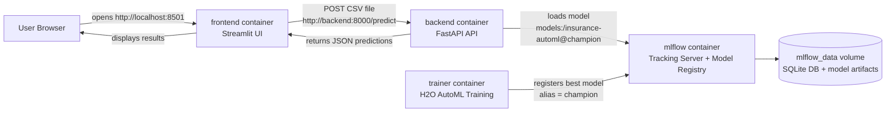

This diagram shows the main communication flow. The user sends the CSV through Streamlit. Streamlit forwards the file to FastAPI. FastAPI uses the model stored in MLflow. The prediction results return to Streamlit and are displayed to the user.

---


<div align="right"><a href="#top">Back to top</a></div>

---

<a id="3-role-of-each-folder-in-the-project"></a>
## 3. Role of Each Folder in the Project

Before explaining the prediction workflow, it is important to understand the project structure.

A typical project structure looks like this:

```text
project-root/
│
├── backend/
├── frontend/
├── demo/
├── notebooks/
├── docker-compose.yml
├── README.md
├── INSTRUCTIONS.txt
├── start.ps1
└── .gitignore
```

Each folder or file has a specific role.

---

<a id="3-1-the-backend-folder"></a>
### 3.1 The `backend/` Folder

The `backend/` folder contains the server-side logic of the application.

It is responsible for:

* starting the FastAPI application;
* loading the trained MLflow model;
* receiving uploaded CSV files;
* converting uploaded data into the correct format;
* applying preprocessing steps;
* running predictions;
* returning predictions as JSON.

The backend is the prediction engine of the application.

Important files usually found in the backend include:

```text
backend/
│
├── main.py
├── train.py
├── utils/
├── data/
├── Dockerfile
└── requirements.txt
```

<a id="backend-main-py"></a>
### `backend/main.py`

This is the most important file for inference.

It usually contains:

* the FastAPI application;
* the `/predict` endpoint;
* the `/health` endpoint;
* the model loading logic;
* the prediction logic.

When the backend container starts, it loads the model from MLflow. When the frontend sends a CSV file, the backend receives it, reads it, converts it, predicts, and returns results.

---

<a id="backend-train-py"></a>
### `backend/train.py`

This file is responsible for training.

It usually performs the following operations:

1. Load the training dataset.
2. Prepare the dataset.
3. Train an H2O AutoML model.
4. Select the best model.
5. Log the model to MLflow.
6. Register the model in the MLflow Model Registry.
7. Assign the alias `champion` to the selected model version.

The important idea is that the model is trained before the user makes predictions.

The user does not train the model when clicking **Start Prediction**. The model already exists in MLflow.

---

<a id="backend-utils"></a>
### `backend/utils/`

The `utils/` folder contains helper functions.

These functions may be used to:

* separate an ID column;
* match test column types with training column types;
* clean input data;
* validate data;
* prepare data for H2O.

This folder keeps the code cleaner. Instead of writing all functions inside `main.py`, reusable logic is placed in separate utility files.

---

<a id="backend-data"></a>
### `backend/data/`

The `data/` folder contains data files used by the backend.

It may contain:

* sample training data;
* sample test data;
* labeled test data;
* processed files;
* column type files such as `train_col_types.json`.

This folder is important because the backend may need reference files to ensure that the prediction CSV has the same structure as the training data.

---

<a id="backend-dockerfile"></a>
### `backend/Dockerfile`

The backend Dockerfile explains how to build the backend image.

It usually installs:

* Python;
* FastAPI;
* Uvicorn;
* MLflow;
* H2O;
* pandas;
* any other backend dependency.

Docker uses this file to create the backend container image.

---

<a id="3-2-the-frontend-folder"></a>
### 3.2 The `frontend/` Folder

The `frontend/` folder contains the Streamlit application.

It is responsible for:

* displaying the web interface;
* allowing the user to upload a CSV file;
* previewing the uploaded dataset;
* providing the **Start Prediction** button;
* sending the file to the backend;
* receiving prediction results;
* displaying tables, metrics, charts, and downloads.

The frontend is the user-facing part of the application.

A typical structure is:

```text
frontend/
│
├── app.py
├── Dockerfile
└── requirements.txt
```

---

<a id="frontend-app-py"></a>
### `frontend/app.py`

This file defines the Streamlit interface.

It usually contains:

* `st.file_uploader(...)` for uploading the CSV file;
* `pd.read_csv(...)` for previewing the dataset;
* a `Start Prediction` button;
* `requests.post(...)` for sending the file to FastAPI;
* code to process the JSON response;
* code to display prediction results.

The frontend does not directly load the model. It does not communicate with MLflow. It only communicates with the backend.

---

<a id="frontend-dockerfile"></a>
### `frontend/Dockerfile`

The frontend Dockerfile builds the Streamlit container.

It installs Streamlit and other dependencies, then starts the Streamlit app.

The frontend is exposed to the user through:

```text
http://localhost:8501
```

---

<a id="3-3-the-demo-folder"></a>
### 3.3 The `demo/` Folder

The `demo/` folder may contain demonstration files.

It can include:

* example CSV files;
* screenshots;
* sample inputs;
* sample outputs;
* files used during classroom demonstrations.

This folder is useful for students because they can test the application with prepared examples.

---

<a id="3-4-the-notebooks-folder"></a>
### 3.4 The `notebooks/` Folder

The `notebooks/` folder is mainly used for experimentation and analysis.

It may contain Jupyter notebooks used to:

* explore the dataset;
* test preprocessing logic;
* test H2O AutoML;
* analyze model results;
* prepare code before moving it into production scripts.

Notebooks are usually not part of the production workflow. They are useful during development and learning.

---

<a id="3-5-the-docker-compose-yml-file"></a>
### 3.5 The `docker-compose.yml` File

The `docker-compose.yml` file defines the full application stack.

It tells Docker Compose:

* which services to start;
* how to build each image;
* which command each service runs;
* which ports are exposed;
* which environment variables are passed;
* which volumes are used;
* which network connects the containers;
* which service must wait for another service.

This file is the orchestration file of the project.

It connects the following services:

```text
mlflow → trainer → backend → frontend
```

---

<a id="3-6-the-readme-md-file"></a>
### 3.6 The `README.md` File

The `README.md` file explains the project to users and developers.

It may include:

* project objective;
* architecture;
* installation steps;
* Docker commands;
* application URLs;
* test instructions;
* troubleshooting.

It is usually the first file a developer reads.

---

<a id="3-7-the-instructions-txt-file"></a>
### 3.7 The `INSTRUCTIONS.txt` File

The `INSTRUCTIONS.txt` file is usually a simplified practical guide.

It may contain:

* commands to run;
* ports to open;
* files to upload;
* expected results;
* troubleshooting notes.

This is useful for students because it provides direct steps.

---

<a id="3-8-the-start-ps1-file"></a>
### 3.8 The `start.ps1` File

The `start.ps1` file is a PowerShell script for Windows.

It may automate commands such as:

```powershell
docker compose up --build
```

or:

```powershell
docker compose down
docker compose up --build
```

It helps students start the project more easily on Windows.

---


<div align="right"><a href="#top">Back to top</a></div>

---

<a id="4-docker-compose-runtime-architecture"></a>
## 4. Docker Compose Runtime Architecture

When the application is started with:

```bash
docker compose up --build
```

Docker Compose builds the images and starts the containers.

The containers are connected to a private Docker network. This network allows them to communicate using service names.

---

<a id="4-1-docker-compose-architecture-diagram"></a>
### 4.1 Docker Compose Architecture Diagram

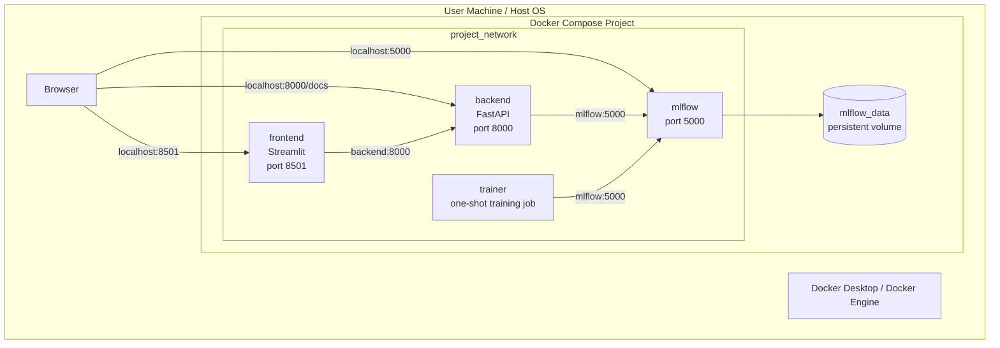

There are two types of communication:

1. User-to-container communication through `localhost`.
2. Container-to-container communication through service names.

---


<div align="right"><a href="#top">Back to top</a></div>

---

<a id="5-startup-order-of-the-services"></a>
## 5. Startup Order of the Services

The startup order is very important.

The backend cannot serve predictions if the model does not exist. The model cannot exist if the trainer has not registered it. The trainer cannot register the model if MLflow is not ready.

Therefore, Docker Compose starts the services in a logical order.

---

<a id="5-1-startup-order-diagram"></a>
### 5.1 Startup Order Diagram

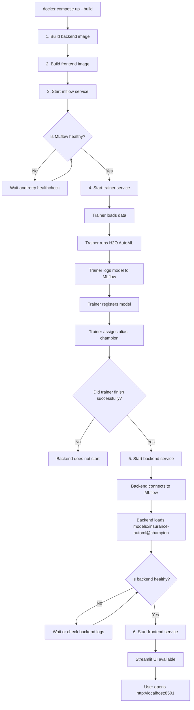

This startup order protects the application from starting too early.

---


<div align="right"><a href="#top">Back to top</a></div>

---

<a id="6-before-the-user-clicks-start-prediction"></a>
## 6. Before the User Clicks Start Prediction

Before any prediction request happens, several things are already running in the background.

<a id="6-1-mlflow-is-running"></a>
### 6.1 MLflow Is Running

The MLflow service is active at:

```text
http://localhost:5000
```

Inside Docker, other containers reach it using:

```text
http://mlflow:5000
```

MLflow contains:

* experiment runs;
* model artifacts;
* registered model versions;
* aliases such as `champion`.

---

<a id="6-2-the-trainer-has-already-registered-the-model"></a>
### 6.2 The Trainer Has Already Registered the Model

The `trainer` service has already executed the training job.

It has:

1. loaded training data;
2. trained multiple candidate models using H2O AutoML;
3. selected the best model;
4. logged the model to MLflow;
5. registered it as `insurance-automl`;
6. assigned the alias `champion`.

After completing its job, the trainer stops.

This is normal. A trainer container is not supposed to run forever.

---

<a id="6-3-the-backend-has-already-loaded-the-model"></a>
### 6.3 The Backend Has Already Loaded the Model

When the backend starts, it uses environment variables to build the model URI:

```text
MODEL_NAME=insurance-automl
MODEL_ALIAS=champion
MLFLOW_TRACKING_URI=http://mlflow:5000
```

Then it loads:

```text
models:/insurance-automl@champion
```

The model is loaded into memory so that it is ready to predict.

This is important because loading the model for every request would be slow.

---

<a id="6-4-the-frontend-is-ready"></a>
### 6.4 The Frontend Is Ready

The Streamlit frontend is available at:

```text
http://localhost:8501
```

The user can now upload a CSV file.

---


<div align="right"><a href="#top">Back to top</a></div>

---

<a id="7-complete-user-prediction-scenario"></a>
## 7. Complete User Prediction Scenario

The prediction scenario starts when the user interacts with the frontend.

---

<a id="7-1-complete-sequence-diagram"></a>
### 7.1 Complete Sequence Diagram

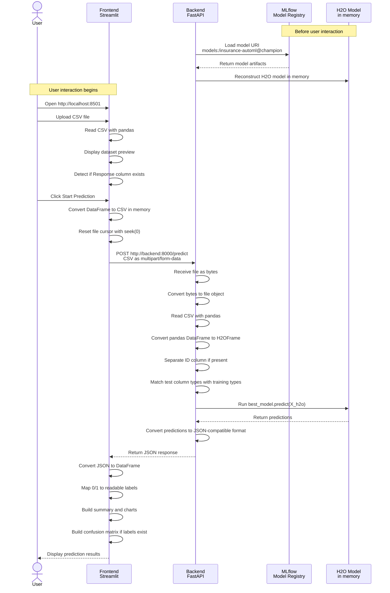

---


<div align="right"><a href="#top">Back to top</a></div>

---

<a id="8-step-1-the-user-uploads-a-csv-file-in-streamlit"></a>
## 8. Step 1 — The User Uploads a CSV File in Streamlit

The user opens the application in the browser:

```text
http://localhost:8501
```

The Streamlit interface displays a file uploader.

The user selects a CSV file from their computer.

At this moment, the file is uploaded into the Streamlit application. However, it is important to understand that the file has not yet been sent to the backend. It is first handled inside the frontend container.

Streamlit receives the file in memory. The application can now inspect it, read it, and display a preview.

The CSV file may contain:

* customer information;
* one-hot encoded columns;
* numeric features;
* categorical encoded features;
* an optional ID column;
* an optional `Response` column if the file is labeled.

If the `Response` column is present, the application can later evaluate the model. If the column is not present, the application can only generate predictions.

---

<a id="8-1-upload-step-diagram"></a>
### 8.1 Upload Step Diagram

```mermaid
flowchart TD
    A["User chooses CSV file"] --> B["Streamlit receives uploaded file"]
    B --> C["File is stored in memory"]
    C --> D["pandas reads CSV"]
    D --> E["CSV becomes DataFrame"]
    E --> F["Streamlit displays data preview"]
    F --> G{"Does CSV contain Response column?"}
    G -->|"Yes"| H["Evaluation will be possible"]
    G -->|"No"| I["Only prediction will be possible"]
```

---


<div align="right"><a href="#top">Back to top</a></div>

---

<a id="9-step-2-streamlit-reads-and-prepares-the-file"></a>
## 9. Step 2 — Streamlit Reads and Prepares the File

After the file is uploaded, Streamlit reads it with pandas.

Pandas transforms the CSV into a DataFrame.

A DataFrame is a table in memory. It has rows and columns, like an Excel sheet.

This step allows Streamlit to:

* preview the data;
* verify that the file is not empty;
* detect whether labels are present;
* prepare the data before sending it to the backend.

Before sending the file to FastAPI, Streamlit rewrites the DataFrame into an in-memory CSV file.

This is done because the backend expects a file upload, not a pandas DataFrame.

The preparation usually follows this logic:

```text
uploaded CSV file
      ↓
pandas DataFrame
      ↓
in-memory CSV file
      ↓
multipart/form-data HTTP file
```

The important operation is `seek(0)`.

When data is written into an in-memory file, the cursor is at the end. If the file is sent like this, the backend may receive an empty file. Calling `seek(0)` moves the cursor back to the beginning, so the backend can read the file correctly.

---

<a id="9-1-file-preparation-diagram"></a>
### 9.1 File Preparation Diagram

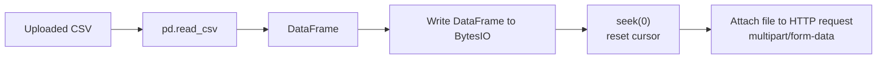

---


<div align="right"><a href="#top">Back to top</a></div>

---

<a id="10-step-3-the-user-clicks-start-prediction"></a>
## 10. Step 3 — The User Clicks Start Prediction

The user then clicks the **Start Prediction** button.

This click is the trigger that starts the prediction workflow.

From the user’s perspective, it is just one button click.

In the background, the frontend performs several actions:

1. It checks that a CSV file was uploaded.
2. It checks that the dataset is not empty.
3. It prepares the file as an HTTP upload.
4. It sends the request to the backend.
5. It waits for the backend response.
6. It handles possible errors.
7. It displays the final results.

The button does not directly run the machine learning model. The button triggers communication with the backend API.

---

<a id="10-1-button-click-diagram"></a>
### 10.1 Button Click Diagram

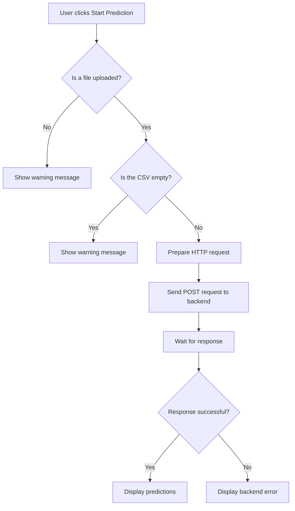

---


<div align="right"><a href="#top">Back to top</a></div>

---

<a id="11-step-4-streamlit-sends-the-request-to-fastapi"></a>
## 11. Step 4 — Streamlit Sends the Request to FastAPI

When the button is clicked, Streamlit sends an HTTP POST request to the backend.

The target URL is:

```text
http://backend:8000/predict
```

The request contains the CSV file using multipart form data.

This means the file is sent like a normal web file upload.

The request includes:

* the backend URL;
* the HTTP method `POST`;
* the uploaded file;
* a timeout value.

The frontend is not sending a simple string. It is sending a real file payload through HTTP.

---


<div align="right"><a href="#top">Back to top</a></div>

---

<a id="12-step-5-why-the-url-is-http-backend-8000-predict"></a>
## 12. Step 5 — Why the URL Is `http://backend:8000/predict`

This is a key Docker concept.

The frontend runs inside a container. The backend runs inside another container.

Inside Docker Compose, containers connected to the same network can communicate using service names.

The service name is:

```text
backend
```

Therefore, the frontend calls:

```text
http://backend:8000/predict
```

This means:

* `http://` is the protocol;
* `backend` is the Docker Compose service name;
* `8000` is the FastAPI port inside the backend container;
* `/predict` is the FastAPI route.

---

<a id="12-1-why-not-localhost"></a>
### 12.1 Why Not `localhost`?

This is a common beginner mistake.

From the user’s browser:

```text
localhost
```

means the user’s own computer.

But from inside the frontend container:

```text
localhost
```

means the frontend container itself.

So if the frontend uses:

```text
http://localhost:8000/predict
```

it will look for FastAPI inside the frontend container. But FastAPI is not running inside the frontend container. It is running in the backend container.

That is why the correct internal URL is:

```text
http://backend:8000/predict
```

---

<a id="12-2-localhost-vs-docker-service-name-diagram"></a>
### 12.2 Localhost vs Docker Service Name Diagram

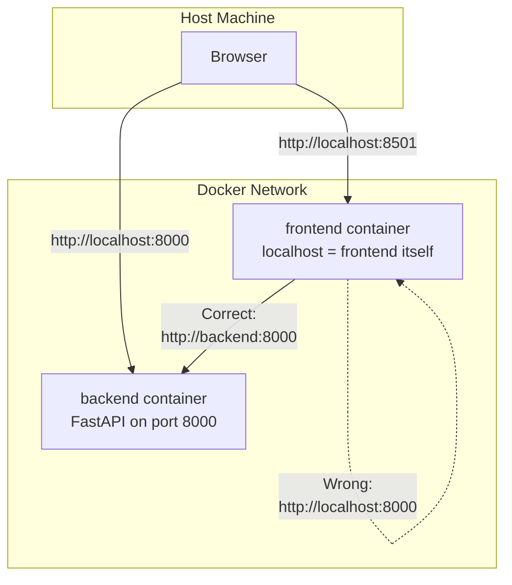

---


<div align="right"><a href="#top">Back to top</a></div>

---

<a id="13-step-6-the-fastapi-backend-receives-the-csv-file"></a>
## 13. Step 6 — The FastAPI Backend Receives the CSV File

The backend exposes a route:

```text
POST /predict
```

When the frontend sends the request, FastAPI receives the uploaded file.

FastAPI extracts the file from the HTTP request. The file is received as bytes.

The backend then converts those bytes into an in-memory file object and reads it with pandas.

This creates a DataFrame inside the backend container.

After that, the backend converts the pandas DataFrame into an H2OFrame.

This conversion is necessary because the trained model is an H2O model. H2O models expect H2OFrame input.

---

<a id="13-1-backend-reception-diagram"></a>
### 13.1 Backend Reception Diagram

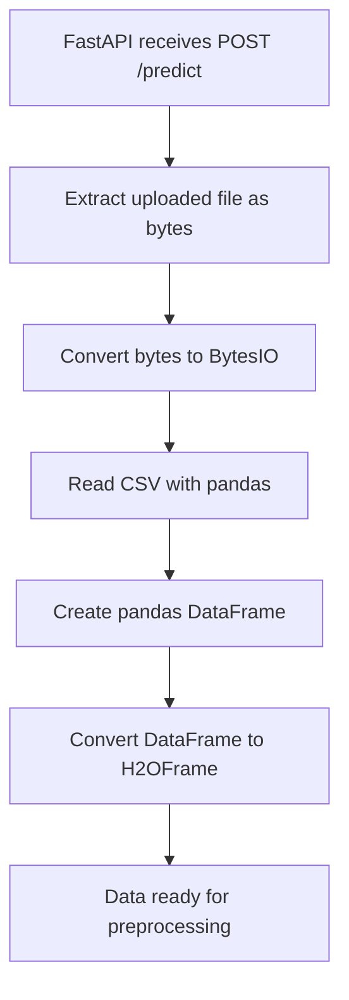

---


<div align="right"><a href="#top">Back to top</a></div>

---

<a id="14-step-7-backend-data-preparation"></a>
## 14. Step 7 — Backend Data Preparation

Before prediction, the backend must prepare the uploaded data.

Machine learning models are sensitive to input structure. The prediction dataset must match the training dataset.

The backend may perform several preparation steps.

---

<a id="14-1-separating-an-id-column"></a>
### 14.1 Separating an ID Column

Some CSV files may contain an ID column.

For example:

```text
CustomerID
ID
Id
id
```

The ID column is useful to identify the customer, but it should not be used as a feature for prediction.

A model should not learn from arbitrary identifiers.

Therefore, the backend separates the ID column before prediction.

Later, after prediction, the backend can attach predictions back to the IDs.

Example:

```text
Customer ID 1001 → Prediction 1
Customer ID 1002 → Prediction 0
```

---

<a id="14-2-matching-column-types"></a>
### 14.2 Matching Column Types

The model was trained with columns of specific types.

For example:

* some columns were numeric;
* some columns were categorical;
* some columns were binary indicators;
* some columns may have been encoded.

If the uploaded CSV has different types, the model may fail or produce incorrect results.

Therefore, the backend compares the test data column types with the training column types.

If a column was categorical during training, the backend tries to make it categorical during prediction.

If a column was numeric during training, the backend tries to make it numeric during prediction.

This step ensures consistency between training and inference.

---

<a id="14-3-data-preparation-diagram"></a>
### 14.3 Data Preparation Diagram

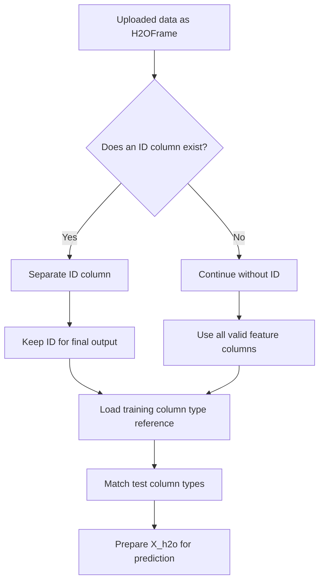

---


<div align="right"><a href="#top">Back to top</a></div>

---

<a id="15-step-8-how-the-backend-uses-the-mlflow-registered-model"></a>
## 15. Step 8 — How the Backend Uses the MLflow Registered Model

The backend uses a model that has already been registered in MLflow.

The model is identified by:

```text
models:/insurance-automl@champion
```

This model URI means:

* `models:/` means the model comes from the MLflow Model Registry;
* `insurance-automl` is the registered model name;
* `champion` is the alias of the selected model version.

The backend does not need to know the exact model version number. It only asks MLflow for the model currently marked as `champion`.

This is powerful because the model can be updated without changing backend code.

For example:

```text
Version 1 → champion
Version 2 → candidate
Version 3 → champion
```

If version 3 becomes better, MLflow can move the `champion` alias to version 3. The backend still loads `@champion`.

---

<a id="15-1-mlflow-model-loading-diagram"></a>
### 15.1 MLflow Model Loading Diagram

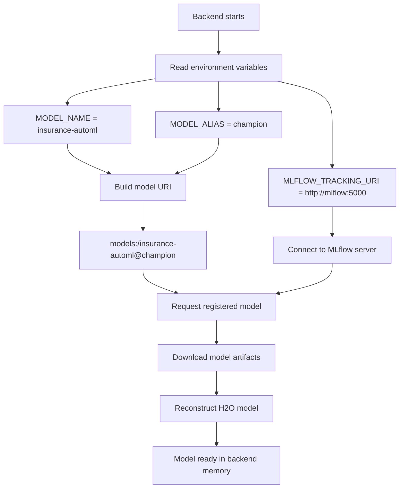

---


<div align="right"><a href="#top">Back to top</a></div>

---

<a id="16-step-9-role-of-environment-variables"></a>
## 16. Step 9 — Role of Environment Variables

The backend and frontend rely on environment variables.

Environment variables make the application configurable without changing source code.

---

<a id="16-1-mlflow-tracking-uri"></a>
### 16.1 `MLFLOW_TRACKING_URI`

```text
MLFLOW_TRACKING_URI=http://mlflow:5000
```

This tells the backend where the MLflow server is.

The backend uses this address to load models from MLflow.

Inside Docker Compose, `mlflow` is the MLflow service name.

---

<a id="16-2-model-name"></a>
### 16.2 `MODEL_NAME`

```text
MODEL_NAME=insurance-automl
```

This tells the backend which registered model to use.

---

<a id="16-3-model-alias"></a>
### 16.3 `MODEL_ALIAS`

```text
MODEL_ALIAS=champion
```

This tells the backend which model version alias to use.

The alias `champion` usually points to the best validated model.

---

<a id="16-4-backend-url"></a>
### 16.4 `BACKEND_URL`

```text
BACKEND_URL=http://backend:8000/predict
```

This tells the Streamlit frontend where to send prediction requests.

---

<a id="16-5-environment-variables-diagram"></a>
### 16.5 Environment Variables Diagram

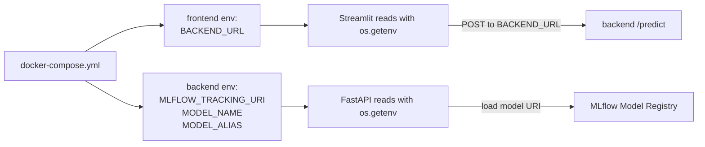

---


<div align="right"><a href="#top">Back to top</a></div>

---

<a id="17-step-10-the-model-performs-predictions"></a>
## 17. Step 10 — The Model Performs Predictions

After preprocessing, the backend sends the prepared H2OFrame to the loaded model.

The model analyzes each row.

Each row represents one customer or one record.

The model returns a prediction for each row.

In this project, the prediction is binary:

```text
0 = Not interested in vehicle insurance
1 = Interested in vehicle insurance
```

The backend then converts these predictions into a Python structure.

If an ID column was present, the backend may return a dictionary:

```json
{
  "1001": 1,
  "1002": 0,
  "1003": 1
}
```

If no ID column was present, the backend may return a list:

```json
[1, 0, 1]
```

---

<a id="17-1-prediction-diagram"></a>
### 17.1 Prediction Diagram

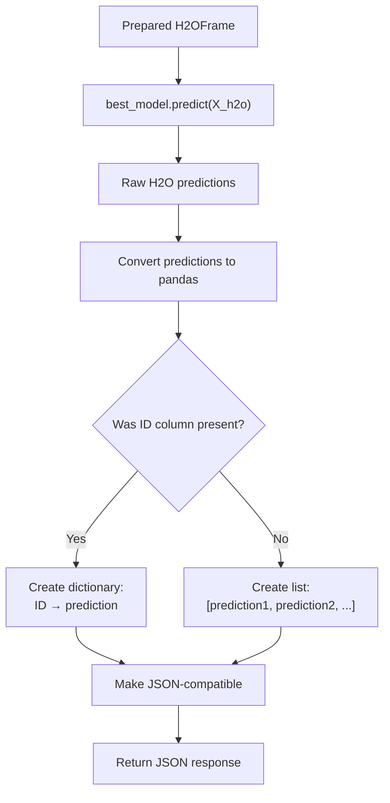

---


<div align="right"><a href="#top">Back to top</a></div>

---

<a id="18-step-11-backend-returns-json-to-streamlit"></a>
## 18. Step 11 — Backend Returns JSON to Streamlit

After predictions are generated, the backend returns the result as a JSON response.

JSON is used because it is a standard format for communication between web services.

FastAPI sends the response back to the frontend container.

The response travels through the Docker network.

At this moment, the backend has completed its job.

---

<a id="18-1-response-flow-diagram"></a>
### 18.1 Response Flow Diagram

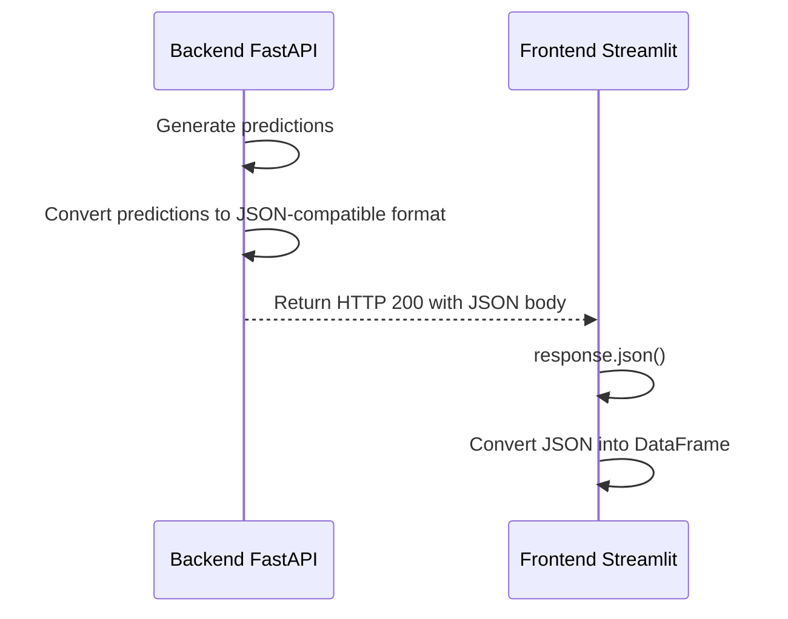

---


<div align="right"><a href="#top">Back to top</a></div>

---

<a id="19-step-12-streamlit-displays-the-results"></a>
## 19. Step 12 — Streamlit Displays the Results

Streamlit receives the backend response.

It converts the JSON response into Python data.

Then it builds a readable results table.

For example, raw predictions may look like this:

```text
[1, 0, 1, 0]
```

Streamlit transforms them into readable labels:

```text
1 → Interested in vehicle insurance
0 → Not interested
```

The user may see:

| Customer | Prediction | Result                          |
| -------- | ---------- | ------------------------------- |
| 1        | 1          | Interested in vehicle insurance |
| 2        | 0          | Not interested                  |
| 3        | 1          | Interested in vehicle insurance |

Streamlit can also display:

* total number of rows;
* number of positive predictions;
* number of negative predictions;
* percentage of interested customers;
* charts;
* detailed prediction table;
* download button.

---

<a id="19-1-display-results-diagram"></a>
### 19.1 Display Results Diagram

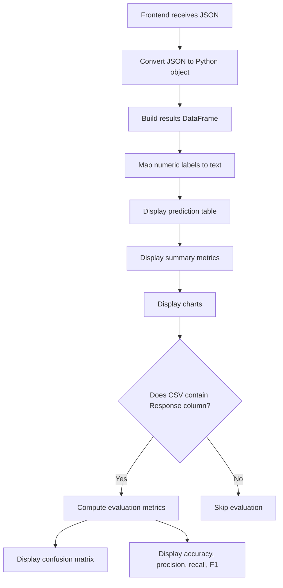

---


<div align="right"><a href="#top">Back to top</a></div>

---

<a id="20-optional-case-if-the-csv-contains-true-labels"></a>
## 20. Optional Case — If the CSV Contains True Labels

If the CSV contains the target column, for example:

```text
Response
```

then Streamlit can compare predictions with true values.

This allows the application to calculate evaluation metrics.

---

<a id="20-1-confusion-matrix-explanation"></a>
### 20.1 Confusion Matrix Explanation

The confusion matrix compares true labels and predicted labels.

| Case           | Meaning                                                                 |
| -------------- | ----------------------------------------------------------------------- |
| True Positive  | The customer was interested, and the model predicted interested         |
| True Negative  | The customer was not interested, and the model predicted not interested |
| False Positive | The customer was not interested, but the model predicted interested     |
| False Negative | The customer was interested, but the model predicted not interested     |

---

<a id="20-2-confusion-matrix-diagram"></a>
### 20.2 Confusion Matrix Diagram

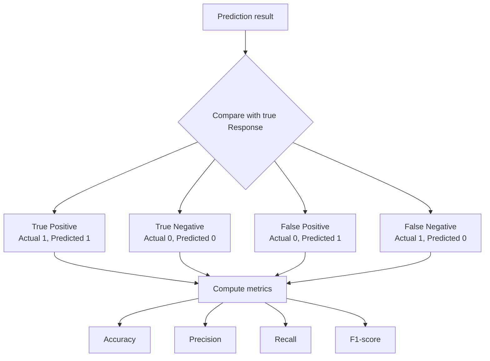

---


<div align="right"><a href="#top">Back to top</a></div>

---

<a id="21-complete-background-workflow-in-one-diagram"></a>
## 21. Complete Background Workflow in One Diagram

The following diagram summarizes the full process from CSV upload to result display.

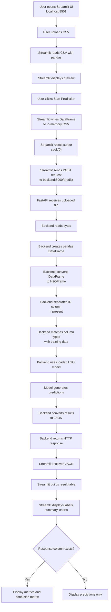

---


<div align="right"><a href="#top">Back to top</a></div>

---

<a id="22-what-could-go-wrong"></a>
## 22. What Could Go Wrong?

Several failures can happen in this architecture.

---

<a id="22-1-mlflow-is-not-healthy"></a>
### 22.1 MLflow Is Not Healthy

If MLflow is not healthy, the trainer may not be able to log and register the model.

The backend may also fail because it cannot load the model.

Possible causes:

* MLflow container is down.
* Port 5000 is not available.
* MLflow healthcheck fails.
* MLflow volume is corrupted.
* Model artifacts are missing.
* The `champion` alias does not exist.

Diagnostic commands:

```bash
docker compose ps
docker compose logs mlflow
docker compose logs trainer
docker compose logs backend
```

---

<a id="22-2-trainer-failed"></a>
### 22.2 Trainer Failed

If the trainer fails, the backend should not start.

This is because the backend depends on the trainer completing successfully.

If no model is registered, the backend cannot load:

```text
models:/insurance-automl@champion
```

Possible causes:

* training data missing;
* H2O AutoML error;
* MLflow connection error;
* insufficient memory;
* incorrect target column;
* model registration failed.

Diagnostic command:

```bash
docker compose logs trainer
```

---

<a id="22-3-backend-is-not-working"></a>
### 22.3 Backend Is Not Working

If the backend is down, Streamlit cannot get predictions.

Possible causes:

* FastAPI crashed;
* model loading failed;
* MLflow is unreachable;
* port 8000 is occupied;
* bad environment variables;
* invalid CSV input;
* missing columns.

Diagnostic commands:

```bash
docker compose logs backend
docker compose ps
```

Browser test:

```text
http://localhost:8000/docs
http://localhost:8000/health
```

---

<a id="22-4-frontend-cannot-reach-backend"></a>
### 22.4 Frontend Cannot Reach Backend

If the frontend cannot reach the backend, the user may see an error when clicking **Start Prediction**.

Possible causes:

* wrong `BACKEND_URL`;
* backend service name misspelled;
* backend not healthy;
* frontend and backend are not on the same Docker network;
* frontend uses `localhost` instead of `backend`.

Correct internal URL:

```text
http://backend:8000/predict
```

Wrong internal URL:

```text
http://localhost:8000/predict
```

---

<a id="22-5-docker-network-problem"></a>
### 22.5 Docker Network Problem

If the Docker network is not configured correctly, service names such as `backend` and `mlflow` will not resolve.

The frontend will not find the backend.

The backend will not find MLflow.

Diagnostic command:

```bash
docker network ls
docker compose ps
```

Internal test:

```bash
docker compose exec frontend python -c "import requests; print(requests.get('http://backend:8000/health').text)"
```

---

<a id="22-6-invalid-csv-file"></a>
### 22.6 Invalid CSV File

The CSV file may also cause problems.

Possible problems:

* empty file;
* wrong delimiter;
* missing columns;
* extra unsupported columns;
* wrong data types;
* missing values;
* target column included when not expected;
* file not encoded correctly.

The backend may fail if the uploaded file does not match the expected training format.

---


<div align="right"><a href="#top">Back to top</a></div>

---

<a id="23-failure-handling-diagram"></a>
## 23. Failure Handling Diagram

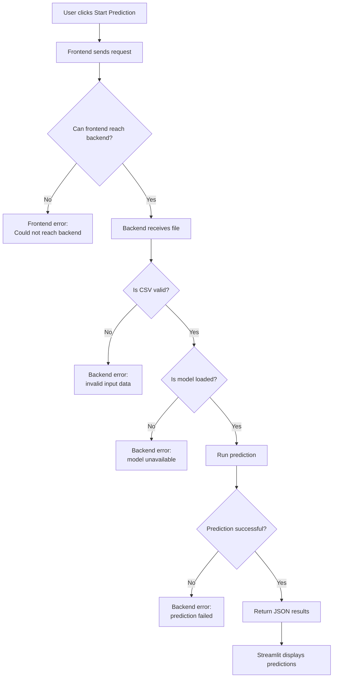

---


<div align="right"><a href="#top">Back to top</a></div>

---

<a id="24-detailed-end-to-end-explanation-in-paragraph-form"></a>
## 24. Detailed End-to-End Explanation in Paragraph Form

The project is a complete AutoML prediction application built with Docker Compose. It contains several services, each with a specific role. The `mlflow` service stores training runs, model artifacts, registered models, and aliases. The `trainer` service trains the H2O AutoML model and registers the best model in MLflow under the name `insurance-automl` with the alias `champion`. The `backend` service runs a FastAPI application that loads this registered model and exposes a `/predict` endpoint. The `frontend` service runs a Streamlit application that allows the user to upload a CSV file and request predictions.

Before the user interacts with the application, Docker Compose starts the services in a controlled order. MLflow starts first and becomes healthy. Then the trainer runs, trains the model, registers it, assigns the alias `champion`, and stops successfully. After that, the backend starts and loads the model from MLflow using the URI `models:/insurance-automl@champion`. Finally, the frontend starts and becomes available to the user at `http://localhost:8501`.

The workflow begins when the user opens the Streamlit interface in the browser. The user uploads a CSV file through the file uploader. Streamlit receives the file in memory and reads it using pandas. The CSV is converted into a DataFrame, which allows the application to display a preview of the uploaded data. Streamlit may also check whether the file contains a `Response` column. If this column exists, the application will later be able to compute evaluation metrics. If it does not exist, the application will only display predictions.

When the user clicks **Start Prediction**, the frontend prepares the uploaded file for transmission. It writes the DataFrame into an in-memory CSV file and resets the file cursor with `seek(0)`. This step is necessary because the backend expects an uploaded file, not a pandas DataFrame. If the cursor is not reset, the backend may receive an empty file.

The frontend then sends an HTTP POST request to `http://backend:8000/predict`. This URL is used because `backend` is the Docker Compose service name. Inside Docker Compose, services on the same network can communicate using their service names. The frontend must not use `localhost:8000` because, from inside the frontend container, `localhost` refers to the frontend container itself, not the backend container.

The FastAPI backend receives the uploaded CSV file on the `/predict` endpoint. FastAPI extracts the file from the HTTP request as bytes. The backend converts these bytes into an in-memory file object, reads the CSV with pandas, and creates a DataFrame. It then converts this DataFrame into an H2OFrame because the trained model is an H2O model.

Before prediction, the backend prepares the data. If an ID column exists, it separates it from the features so that the ID is not used as an input feature. The ID can later be used to associate predictions with specific customers. The backend also matches the test column types with the training column types to ensure consistency between training and inference.

The backend then uses the model that was already loaded from MLflow. The model was identified using three environment variables: `MLFLOW_TRACKING_URI`, `MODEL_NAME`, and `MODEL_ALIAS`. `MLFLOW_TRACKING_URI` tells the backend where the MLflow server is located. `MODEL_NAME` identifies the registered model name. `MODEL_ALIAS` identifies the selected version, usually the production-ready version called `champion`.

Once the data is ready, the backend calls the H2O model to generate predictions. The model processes each row of the uploaded CSV and returns a prediction. In this project, the prediction is binary: `0` means the customer is not interested, and `1` means the customer is interested in vehicle insurance.

After predictions are generated, the backend converts the result into a JSON-compatible structure. If an ID column was present, the result may be returned as a dictionary mapping IDs to predictions. If no ID column was present, the result may be returned as a simple list of predictions. FastAPI sends this JSON response back to the Streamlit frontend.

Streamlit receives the JSON response and converts it into a DataFrame for display. It maps numeric predictions into readable labels, such as `Interested in vehicle insurance` or `Not interested`. It then displays the prediction table, summary metrics, charts, and optional downloads. If the uploaded CSV contains the true `Response` column, Streamlit also compares the predictions to the real labels and displays evaluation metrics such as accuracy, precision, recall, F1-score, and a confusion matrix.

Several problems can occur during this workflow. If MLflow is not healthy, the trainer may fail or the backend may not load the model. If the trainer fails, the `champion` model may not exist, so the backend cannot start correctly. If the backend is down, Streamlit cannot send prediction requests. If the Docker network is misconfigured, the frontend may not resolve the service name `backend`, or the backend may not resolve the service name `mlflow`. If the CSV format is invalid, the backend may fail during data preparation or prediction.

In conclusion, this workflow demonstrates a complete MLOps application. The user sees a simple Streamlit interface, but behind the scenes, Docker Compose coordinates several containers, MLflow manages the model, FastAPI serves predictions, H2O performs inference, and Streamlit displays the results. This architecture is reusable and can be adapted to many other machine learning projects.

---


<div align="right"><a href="#top">Back to top</a></div>

---

<a id="25-final-mermaid-summary"></a>
## 25. Final Mermaid Summary

```mermaid
flowchart LR
    A["1. User uploads CSV"] --> B["2. Streamlit reads CSV"]
    B --> C["3. User clicks Start Prediction"]
    C --> D["4. Streamlit sends POST request"]
    D --> E["5. FastAPI receives file"]
    E --> F["6. Backend prepares data"]
    F --> G["7. Backend uses MLflow model"]
    G --> H["8. H2O model predicts"]
    H --> I["9. Backend returns JSON"]
    I --> J["10. Streamlit displays results"]
    J --> K["11. Optional evaluation<br/>if Response column exists"]
```

<div align="right"><a href="#top">Back to top</a></div>
