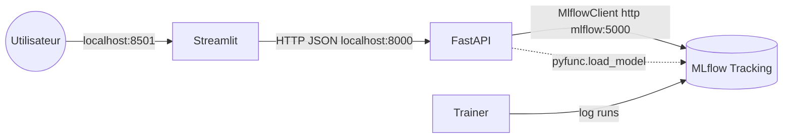

## Avant de commencer — Créer les dossiers locaux

> **Important**
>
> Vous DEVEZ créer les dossiers locaux `database/` et `mlruns/` AVANT le premier `docker compose up`.
>
> Le fichier `docker-compose.yml` de ce chapitre utilise des **bind mounts** : des dossiers de votre machine sont montés dans le conteneur. Il ne s’agit pas de volumes Docker anonymes.
>
> Si les dossiers locaux n’existent pas, Docker peut les créer silencieusement comme des dossiers vides appartenant à `root`. Sur Windows, cela peut les rendre difficiles à inspecter ou à supprimer depuis l’éditeur. Vous risquez alors de vous demander pourquoi le fichier `mlflow.db` semble “disparaître” après un `docker compose down -v`.

### Créer les dossiers maintenant

```bash
mkdir database mlruns       # bash / Git Bash / macOS / Linux / WSL
````

```powershell
New-Item -ItemType Directory database, mlruns -Force | Out-Null   # PowerShell
```

### Ce qui se trouve dans ces dossiers — et le rôle de `working_dir`

| Hôte, c’est-à-dire votre ordinateur, dans le dossier du chapitre | Chemin dans le conteneur, service `mlflow` | Contenu                                                |
| ---------------------------------------------------------------- | ------------------------------------------ | ------------------------------------------------------ |
| `./database/`                                                    | `/mlflow/database/`                        | `mlflow.db` — base SQLite de suivi MLflow              |
| `./mlruns/`                                                      | `/mlflow/mlruns/`                          | Artefacts : modèles, graphiques, fichiers de métriques |
| `.` — tout le dossier du chapitre                                | `/work/` ← c’est le `working_dir:`         | Tout le projet : `trainer/`, `data/`, etc.             |

Le troisième montage (`.:/work`) combiné avec `working_dir: /work` permet, dans **Docker Desktop → Containers → `mlflow-recap-XX` → Exec → `ls`**, de voir tous les fichiers du projet.

Sans ce réglage, l’exécution interactive vous placerait dans `/mlflow/`, et vous ne verriez rien d’utile.

La directive `working_dir:` dans Docker Compose définit le dossier courant par défaut pour `RUN`, `CMD` et toute commande `docker compose exec`. On peut la comprendre comme un `cd /work` intégré directement dans le conteneur.

---

## Deux façons de lancer l’entraînement

> **Note**
>
> **Méthode A — méthode canonique, avec un conteneur `trainer` lancé une seule fois, recommandée pour ce cours :**

```bash
docker compose run --rm trainer --alpha 0.1 --l1_ratio 0.1
```

> **Méthode B — avec `docker compose exec` dans le conteneur `mlflow` déjà lancé, pratique avec Docker Desktop :**

```bash
docker compose exec mlflow python trainer/train.py --alpha 0.1 --l1_ratio 0.1
```

Les deux commandes exécutent le même fichier `train.py`.

La méthode B fonctionne parce que `mlflow==2.16.2` installe aussi, comme dépendances transitives, des bibliothèques comme `scikit-learn`, `pandas` et `numpy`.

À partir du chapitre 05, la variable d’environnement `MLFLOW_TRACKING_URI` est définie dans le service `trainer` du fichier `docker-compose.yml`, et `train.py` la lit avec `os.getenv(...)`.

Donc, la méthode A et la méthode B fonctionnent directement, et les runs apparaissent dans l’interface MLflow sous la bonne expérience.

Si un run n’apparaît PAS dans l’interface MLflow, forcez l’URI avec :

```bash
docker compose exec -e MLFLOW_TRACKING_URI=http://localhost:5000 mlflow python trainer/train.py ...
```

---

## Ce qui est nouveau par rapport au chapitre 10

* Un dictionnaire de fabrique de modèles :

```python
MODELS = {"ElasticNet": ElasticNet, "Ridge": Ridge, "Lasso": Lasso}
```

* Un appel `mlflow.set_experiment(...)` par famille de modèles, donc 3 expériences.
* Chaque expérience reçoit la même liste `CONFIGS`, ce qui permet une comparaison équitable.
* Chaque run reçoit des tags comme `algo`, `version`, `dataset`, ce qui permet aussi de faire des recherches entre plusieurs expériences.

---

## Structure du projet

Le projet suit la structure standard utilisée dans cette série de récapitulatifs.

```text
chap14-.../
+- README.md                 <- ce fichier
+- docker-compose.yml        <- mlflow + trainer + api + ui
+- mlflow/
|  +- Dockerfile             <- image du serveur MLflow Tracking
+- data/
|  +- red-wine-quality.csv
+- trainer/                  <- service d’entraînement
|  +- Dockerfile
|  +- requirements.txt
|  +- train.py
+- api/                      <- service de serving FastAPI
|  +- Dockerfile
|  +- requirements.txt
|  +- main.py
+- ui/                       <- interface pédagogique Streamlit
   +- Dockerfile
   +- requirements.txt
   +- app.py
   +- pages_content.py
```

---

## Exécuter le projet — 100 % Docker, sans Python sur l’hôte

Voici la séquence d’exécution canonique pour cette série de chapitres.
Elle est identique pour tous les chapitres à partir du chapitre 04. Seuls les arguments du service `trainer` changent.

---

### 1. Se placer dans le dossier du chapitre

```bash
cd chap11-mlflow-step-by-step-recap...
```

---

### 2. Construire les images et démarrer le serveur MLflow en arrière-plan

```bash
docker compose up -d --build mlflow
```

Explication :

* `-d` lance le serveur en mode détaché, afin que le terminal reste disponible pour lancer le trainer.
* `--build` force la reconstruction si un `Dockerfile` ou un fichier `requirements.txt` a été modifié.

Vérifier avec :

```bash
docker compose ps
# mlflow-recap-11    Up X seconds (healthy)
```

Ouvrir ensuite :

```text
http://localhost:5000
```

Au départ, l’interface est vide, à part l’expérience `Default`, sauf si des volumes persistants existent déjà depuis un chapitre précédent.

---

### 3. Lancer le trainer avec les arguments CLI

```bash
docker compose run --rm trainer
```

---

### 4. Actualiser l’interface MLflow

Ouvrir ou rafraîchir :

```text
http://localhost:5000
```

Résultat attendu :

* Expériences : `exp_elasticnet`, `exp_ridge`, `exp_lasso`
* 3 runs dans chaque expérience
* 9 runs au total

Dans l’interface MLflow :

* cliquez sur une expérience ;
* utilisez **Compare** pour comparer les runs d’une même famille de modèles ;
* utilisez la barre de recherche avec une expression comme :

```text
tags.algo = "Ridge"
```

pour afficher des runs selon un algorithme précis.

> **Particularité du chapitre.**
>
> Chaque expérience possède son propre `experiment_id`.
>
> `mlflow.set_experiment(...)` retourne l’objet expérience. Il est donc préférable de récupérer son `.experiment_id` et de le passer explicitement à `start_run(experiment_id=...)`.
>
> Cela évite les confusions liées à l’état global de MLflow.

---

### 5. Arrêter les conteneurs

```bash
docker compose down       # conserve les volumes, donc la base et les artefacts survivent
docker compose down -v    # supprime tout : base, artefacts et volumes nommés du chapitre
```

---

## Ce qui est créé sur votre machine

Ce chapitre utilise des **volumes Docker nommés** plutôt que des dossiers locaux montés directement pour les données MLflow.

| Volume             | Contenu                                                                   |
| ------------------ | ------------------------------------------------------------------------- |
| `mlflow-db`        | Base SQLite avec les métadonnées : expériences, runs, modèles enregistrés |
| `mlflow-artifacts` | Modèles sérialisés, signatures, graphiques, fichiers CSV                  |

Pour inspecter ces volumes :

```bash
docker volume ls | grep recap
docker volume inspect <volume_name>
```

Ces volumes survivent à la commande :

```bash
docker compose down
```

Ils sont supprimés uniquement avec :

```bash
docker compose down -v
```

---

## Récapitulatif — bash, exécution complète

```bash
cd chap11-mlflow-step-by-step-recap...

docker compose up -d --build mlflow

docker compose run --rm trainer

# Ouvrir http://localhost:5000 et inspecter les runs dans les expériences :
# exp_elasticnet, exp_ridge, exp_lasso

docker compose down
```

---

## Récapitulatif — Windows PowerShell

```powershell
cd chap11-mlflow-step-by-step-recap...

docker compose up -d --build mlflow

docker compose run --rm trainer

# Ouvrir http://localhost:5000 et inspecter les runs dans les expériences :
# exp_elasticnet, exp_ridge, exp_lasso

docker compose down
```

---

## Entrer manuellement dans le conteneur trainer pour déboguer

Parfois, il est utile d’ouvrir un shell dans le conteneur `trainer` pour inspecter le système de fichiers, les variables d’environnement ou exécuter le script étape par étape.

```bash
docker compose run --rm --entrypoint bash trainer

# À l’intérieur du conteneur :
#   cat train.py
#   ls /code/data
#   env | grep MLFLOW
#   python train.py --alpha 0.5 --l1_ratio 0.5
#   exit
```

L’option `--entrypoint bash` remplace l’`ENTRYPOINT` défini dans l’image :

```dockerfile
ENTRYPOINT ["python", "train.py"]
```

Au lieu de lancer directement le script Python, Docker ouvre un shell bash.

---

## Dépannage

<details>
<summary><strong>Le port 5000 est déjà utilisé sur Windows</strong></summary>

Le serveur MLflow publie le port `5000:5000`.

Si un autre programme utilise déjà le port 5000, le conteneur ne pourra pas démarrer.

CMD :

```bat
netstat -ano | findstr :5000
:: La dernière colonne correspond au PID. Ensuite :
tasklist | findstr 12345
taskkill /PID 12345 /F
```

PowerShell :

```powershell
Get-NetTCPConnection -LocalPort 5000
Stop-Process -Id 12345 -Force
```

Le port 5000 est souvent déjà utilisé par :

* des serveurs Flask de développement ;
* AirPlay sur macOS ;
* Hyper-V ;
* IIS ;
* NetBIOS ;
* un ancien conteneur MLflow oublié après un chapitre précédent.

</details>

---

<details>
<summary><strong>Docker Desktop est bloqué ou les conteneurs restent dans l’état `Created`</strong></summary>

Ouvrir **PowerShell en tant qu’administrateur** :

```powershell
# 1. Arrêter les processus Docker Desktop
Get-Process *docker* -ErrorAction SilentlyContinue | Stop-Process -Force

# 2. Arrêter le service Docker
Stop-Service com.docker.service -Force -ErrorAction SilentlyContinue

# 3. Arrêter complètement le backend WSL
wsl --shutdown
```

Attendre quelques secondes, puis relancer :

```powershell
Start-Service com.docker.service
Start-Process "C:\Program Files\Docker\Docker\Docker Desktop.exe"
```

Si Docker reste bloqué :

```powershell
taskkill /F /IM "Docker Desktop.exe"
taskkill /F /IM "com.docker.backend.exe"
taskkill /F /IM "com.docker.service.exe"
taskkill /F /IM "dockerd.exe"
wsl --shutdown
```

Ensuite, redémarrer Docker Desktop depuis le menu Démarrer.

</details>

---

<details>
<summary><strong>Le trainer affiche `Tracking URI: file:///code/mlruns`</strong></summary>

Cela signifie que le trainer n’a PAS vu la variable d’environnement `MLFLOW_TRACKING_URI`.

Trois éléments sont à vérifier :

1. Dans `docker-compose.yml`, vérifier que le service `trainer` contient bien :

```yaml
environment:
  MLFLOW_TRACKING_URI:
```

2. Vérifier que vous avez lancé le trainer avec :

```bash
docker compose run --rm trainer ...
```

et non avec `docker run` directement.

3. Vérifier que le service MLflow est bien en bonne santé :

```bash
docker compose ps
# mlflow-recap-11 ... healthy
```

Pour forcer l’URI au moment de l’exécution :

```bash
docker compose run --rm -e MLFLOW_TRACKING_URI=http://mlflow:5000 trainer --alpha 0.4 --l1_ratio 0.4
```

</details>

---

<details>
<summary><strong>Le trainer échoue immédiatement avec `Image not found` ou `manifest unknown`</strong></summary>

Cela signifie généralement que vous avez oublié `--build` ou que l’image du trainer est ancienne.

```bash
docker compose down
docker compose up -d --build mlflow
docker compose run --rm trainer --alpha 0.4 --l1_ratio 0.4
```

Si `--build` échoue aussi, nettoyer puis réessayer :

```bash
docker compose down -v
docker builder prune -af
docker compose up -d --build mlflow
```

</details>

---

## Chapitre 14 — Servir les modèles avec FastAPI + Streamlit

Ce chapitre ajoute deux services par-dessus MLflow et le trainer :

* **`api`** — une API **FastAPI** qui charge les modèles enregistrés dans MLflow
  et expose une route de prédiction.
* **`ui`** — une interface **Streamlit** pédagogique en 5 onglets. Elle consomme
  uniquement l’API FastAPI, jamais MLflow directement.

### Architecture



### Ports exposés

* `5000` — interface web MLflow.
* `8000` — API FastAPI (documentation interactive sur `http://localhost:8000/docs`).
* `8501` — interface Streamlit.

### Séquence de démarrage complète

```bash
# 1. Démarrer le serveur MLflow
docker compose up -d --build mlflow

# 2. Entraîner les modèles (crée 9 runs dans 3 expériences)
docker compose run --rm trainer

# 3. Démarrer l'API et l'interface
docker compose up -d --build api ui
```

Puis ouvrir :

* Interface Streamlit : `http://localhost:8501`
* Documentation API (Swagger) : `http://localhost:8000/docs`
* Interface MLflow : `http://localhost:5000`

### Les onglets de l’interface Streamlit

* **Accueil** — vue d’ensemble, diagramme du flux MLOps, santé du système, KPI.
* **Exploration** — analyse exploratoire du dataset (histogrammes, matrice de
  corrélation, boxplots par niveau de qualité).
* **Théorie** — explication des modèles Ridge, Lasso et ElasticNet avec leurs
  formules et une illustration du compromis biais-variance.
* **Comparaison MLflow** — tableau et graphiques comparant les 9 runs, sélection
  automatique du modèle champion (plus petit RMSE).
* **Prédiction** — curseurs interactifs pour les 11 caractéristiques, presets par
  niveau de qualité, jauge de résultat et coefficients du modèle.

### Endpoints de l’API

* `GET /health` — vérifie la connexion à MLflow.
* `GET /experiments` — liste les expériences et leur nombre de runs.
* `GET /runs?experiment_name=...` — runs d’une expérience, triés par RMSE.
* `GET /features` — statistiques (min/max/mean/std) de chaque feature.
* `GET /presets` — profils médians des vins par niveau de qualité.
* `GET /model/{run_id}/coefficients` — coefficients du modèle linéaire.
* `POST /predict` — prédit la qualité à partir d’un `run_id` et des 11 features.

### Dépannage — chapitre 14

<details>
<summary><strong>Aucun run visible dans l’interface Streamlit</strong></summary>

L’interface affiche « Aucun run trouvé ». Cela signifie que MLflow est vide.

Lancez d’abord l’entraînement, puis rafraîchissez :

```bash
docker compose run --rm trainer
```

Ensuite, cliquez sur **« Rafraîchir les données »** dans la barre latérale.

</details>

<details>
<summary><strong>L’API ne parvient pas à charger un modèle (404)</strong></summary>

L’API charge les modèles via `mlflow.pyfunc.load_model` en lisant les artefacts
dans `./mlruns`. Vérifiez que le service `api` monte bien ce dossier
(`./mlruns:/mlflow/mlruns` dans `docker-compose.yml`) et que le trainer a bien
enregistré ses runs.

</details>

<details>
<summary><strong>« API injoignable » dans Streamlit</strong></summary>

Vérifiez que le service `api` est démarré et sain :

```bash
docker compose ps
curl http://localhost:8000/health
```

Dans la barre latérale de Streamlit, l’URL de l’API doit être `http://api:8000`
(nom de service Docker) lorsque tout tourne dans Docker Compose.

</details>

---

## Chapitre suivant

**Suite** : [chap12](../12-practical-work-mlflow-step-by-step-recap-automating-logging-with-mlflow-autolog.md)

Dans le chapitre suivant, on remplace une grande partie de `train_one_run` par une seule ligne :

```python
mlflow.autolog()
```

MLflow détecte automatiquement l’appel à `.fit()` et enregistre pour vous :

* les paramètres ;
* les métriques ;
* le modèle ;
* la signature du modèle.

```
```
