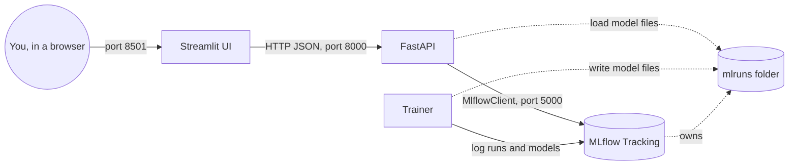

# Wine Quality MLOps - MLflow + FastAPI + Streamlit

An end-to-end, beginner-friendly MLOps project. It trains three families of
regularized linear regression models (ElasticNet, Ridge, Lasso) to predict the
quality of red wine, tracks every experiment in MLflow, serves the trained
models through a FastAPI service, and exposes an interactive, educational
Streamlit interface.

Everything runs in Docker. You do not need Python installed on your machine.

---

## Table of contents

- [What this project does](#what-this-project-does)
- [Architecture](#architecture)
- [Prerequisites](#prerequisites)
- [Quick start](#quick-start)
- [Ports and URLs](#ports-and-urls)
- [The four services](#the-four-services)
- [Project structure](#project-structure)
- [The dataset and the models](#the-dataset-and-the-models)
- [API endpoints](#api-endpoints)
- [The Streamlit interface](#the-streamlit-interface)
- [Configuration](#configuration)
- [Common commands](#common-commands)
- [Troubleshooting](#troubleshooting)
- [Full documentation](#full-documentation)

---

## What this project does

1. **Data** - a dataset of ~1599 Portuguese red wines with 11 physico-chemical
   features and a quality score (3 to 8).
2. **Training** (`trainer`) - trains 3 model families x 3 `alpha` values = 9
   runs, and logs them to MLflow.
3. **Tracking** (`mlflow`) - stores every run, its parameters, metrics, and
   saved model.
4. **Serving** (`api`) - a FastAPI service that loads models from MLflow and
   answers prediction requests.
5. **Interface** (`ui`) - a Streamlit web app with 5 tabs. It talks only to the
   API, never directly to MLflow.

The core MLOps idea: **training and serving are separated**. The trainer runs
once, the result is stored, and the API serves it continuously.

---

## Architecture



---

## Prerequisites

- **Docker Desktop** installed and running.
- That is all. No local Python, no local libraries.

---

## Quick start

Run these three commands from the project folder (the one containing
`docker-compose.yml`), in order:

```bash
# 1. Start the MLflow tracking server
docker compose up -d --build mlflow

# 2. Train the models (creates 9 runs in MLflow)
docker compose run --rm trainer

# 3. Start the API and the UI
docker compose up -d --build api ui
```

Then open in your browser:

- **Streamlit app**: http://localhost:8501
- **API docs (Swagger)**: http://localhost:8000/docs
- **MLflow**: http://localhost:5000

> New here? Follow the fully literal, copy-paste runbook in
> [documentation/00-run-step-by-step.md](documentation/00-run-step-by-step.md).

---

## Ports and URLs

| Service | URL | Purpose |
| --- | --- | --- |
| `ui` (Streamlit) | http://localhost:8501 | The interactive web app |
| `api` (FastAPI) | http://localhost:8000/docs | Interactive API documentation |
| `mlflow` | http://localhost:5000 | Experiment tracking UI |

---

## The four services

| Service | Long-running? | Role |
| --- | --- | --- |
| `mlflow` | yes | The project's memory: runs, metrics, saved models. |
| `trainer` | no (one-shot) | Trains the 9 models, then exits. |
| `api` | yes | Loads models from MLflow and predicts. |
| `ui` | yes | The web page. Talks only to the API. |

All services share a private Docker network (`recap-net`) and find each other by
name (the API reaches MLflow at `http://mlflow:5000`, the UI reaches the API at
`http://api:8000`).

### Shared artifact storage (important)

MLflow is started with `--default-artifact-root /mlflow/mlruns`, a local path.
In that mode, the **client** (the trainer and the API) reads and writes model
files directly on that path. Therefore the `mlflow`, `trainer`, and `api`
services all bind-mount the same host folder `./mlruns` at `/mlflow/mlruns`, so
they share the exact same model files. If the trainer did not mount it, the
saved models would be lost when its one-shot container is removed.

---

## Project structure

```text
14-.../
├── README.md                 <- this file
├── docker-compose.yml        <- defines the 4 services
├── data/
│   └── red-wine-quality.csv  <- the dataset
├── mlflow/
│   └── Dockerfile            <- MLflow tracking server image
├── trainer/
│   ├── Dockerfile
│   ├── requirements.txt
│   └── train.py              <- training script (9 runs)
├── api/
│   ├── Dockerfile
│   ├── requirements.txt
│   └── main.py               <- FastAPI app (endpoints)
├── ui/
│   ├── Dockerfile
│   ├── requirements.txt
│   ├── app.py                <- Streamlit app (5 tabs)
│   └── pages_content.py      <- educational texts
├── database/                 <- created at run time: mlflow.db (SQLite)
├── mlruns/                   <- created at run time: saved models / artifacts
└── documentation/
    ├── 00-run-step-by-step.md  <- literal command-by-command runbook (EN)
    ├── 01-complete-guide.md    <- full beginner guide (EN)
    ├── 01-guide-complet.md     <- full beginner guide (FR)
    └── 02-antiseche.md         <- cheat sheet (FR)
```

`database/` and `mlruns/` are created automatically on first run.

---

## The dataset and the models

**Dataset** (`data/red-wine-quality.csv`): 11 features (fixed acidity, volatile
acidity, citric acid, residual sugar, chlorides, free sulfur dioxide, total
sulfur dioxide, density, pH, sulphates, alcohol) and the target `quality`
(3 to 8). The task is a **regression** (predicting a number).

**Models** - three regularized linear regressions, differing only in their
penalty:

| Model | Penalty | Key effect |
| --- | --- | --- |
| Ridge | L2 (squares) | shrinks all coefficients, never to zero |
| Lasso | L1 (absolute) | can set coefficients exactly to zero (feature selection) |
| ElasticNet | L1 + L2 | a blend of both (`l1_ratio` controls the mix) |

`alpha` is the regularization strength (larger = simpler model). The trainer
sweeps `alpha` over `[0.7, 0.9, 0.4]` for each family, producing **9 runs**.

**Metrics logged**: RMSE and MAE (lower is better) and R2 (closer to 1 is
better). On this dataset, Ridge typically wins with RMSE around 0.66.

You can change hyperparameters at run time:

```bash
docker compose run --rm trainer --alpha 0.3 --l1_ratio 0.5
```

---

## API endpoints

Base URL: `http://localhost:8000` (interactive docs at `/docs`).

| Method + path | Description |
| --- | --- |
| `GET /health` | Whether MLflow is reachable and how many experiments exist. |
| `GET /experiments` | All experiments with their run counts. |
| `GET /runs?experiment_name=...` | Runs of one experiment, sorted by RMSE. |
| `GET /features` | Per-feature min/max/mean/std/median (used to build sliders). |
| `GET /presets` | Median wine profile per quality level. |
| `GET /model/{run_id}/coefficients` | Linear coefficients of one model. |
| `POST /predict` | Predict quality from a `run_id` and 11 feature values. |

Example prediction:

```bash
curl -X POST http://localhost:8000/predict \
  -H "Content-Type: application/json" \
  -d '{"run_id":"RUN_ID","features":{"fixed_acidity":7.4,"volatile_acidity":0.7,"citric_acid":0.0,"residual_sugar":1.9,"chlorides":0.076,"free_sulfur_dioxide":11,"total_sulfur_dioxide":34,"density":0.9978,"ph":3.51,"sulphates":0.56,"alcohol":9.4}}'
```

---

## The Streamlit interface

Open http://localhost:8501. The app has five tabs:


1. **Home** - overview, MLOps flow diagram, and key numbers (experiments, runs,
   best RMSE).
2. **Data exploration** - preview, statistics, histograms, correlation matrix,
   boxplots by quality.
3. **Theory** - the math of Ridge/Lasso/ElasticNet and an interactive
   bias-variance illustration.
4. **MLflow comparison** - sortable table of the 9 runs, RMSE bar chart, radar
   chart, and the automatically selected champion (lowest RMSE).
5. **Prediction** - 11 sliders, quality presets, a model selector (pre-filled
   with the champion), a predict button, a result gauge, and a coefficients
   chart.

The sidebar shows a live health badge and a "Refresh data" button (clears the
cache after you train new runs).

---

## Configuration

Set in `docker-compose.yml`:

| Variable | Service | Default | Purpose |
| --- | --- | --- | --- |
| `MLFLOW_TRACKING_URI` | trainer, api | `http://mlflow:5000` | Where MLflow lives. |
| `API_URL` | ui | `http://api:8000` | Where the UI finds the API. |

The Dockerfiles install dependencies with `pip install --timeout=120
--retries=10` so builds survive slow or flaky internet connections.

---

## Common commands

```bash
docker compose ps                    # list services and their status
docker compose logs -f api           # follow the API logs
docker compose up -d --build ui      # rebuild and restart just the UI
docker compose run --rm trainer      # train again (creates new runs)
docker compose down                  # stop containers, keep data
docker compose down -v               # stop and erase named volumes
```

---

## Troubleshooting

| Symptom | Fix |
| --- | --- |
| App shows "No run found" | Run `docker compose run --rm trainer`, then click "Refresh data" in the sidebar. |
| Prediction error `No such file ... my_new_model_1` | Ensure `trainer` and `api` both mount `./mlruns:/mlflow/mlruns`. Then reset and re-run (see the runbook). |
| Build error `Read timed out` / `Name or service not known` | Slow internet to PyPI. Run the same command again. |
| "API unreachable" in the sidebar | Check `docker compose ps` and `curl http://localhost:8000/health`. |
| Port already in use (5000/8000/8501) | Stop the other program, or change the host port in `docker-compose.yml`. |
| MLflow warns "Failed to import Git ..." | Harmless; Git is simply not installed in the container. |

---

## Full documentation

- [documentation/00-run-step-by-step.md](documentation/00-run-step-by-step.md)
  - literal, copy-paste runbook: destroy everything, then run command by command
  (English).
- [documentation/01-complete-guide.md](documentation/01-complete-guide.md)
  - complete A-to-Z beginner guide (English).
- [documentation/01-guide-complet.md](documentation/01-guide-complet.md)
  - complete A-to-Z beginner guide (French).
- [documentation/02-antiseche.md](documentation/02-antiseche.md)
  - quick reference cheat sheet (French).
