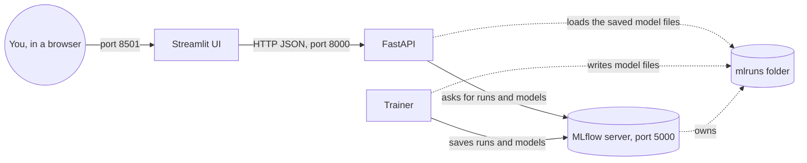
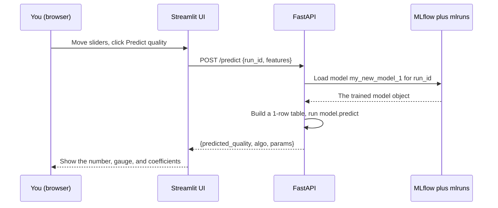
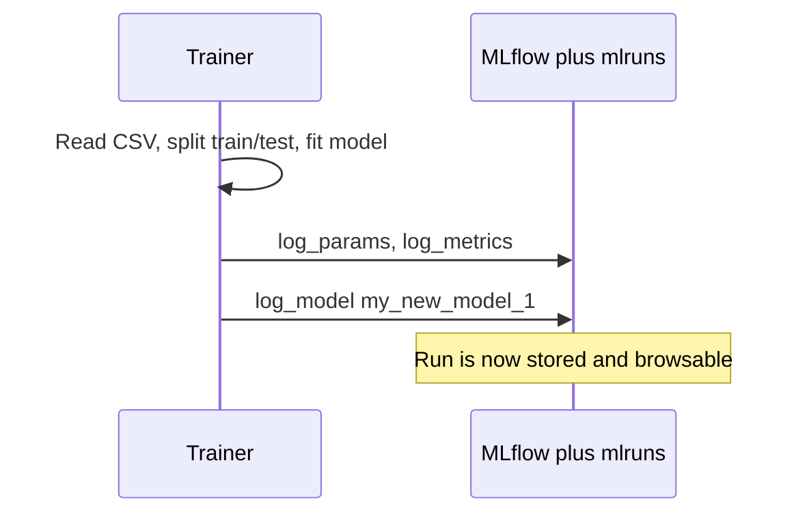

# Wine Quality MLOps - Complete Beginner Guide (A to Z)

> This document explains **everything** about this project, from the very first
> concept to running the whole application. It is written for a **complete
> beginner**. No prior knowledge of Machine Learning, Docker, or web APIs is
> assumed. Every term is defined the first time it appears.

---

## Table of contents

1. [What is this project, in one paragraph?](#1-what-is-this-project-in-one-paragraph)
2. [The big picture: what is MLOps?](#2-the-big-picture-what-is-mlops)
3. [Key vocabulary (glossary)](#3-key-vocabulary-glossary)
4. [The four services and how they talk to each other](#4-the-four-services-and-how-they-talk-to-each-other)
5. [The dataset: red wine quality](#5-the-dataset-red-wine-quality)
6. [Machine Learning basics you need](#6-machine-learning-basics-you-need)
7. [The three models: Ridge, Lasso, ElasticNet](#7-the-three-models-ridge-lasso-elasticnet)
8. [Docker and Docker Compose explained](#8-docker-and-docker-compose-explained)
9. [Project structure: every file explained](#9-project-structure-every-file-explained)
10. [The MLflow service (tracking server)](#10-the-mlflow-service-tracking-server)
11. [The trainer service (train.py line by line)](#11-the-trainer-service-trainpy-line-by-line)
12. [The API service (FastAPI, main.py line by line)](#12-the-api-service-fastapi-mainpy-line-by-line)
13. [The UI service (Streamlit, app.py explained)](#13-the-ui-service-streamlit-apppy-explained)
14. [How to run the project step by step](#14-how-to-run-the-project-step-by-step)
15. [Using the Streamlit interface, tab by tab](#15-using-the-streamlit-interface-tab-by-tab)
16. [Using the API directly](#16-using-the-api-directly)
17. [How data flows through the whole system](#17-how-data-flows-through-the-whole-system)
18. [Troubleshooting](#18-troubleshooting)
19. [Frequently asked questions](#19-frequently-asked-questions)
20. [Going further](#20-going-further)

---

## 1. What is this project, in one paragraph?

This project takes a table of **red wines**. For each wine we know 11 chemical
measurements (like how much alcohol it contains, how acidic it is, etc.) and a
**quality score** given by human tasters (a number from 3 to 8). We teach a
computer program to **predict the quality score** from the 11 measurements.
Then we wrap everything in a small system that a beginner can click through in
a web browser: you move sliders to describe a wine, press a button, and the
system tells you the predicted quality. Along the way, the project shows you the
**professional tools** used in the real world to organize this kind of work:
Docker, MLflow, FastAPI, and Streamlit.

---

## 2. The big picture: what is MLOps?

**ML** means **Machine Learning**: teaching a computer to find patterns in data
instead of programming every rule by hand.

**Ops** comes from **Operations**: everything needed to actually *run* software
reliably (installing it, starting it, monitoring it, updating it).

**MLOps** = **Machine Learning + Operations**. It is the set of practices and
tools that take a Machine Learning model from "it works on my laptop" to "it
runs as a real, reproducible service that other people and programs can use".

A typical MLOps cycle has these stages, and this project shows each of them:

| Stage | Question it answers | In this project |
| --- | --- | --- |
| Data | What do we learn from? | `data/red-wine-quality.csv` |
| Training | How do we build the model? | `trainer/train.py` |
| Tracking | How do we remember every experiment? | MLflow server |
| Serving | How do other programs use the model? | FastAPI (`api/`) |
| Interface | How does a human use it? | Streamlit (`ui/`) |
| Packaging | How do we run it anywhere? | Docker + Docker Compose |

The most important idea of MLOps in this project: **the person who trains the
model and the program that uses the model are separated**. Training happens once
(the `trainer`), the result is stored (MLflow), and serving happens continuously
(the `api`). This separation is exactly how real companies work.

---

## 3. Key vocabulary (glossary)

Read this once, then refer back to it whenever a word is unclear.

- **Dataset**: a table of data. Rows are examples (here, wines), columns are
  measurements.
- **Feature**: one input column used to make a prediction (e.g. `alcohol`).
- **Target** (or **label**): the column we try to predict (here, `quality`).
- **Model**: a mathematical formula whose numbers ("coefficients") are adjusted
  so that it predicts the target from the features.
- **Training** (or **fitting**): the process of adjusting the model's numbers
  using known examples.
- **Prediction** (or **inference**): using a trained model on new data to get an
  answer.
- **Hyperparameter**: a setting you choose *before* training that changes how
  training behaves (e.g. `alpha`). It is not learned from data.
- **Metric**: a number that measures how good a model is (e.g. RMSE).
- **Run**: one single training attempt with one set of hyperparameters. MLflow
  stores one "run" per attempt.
- **Experiment**: a named group of runs. Here we have one experiment per model
  family (ElasticNet, Ridge, Lasso).
- **Artifact**: a file produced by a run and saved by MLflow (e.g. the saved
  model file).
- **API** (Application Programming Interface): a way for one program to ask
  another program to do something, usually over HTTP.
- **Endpoint**: one specific URL of an API that does one specific thing
  (e.g. `/predict`).
- **HTTP**: the protocol web browsers and APIs use to exchange messages.
- **JSON**: a simple text format to represent data (used by our API).
- **Container**: a lightweight, isolated box that contains a program and
  everything it needs to run. Created with Docker.
- **Image**: the frozen "recipe" from which containers are created.
- **Bind mount / volume**: a way to share a folder between your computer and a
  container so that files survive when the container stops.

---

## 4. The four services and how they talk to each other

A **service** here means one running program, living in its own container. This
project has four of them.



- **MLflow** (`mlflow` service, port 5000): the memory of the project. It stores
  every run, its metrics, and the saved models. It has its own web page.
- **Trainer** (`trainer` service): runs once, trains 9 models, and sends them to
  MLflow. Then it stops.
- **API** (`api` service, port 8000): stays running. It reads models from MLflow
  and answers prediction requests.
- **UI** (`ui` service, port 8501): stays running. It is the web page you click
  through. It only talks to the API, never directly to MLflow.

Why so many pieces? Because in the real world each of these responsibilities is
handled by a different team or system. Keeping them separate makes each one
simple, replaceable, and testable.

---

## 5. The dataset: red wine quality

The file is `data/red-wine-quality.csv`. `CSV` means "Comma-Separated Values": a
plain text table where each line is a row and columns are separated by commas.

It contains about **1599 red wines**. Each wine has **11 features** plus the
**target** `quality`.

| Column | Meaning (simple) |
| --- | --- |
| `fixed acidity` | Non-evaporating acids (tartaric acid). |
| `volatile acidity` | Vinegar-like acids; too much tastes bad. |
| `citric acid` | Adds freshness. |
| `residual sugar` | Sugar left after fermentation. |
| `chlorides` | Amount of salt. |
| `free sulfur dioxide` | Free SO2, protects wine from microbes. |
| `total sulfur dioxide` | Total SO2 (free + bound). |
| `density` | How heavy the liquid is vs water. |
| `pH` | How acidic (low) or basic (high). |
| `sulphates` | Additive linked to SO2 levels. |
| `alcohol` | Percentage of alcohol. |
| `quality` | **Target**: taster score, integer from 3 to 8. |

The task is a **regression**: predicting a number (quality) rather than a
category. Even though quality is a whole number in the data, our models output a
decimal like `5.06`, which we read as "a bit above average".

---

## 6. Machine Learning basics you need

### 6.1 Linear regression in plain words

Imagine you believe quality can be estimated by a weighted sum of the features:

```
quality = b0
        + b1 * (fixed acidity)
        + b2 * (volatile acidity)
        + ...
        + b11 * (alcohol)
```

Each `b` is a **coefficient** (a weight). `b0` is the **intercept** (a base
value). Training means finding the `b` values that make the formula match the
known wines as closely as possible.

Written compactly, with `y` the target and `X` the features:

$$\hat{y} = \beta_0 + \beta_1 x_1 + \dots + \beta_{11} x_{11}$$

The hat on `y` means "predicted", to distinguish it from the true value.

### 6.2 How "closeness" is measured

We measure the mistake with the **error** = (true quality) - (predicted
quality). Training minimizes the total squared error across all wines. Squaring
makes big mistakes count more and keeps everything positive.

### 6.3 Overfitting and regularization

If a model has too much freedom, it can **memorize** the training wines instead
of learning general rules. This is called **overfitting**: great on known data,
bad on new data.

**Regularization** fights overfitting by adding a penalty for large
coefficients. This keeps the model simpler. The strength of that penalty is the
hyperparameter **alpha**:

- Small `alpha` -> weak penalty -> model can be complex (risk of overfitting).
- Large `alpha` -> strong penalty -> model is simpler (risk of underfitting).

### 6.4 Train/test split

Before training, the data is split in two: a **training set** (to fit the model)
and a **test set** (to check it on data it has never seen). This is how we get an
honest measure of quality. In `train.py` this is done with
`train_test_split(data)`.

### 6.5 The metrics used here

- **RMSE** (Root Mean Squared Error): the typical size of the error, in quality
  points. Lower is better. `RMSE = 0.66` means predictions are off by about
  0.66 points on average.
- **MAE** (Mean Absolute Error): the average absolute error. Lower is better.
  Less sensitive to rare huge mistakes than RMSE.
- **R2** (R-squared): the fraction of the variation in quality that the model
  explains, from 0 to 1. Higher is better. `R2 = 0.38` means the model explains
  38% of the variation.

---

## 7. The three models: Ridge, Lasso, ElasticNet

All three are linear regressions **with regularization**. They differ only in
the *shape* of the penalty they add.

### 7.1 Ridge (L2 penalty)

$$\min_{\beta}\ \lVert y - X\beta \rVert_2^2 \ +\ \alpha \lVert \beta \rVert_2^2$$

- Penalizes the **sum of squared** coefficients.
- Shrinks all coefficients toward zero but never exactly to zero.
- Best when many features are correlated with each other.

### 7.2 Lasso (L1 penalty)

$$\min_{\beta}\ \lVert y - X\beta \rVert_2^2 \ +\ \alpha \lVert \beta \rVert_1$$

- Penalizes the **sum of absolute values** of coefficients.
- Can push some coefficients to **exactly zero**, effectively removing those
  features. This is automatic **feature selection**.

### 7.3 ElasticNet (L1 + L2)

$$\min_{\beta}\ \lVert y - X\beta \rVert_2^2 \ +\ \alpha \big( \rho \lVert \beta \rVert_1 + (1-\rho)\lVert \beta \rVert_2^2 \big)$$

- A mix of Ridge and Lasso. The mix ratio is `l1_ratio` (written as rho).
- `l1_ratio = 0` behaves like Ridge, `l1_ratio = 1` behaves like Lasso.

### 7.4 What the project actually observes

When you run the project, Ridge usually wins on this dataset (lowest RMSE,
around 0.66), while ElasticNet and Lasso with the chosen `alpha` values behave
worse (RMSE around 0.83). This is a great teaching moment: **the best model
depends on the data and the hyperparameters**, which is exactly why we track and
compare many runs.

---

## 8. Docker and Docker Compose explained

### 8.1 The problem Docker solves

Software needs a specific environment: a certain Python version, certain
libraries, certain settings. "It works on my machine" is a famous problem: code
that runs for one person fails for another because their environments differ.

**Docker** solves this by packaging a program together with its entire
environment into a **container**. A container runs the same way on any computer
that has Docker.

### 8.2 Images vs containers

- An **image** is a read-only recipe: "start from Python 3.12, install these
  libraries, copy this code". Images are built from a `Dockerfile`.
- A **container** is a running instance created from an image. You can start,
  stop, and delete containers freely; the image stays.

### 8.3 Reading a Dockerfile

Here is the trainer's `Dockerfile` with every line explained:

```dockerfile
FROM python:3.12-slim
WORKDIR /code
COPY requirements.txt .
RUN pip install --no-cache-dir --timeout=120 --retries=10 -r requirements.txt
COPY train.py .
ENTRYPOINT ["python", "train.py"]
```

- `FROM python:3.12-slim`: start from a small official image that already has
  Python 3.12.
- `WORKDIR /code`: from now on, work inside the `/code` folder in the container.
- `COPY requirements.txt .`: copy the list of libraries into the image.
- `RUN pip install ...`: install those libraries. The `--timeout=120
  --retries=10` options make installation survive a slow or flaky internet
  connection (we added these after real network timeouts).
- `COPY train.py .`: copy the training script into the image.
- `ENTRYPOINT ["python", "train.py"]`: when a container starts, run this command
  by default.

### 8.4 What is Docker Compose?

Running four containers by hand, wiring their network and ports, would be
tedious and error-prone. **Docker Compose** lets you describe all services in
one file, `docker-compose.yml`, and start them with a single command.

Key concepts inside `docker-compose.yml`:

- `services:` lists each container to run (`mlflow`, `trainer`, `api`, `ui`).
- `build:` says which folder's `Dockerfile` to build.
- `ports: - "8000:8000"` maps a port: `HOST:CONTAINER`. It makes the container's
  port 8000 reachable at `localhost:8000` on your machine.
- `volumes:` shares folders between your machine and the container so data
  survives restarts (e.g. `./mlruns:/mlflow/mlruns`).
- `environment:` sets configuration values inside the container (e.g.
  `MLFLOW_TRACKING_URI`).
- `networks:` puts services on a shared private network so they can find each
  other **by name** (the API reaches MLflow at `http://mlflow:5000`).
- `depends_on:` controls start order (the API waits until MLflow is healthy).
- `healthcheck:` a small test Docker runs repeatedly to know if a service is
  ready.

### 8.5 The most useful commands

```bash
docker compose up -d --build <service>   # build then start in the background
docker compose run --rm <service>        # run a one-shot service, then remove it
docker compose ps                        # list running services and their state
docker compose logs <service>            # show the output (logs) of a service
docker compose down                      # stop and remove containers
docker compose down -v                   # also remove named volumes (data reset)
```

`-d` means "detached" (run in the background). `--build` forces a rebuild if the
code or Dockerfile changed. `--rm` removes the one-shot container after it exits.

---

## 9. Project structure: every file explained

```text
14-.../
├── README.md                 <- original chapter readme
├── docker-compose.yml        <- defines the 4 services (mlflow, trainer, api, ui)
├── data/
│   └── red-wine-quality.csv  <- the dataset
├── mlflow/
│   └── Dockerfile            <- image for the MLflow tracking server
├── trainer/
│   ├── Dockerfile            <- image for the training job
│   ├── requirements.txt      <- Python libraries for training
│   └── train.py              <- the training script
├── api/
│   ├── Dockerfile            <- image for the FastAPI service
│   ├── requirements.txt      <- Python libraries for the API
│   └── main.py               <- the API code (endpoints)
├── ui/
│   ├── Dockerfile            <- image for the Streamlit app
│   ├── requirements.txt      <- Python libraries for the UI
│   ├── app.py                <- the Streamlit app (5 tabs)
│   └── pages_content.py      <- long educational texts
├── database/                 <- created at run time: MLflow's SQLite database
├── mlruns/                   <- created at run time: saved models and artifacts
└── documentation/
    └── 01-complete-guide.md  <- this document
```

Two folders are created automatically the first time you run the project:

- `database/` holds `mlflow.db`, a small **SQLite** database file. SQLite is a
  database that lives in a single file. MLflow stores here the list of
  experiments, runs, parameters, and metrics.
- `mlruns/` holds the **artifacts**: the actual saved model files and any files
  logged during a run. This folder is shared with the trainer and the API so
  everyone sees the same models.

---

## 10. The MLflow service (tracking server)

### 10.1 What MLflow is

**MLflow** is an open-source tool that records Machine Learning experiments. Its
job in this project: every time we train a model, MLflow remembers the
hyperparameters used, the metrics obtained, and the saved model file. It also
gives us a web page (at `http://localhost:5000`) to browse and compare
everything.

### 10.2 The MLflow Dockerfile

```dockerfile
FROM python:3.12-slim
WORKDIR /mlflow
RUN pip install --no-cache-dir mlflow==2.16.2
EXPOSE 5000
CMD ["mlflow", "server", \
     "--backend-store-uri", "sqlite:///database/mlflow.db", \
     "--default-artifact-root", "/mlflow/mlruns", \
     "--host", "0.0.0.0", "--port", "5000"]
```

- `--backend-store-uri sqlite:///database/mlflow.db`: store experiment metadata
  (runs, params, metrics) in a SQLite file at `database/mlflow.db`.
- `--default-artifact-root /mlflow/mlruns`: store artifact files (the saved
  models) under `/mlflow/mlruns`.
- `--host 0.0.0.0`: listen on all network interfaces so other containers can
  reach it.
- `EXPOSE 5000` and `--port 5000`: use port 5000.

### 10.3 Important detail about artifacts (a real bug we fixed)

With `--default-artifact-root` set to a **local path**, it is the **client**
(the trainer, or the API) that reads and writes the artifact files directly on
that path. Therefore every container that logs or loads a model must see the
same `mlruns` folder.

At first, only the `mlflow` and `api` services mounted `./mlruns`. The
`trainer` did not, so it wrote model files inside its own temporary container
and they were lost when the container was removed with `--rm`. The prediction
then failed with `No such file or directory: .../my_new_model_1`.

The fix was to mount `./mlruns` into the `trainer` too, so all three services
share the same artifact storage:

```yaml
  trainer:
    volumes:
      - ./data:/code/data
      - ./mlruns:/mlflow/mlruns   # <-- the fix: share artifacts
```

This is a very common real-world MLOps mistake, and a good lesson: **the model
files must live somewhere every service can reach.**

---

## 11. The trainer service (train.py line by line)

The training script lives in `trainer/train.py`. Here is what it does, section
by section.

### 11.1 Imports and setup

```python
import mlflow
import mlflow.sklearn
import numpy as np
import pandas as pd
from sklearn.linear_model import ElasticNet, Lasso, Ridge
from sklearn.metrics import mean_absolute_error, mean_squared_error, r2_score
from sklearn.model_selection import train_test_split
```

- `pandas` reads and manipulates the CSV table.
- `numpy` does math on numbers and arrays.
- `scikit-learn` (`sklearn`) provides the three models and the metrics.
- `mlflow` records everything.

### 11.2 Reading command-line arguments

```python
parser.add_argument("--alpha", type=float, required=False, default=0.7)
parser.add_argument("--l1_ratio", type=float, required=False, default=0.7)
```

You can change the hyperparameters when you start the trainer, for example:

```bash
docker compose run --rm trainer --alpha 0.3 --l1_ratio 0.5
```

If you pass nothing, it uses `alpha=0.7` and `l1_ratio=0.7`.

### 11.3 The metric helper

```python
def eval_metrics(actual, pred):
    rmse = np.sqrt(mean_squared_error(actual, pred))
    mae = mean_absolute_error(actual, pred)
    r2 = r2_score(actual, pred)
    return rmse, mae, r2
```

Given the true values and the predictions, it computes RMSE, MAE, and R2.

### 11.4 Model factories

```python
def make_elasticnet(alpha, l1_ratio):
    return (ElasticNet(alpha=alpha, l1_ratio=l1_ratio, random_state=42),
            {"alpha": alpha, "l1_ratio": l1_ratio})
```

A "factory" is a small function that builds a model and returns it together with
the parameters we want to record. There is one factory per model family. Note
that Ridge and Lasso ignore `l1_ratio` (only ElasticNet uses it).

### 11.5 Training one run

```python
def train_one_run(run_name, factory, alpha, l1_ratio, ...):
    mlflow.start_run(run_name=run_name)
    mlflow.set_tags(COMMON_TAGS)
    estimator, params_to_log = factory(alpha, l1_ratio)
    estimator.fit(train_x, train_y)          # <-- actual training
    preds = estimator.predict(test_x)        # <-- predictions on test set
    rmse, mae, r2 = eval_metrics(test_y, preds)
    mlflow.log_params(params_to_log)         # record hyperparameters
    mlflow.log_metrics({"rmse": rmse, "r2": r2, "mae": mae})  # record scores
    mlflow.sklearn.log_model(estimator, "my_new_model_1")     # save the model
    mlflow.log_artifacts("data/")            # also save the data folder
    mlflow.end_run()
```

`mlflow.start_run` / `mlflow.end_run` mark the beginning and end of one recorded
attempt. `estimator.fit(...)` is where the model actually learns. The saved
model is named `my_new_model_1`; the API uses exactly this name to load it back.

### 11.6 The main loop: 3 experiments x 3 alphas = 9 runs

```python
EXPERIMENTS = [
    ("exp_multi_EL",    make_elasticnet),
    ("exp_multi_Ridge", make_ridge),
    ("exp_multi_Lasso", make_lasso),
]
ALPHAS = [args.alpha, 0.9, 0.4]

for exp_name, factory in EXPERIMENTS:
    exp = mlflow.set_experiment(experiment_name=exp_name)
    for i, alpha in enumerate(ALPHAS, start=1):
        train_one_run(run_name=f"run{i}.1", factory=factory, alpha=alpha, ...)
```

For each of the three model families, it creates a named experiment and trains
three models (with `alpha` values `0.7`, `0.9`, `0.4` by default). That is **9
runs total**, all stored in MLflow.

### 11.7 What you see when it runs

The script prints each run's metrics, for example:

```text
========== Experiment: exp_multi_Ridge ==========
  >>> run3.1  Ridge({'alpha': 0.4})  RMSE=0.6612  MAE=0.5081  R2=0.3805
```

After it finishes, the `trainer` container exits. That is normal: training is a
one-shot job.

---

## 12. The API service (FastAPI, main.py line by line)

### 12.1 What FastAPI is

**FastAPI** is a Python library to build web APIs quickly. It also generates an
interactive documentation page automatically, available at
`http://localhost:8000/docs`. **Uvicorn** is the server that actually runs the
FastAPI app.

### 12.2 Configuration at the top of the file

```python
TRACKING_URI = os.getenv("MLFLOW_TRACKING_URI", "http://mlflow:5000")
DATA_PATH = os.getenv("DATA_PATH", "data/red-wine-quality.csv")
MODEL_ARTIFACT_NAME = os.getenv("MODEL_ARTIFACT_NAME", "my_new_model_1")
mlflow.set_tracking_uri(TRACKING_URI)
```

- It reads the MLflow address from the environment (set in `docker-compose.yml`
  to `http://mlflow:5000`).
- `MODEL_ARTIFACT_NAME` is `my_new_model_1`, matching the name used by the
  trainer.

### 12.3 The feature name mapping

The CSV columns contain spaces (e.g. `fixed acidity`), but JSON keys are nicer
without spaces (`fixed_acidity`). The API keeps a dictionary that translates
between the two, so requests can use clean names while the model still receives
the exact column names it was trained on.

### 12.4 Caching models for speed

```python
@lru_cache(maxsize=16)
def load_model(run_id: str):
    model_uri = f"runs:/{run_id}/{MODEL_ARTIFACT_NAME}"
    return mlflow.pyfunc.load_model(model_uri)
```

`@lru_cache` remembers the last few loaded models in memory, so the API does not
reload the same model from disk on every request. `runs:/<run_id>/...` is
MLflow's way of naming a saved model by the run that produced it.

### 12.5 The endpoints (what the API can do)

| Method + path | What it returns |
| --- | --- |
| `GET /health` | Whether MLflow is reachable and how many experiments exist. |
| `GET /experiments` | The list of experiments with how many runs each has. |
| `GET /runs?experiment_name=...` | All runs of one experiment, sorted by RMSE. |
| `GET /features` | For each feature: min, max, mean, std, median (for sliders). |
| `GET /presets` | Median wine profile for each quality level (for quick fills). |
| `GET /model/{run_id}/coefficients` | The linear coefficients of one model. |
| `POST /predict` | Predicts quality from a `run_id` and 11 feature values. |

### 12.6 A closer look at /predict

```python
@app.post("/predict", response_model=PredictResponse)
def predict(request: PredictRequest) -> PredictResponse:
    model = load_model(request.run_id)          # load (or reuse) the model
    feature_dict = request.features.model_dump()
    row = {column: feature_dict[api_key] for api_key, column in API_KEY_TO_COLUMN.items()}
    frame = pd.DataFrame([row], columns=FEATURE_COLUMNS)  # one-row table
    prediction = model.predict(frame)           # run the model
    value = float(prediction[0])
    ...
    return PredictResponse(predicted_quality=round(value, 4), run_id=..., algo=..., params=...)
```

Step by step: it loads the chosen model, builds a one-row table with the 11
features (using the exact column names), asks the model to predict, and returns
the predicted quality plus which algorithm and parameters were used.

### 12.7 Input validation with Pydantic

FastAPI uses **Pydantic** models (`WineFeatures`, `PredictRequest`) to
automatically check that incoming JSON has the right fields and types. If a
field is missing or of the wrong type, FastAPI returns a clear error instead of
crashing.

---

## 13. The UI service (Streamlit, app.py explained)

### 13.1 What Streamlit is

**Streamlit** turns a Python script into an interactive web page. You write
normal Python (with `st.slider`, `st.button`, `st.plotly_chart`, ...) and
Streamlit renders it as a UI in the browser at `http://localhost:8501`.

### 13.2 Golden rule of this UI

The UI **only talks to the API**. It never imports MLflow or scikit-learn. This
mirrors real systems where the front-end and the model server are separate.
All communication happens through small helper functions:

```python
def api_get(path, **params): ...    # sends an HTTP GET to the API
def api_post(path, payload): ...    # sends an HTTP POST to the API
```

Results are cached with `@st.cache_data` so the page stays fast.

### 13.3 The sidebar

On the left you find: the API URL (default `http://api:8000`), a "Refresh data"
button that clears the cache, a live health badge (green if API + MLflow are
OK), and a reminder of the start-up commands.

### 13.4 The five tabs

1. **Home**: overview, a diagram of the MLOps flow, and three key numbers
   (experiments, runs, best RMSE).
2. **Data exploration**: preview of the data, statistics, histograms, a
   correlation matrix, and boxplots by quality.
3. **Theory**: the math of Ridge/Lasso/ElasticNet and an interactive
   bias-variance illustration.
4. **MLflow comparison**: a sortable table of all 9 runs, a bar chart of RMSE,
   a radar chart of the champions, and the automatically selected global
   champion (lowest RMSE).
5. **Prediction**: 11 sliders, quality presets, a model selector (pre-filled
   with the champion), a predict button, a gauge showing the result, and a bar
   chart of the model's coefficients.

### 13.5 Session state links the tabs

When the comparison tab finds the champion run, it stores its id in
`st.session_state["champion_run_id"]`. The prediction tab reads it to
pre-select the best model. This is how Streamlit remembers values between
interactions.

---

## 14. How to run the project step by step

> Prerequisite: **Docker Desktop** installed and running. You do NOT need Python
> installed on your machine; everything runs inside containers.

### Step 0. Open a terminal in the project folder

Open PowerShell (Windows) or a terminal (macOS/Linux) and move into the chapter
folder (the one that contains `docker-compose.yml`).

### Step 1. Start the MLflow server

```bash
docker compose up -d --build mlflow
```

Wait a few seconds, then check it is healthy:

```bash
docker compose ps
```

You should see `mlflow-recap-11 ... Up ... (healthy)`. Open
`http://localhost:5000` in your browser: MLflow's page appears, empty for now.

### Step 2. Train the models (creates 9 runs)

```bash
docker compose run --rm trainer
```

This prints the metrics of each run and then exits. Refresh
`http://localhost:5000`: you now see three experiments (`exp_multi_EL`,
`exp_multi_Ridge`, `exp_multi_Lasso`), each with 3 runs.

### Step 3. Start the API and the UI

```bash
docker compose up -d --build api ui
```

### Step 4. Open the interface

- Streamlit UI: `http://localhost:8501`
- API documentation (Swagger): `http://localhost:8000/docs`
- MLflow: `http://localhost:5000`

### Step 5. Stop everything when finished

```bash
docker compose down        # stop containers, keep the database and models
docker compose down -v     # also remove named volumes
```

> Note about slow internet: the Dockerfiles use `pip install --timeout=120
> --retries=10`. If a build still fails with a network error, simply run the
> same command again; it usually succeeds on the second or third try.

---

## 15. Using the Streamlit interface, tab by tab

### 15.1 Home

Read the introduction, look at the flow diagram, and check the three metrics.
If "Recorded runs" is 0, you forgot Step 2 (training). Go run the trainer and
click "Refresh data" in the sidebar.

### 15.2 Data exploration

- Use the dropdown to pick a variable and see its histogram.
- Read the correlation matrix: numbers near +1 or -1 are strong links.
- Look at the boxplots: for example, higher `alcohol` usually goes with higher
  quality.

### 15.3 Theory

Open each expander to read the math. Move the `alpha` slider to see the
bias-variance idea: the total error curve has a minimum, which is the sweet
spot for `alpha`.

### 15.4 MLflow comparison

- The table lists all 9 runs sorted by RMSE (best at the top).
- The green banner names the global champion.
- The bar chart compares RMSE across algorithms and alphas.
- The radar chart compares the best model of each family on all three metrics.

### 15.5 Prediction

1. (Optional) Click a **preset** button such as "Quality 5 (681 wines)" to fill
   the sliders with a typical wine of that quality.
2. Adjust the 11 sliders as you like.
3. Choose a **model** (it defaults to the champion).
4. Click **Predict quality**.
5. Read the predicted number and the gauge, and inspect the coefficients chart
   to understand which features pushed the result up or down.

---

## 16. Using the API directly

You can use the API without the UI, which is great for learning how APIs work.

### 16.1 With the browser (Swagger)

Open `http://localhost:8000/docs`. You will see every endpoint with a "Try it
out" button. This is the easiest way to experiment.

### 16.2 With curl (command line)

Check health:

```bash
curl http://localhost:8000/health
```

List experiments:

```bash
curl http://localhost:8000/experiments
```

Make a prediction (replace `RUN_ID` with a real run id from `/runs`):

```bash
curl -X POST http://localhost:8000/predict \
  -H "Content-Type: application/json" \
  -d '{"run_id":"RUN_ID","features":{"fixed_acidity":7.4,"volatile_acidity":0.7,"citric_acid":0.0,"residual_sugar":1.9,"chlorides":0.076,"free_sulfur_dioxide":11,"total_sulfur_dioxide":34,"density":0.9978,"ph":3.51,"sulphates":0.56,"alcohol":9.4}}'
```

A typical answer:

```json
{"predicted_quality": 5.06, "run_id": "RUN_ID", "algo": "Ridge", "params": {"alpha": "0.4"}}
```

> On Windows PowerShell, quoting JSON on one line is tricky. The simplest method
> is to use the Swagger page at `/docs`, or save the JSON to a file and use
> `curl.exe --data "@file.json"`.

---

## 17. How data flows through the whole system

Follow one prediction from your click to the answer:



And here is how a model got there in the first place:



---

## 18. Troubleshooting

**"No run found" in the UI / empty MLflow page.**
You have not trained yet. Run `docker compose run --rm trainer`, then click
"Refresh data" in the Streamlit sidebar.

**Prediction fails with "No such file or directory: .../my_new_model_1".**
The artifact folder is not shared with every service. Make sure the `trainer`
and `api` services both mount `./mlruns:/mlflow/mlruns` in `docker-compose.yml`.
If the database still points to old, lost models, reset with a clean run:

```bash
docker compose down
# delete the old database file and the empty mlruns content, then:
docker compose up -d mlflow
docker compose run --rm trainer
docker compose up -d api ui
```

**Build fails with `Read timed out` or `Name or service not known`.**
This is a slow or flaky internet connection to PyPI, not a code error. Just run
the same `docker compose ... --build ...` command again. The Dockerfiles already
retry downloads with a long timeout.

**"API unreachable" in the sidebar.**
The `api` service is not running or not ready. Check with `docker compose ps`
and `curl http://localhost:8000/health`. Inside Docker, the UI reaches the API
at `http://api:8000` (the service name), which is the default.

**Port already in use (5000, 8000, or 8501).**
Another program uses that port. Stop it, or change the host side of the port
mapping in `docker-compose.yml` (e.g. `"8502:8501"`).

**MLflow warns "Failed to import Git ...".**
Harmless. It only means Git is not installed in the container; MLflow simply
does not record a Git commit id. Training still works.

---

## 19. Frequently asked questions

**Do I need to know Python to run this?**
No. To *run* it you only need Docker. To *modify* it, basic Python helps.

**Why are there 9 runs?**
Three model families times three `alpha` values = 9 runs, so you can compare
them fairly.

**Why does the predicted quality have decimals when the data is integers?**
Because regression outputs a continuous estimate. `5.06` means "slightly above
average". You could round it if you wanted a whole number.

**Can I change the hyperparameters?**
Yes: `docker compose run --rm trainer --alpha 0.2 --l1_ratio 0.4`. Then refresh
the UI to see the new runs.

**Where are my trained models stored?**
Metadata (params, metrics) in `database/mlflow.db`; the model files in
`mlruns/`. Both folders are on your machine and survive `docker compose down`.

**Is the UI doing the Machine Learning?**
No. The UI only draws charts and calls the API. The API loads models from
MLflow. The trainer created those models. Each part has one job.

---

## 20. Going further

Ideas to deepen your understanding once the project runs:

- **Try new hyperparameters** and watch the champion change in the comparison
  tab.
- **Add a new model family** (for example `LinearRegression` with no penalty)
  in `train.py` and see how it compares.
- **Log a model signature** to silence the MLflow warning and make the saved
  model self-describing.
- **Add an endpoint** to the API, such as batch prediction from an uploaded CSV.
- **Replace the local artifact storage** with MLflow's artifact proxy
  (`--serve-artifacts`) so clients no longer need to share the `mlruns` folder.
- **Add automated tests** for the API using `pytest` and FastAPI's test client.

You now understand, from A to Z, what every part of this project does and why.
Congratulations, and enjoy experimenting.
