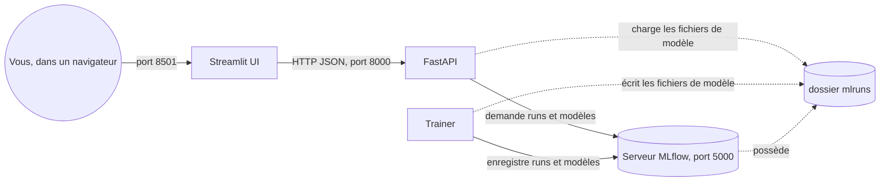
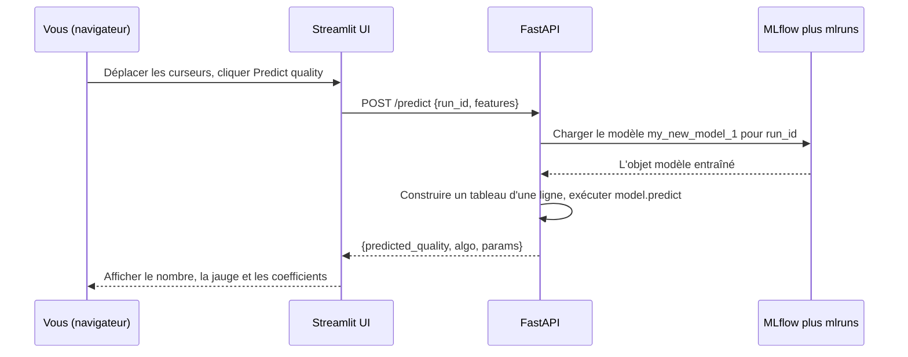
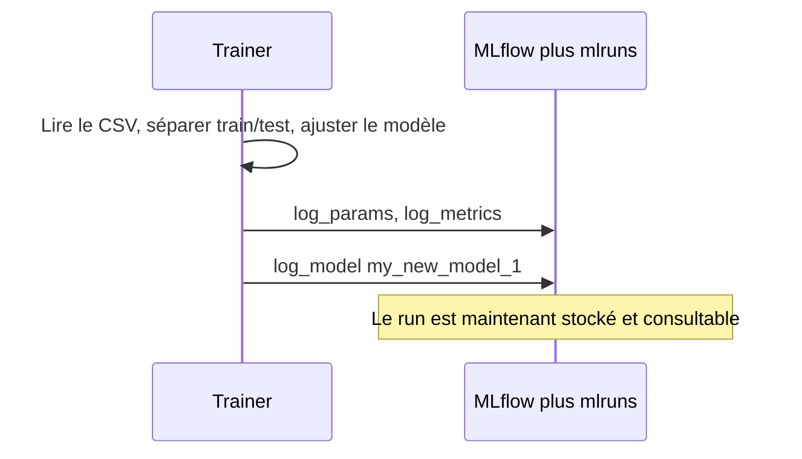

# Wine Quality MLOps - Guide complet pour débutant (de A à Z)

> Ce document explique **tout** sur ce projet, du tout premier concept jusqu'à
> l'exécution complète de l'application. Il est écrit pour un **grand
> débutant**. Aucune connaissance préalable en Machine Learning, Docker ou API
> web n'est supposée. Chaque terme est défini la première fois qu'il apparaît.

---

## Table des matières

1. [C'est quoi ce projet, en un paragraphe ?](#1-cest-quoi-ce-projet-en-un-paragraphe)
2. [La vue d'ensemble : c'est quoi le MLOps ?](#2-la-vue-densemble-cest-quoi-le-mlops)
3. [Vocabulaire clé (glossaire)](#3-vocabulaire-clé-glossaire)
4. [Les quatre services et comment ils se parlent](#4-les-quatre-services-et-comment-ils-se-parlent)
5. [Le jeu de données : la qualité du vin rouge](#5-le-jeu-de-données-la-qualité-du-vin-rouge)
6. [Les bases du Machine Learning](#6-les-bases-du-machine-learning)
7. [Les trois modèles : Ridge, Lasso, ElasticNet](#7-les-trois-modèles-ridge-lasso-elasticnet)
8. [Docker et Docker Compose expliqués](#8-docker-et-docker-compose-expliqués)
9. [Structure du projet : chaque fichier expliqué](#9-structure-du-projet-chaque-fichier-expliqué)
10. [Le service MLflow (serveur de suivi)](#10-le-service-mlflow-serveur-de-suivi)
11. [Le service trainer (train.py ligne par ligne)](#11-le-service-trainer-trainpy-ligne-par-ligne)
12. [Le service API (FastAPI, main.py ligne par ligne)](#12-le-service-api-fastapi-mainpy-ligne-par-ligne)
13. [Le service UI (Streamlit, app.py expliqué)](#13-le-service-ui-streamlit-apppy-expliqué)
14. [Comment lancer le projet étape par étape](#14-comment-lancer-le-projet-étape-par-étape)
15. [Utiliser l'interface Streamlit, onglet par onglet](#15-utiliser-linterface-streamlit-onglet-par-onglet)
16. [Utiliser l'API directement](#16-utiliser-lapi-directement)
17. [Comment les données circulent dans tout le système](#17-comment-les-données-circulent-dans-tout-le-système)
18. [Dépannage](#18-dépannage)
19. [Questions fréquentes](#19-questions-fréquentes)
20. [Aller plus loin](#20-aller-plus-loin)

---

## 1. C'est quoi ce projet, en un paragraphe ?

Ce projet part d'un tableau de **vins rouges**. Pour chaque vin, on connaît 11
mesures chimiques (comme la quantité d'alcool, l'acidité, etc.) et une **note de
qualité** donnée par des dégustateurs humains (un nombre de 3 à 8). On apprend à
un programme informatique à **prédire la note de qualité** à partir des 11
mesures. Ensuite, on emballe le tout dans un petit système qu'un débutant peut
utiliser dans un navigateur web : vous déplacez des curseurs pour décrire un
vin, vous cliquez sur un bouton, et le système vous donne la qualité prédite. Au
passage, le projet vous montre les **outils professionnels** utilisés dans le
monde réel pour organiser ce genre de travail : Docker, MLflow, FastAPI et
Streamlit.

---

## 2. La vue d'ensemble : c'est quoi le MLOps ?

**ML** veut dire **Machine Learning** (apprentissage automatique) : apprendre à
un ordinateur à trouver des motifs dans des données, au lieu de programmer chaque
règle à la main.

**Ops** vient d'**Operations** (exploitation) : tout ce qu'il faut pour vraiment
*faire tourner* un logiciel de façon fiable (l'installer, le démarrer, le
surveiller, le mettre à jour).

**MLOps** = **Machine Learning + Operations**. C'est l'ensemble des pratiques et
des outils qui font passer un modèle de Machine Learning du stade « ça marche sur
mon portable » au stade « ça tourne comme un vrai service reproductible que
d'autres personnes et programmes peuvent utiliser ».

Un cycle MLOps typique comporte ces étapes, et ce projet montre chacune d'elles :

| Étape | Question à laquelle elle répond | Dans ce projet |
| --- | --- | --- |
| Données | À partir de quoi apprend-on ? | `data/red-wine-quality.csv` |
| Entraînement | Comment construit-on le modèle ? | `trainer/train.py` |
| Suivi | Comment mémorise-t-on chaque expérience ? | serveur MLflow |
| Service | Comment les autres programmes utilisent-ils le modèle ? | FastAPI (`api/`) |
| Interface | Comment un humain l'utilise-t-il ? | Streamlit (`ui/`) |
| Emballage | Comment l'exécuter partout ? | Docker + Docker Compose |

L'idée la plus importante du MLOps dans ce projet : **la personne qui entraîne le
modèle et le programme qui utilise le modèle sont séparés**. L'entraînement a
lieu une fois (le `trainer`), le résultat est stocké (MLflow), et le service
tourne en continu (l'`api`). Cette séparation est exactement la façon dont
travaillent les vraies entreprises.

---

## 3. Vocabulaire clé (glossaire)

Lisez ceci une fois, puis revenez-y dès qu'un mot n'est pas clair.

- **Jeu de données (dataset)** : un tableau de données. Les lignes sont des
  exemples (ici, des vins), les colonnes sont des mesures.
- **Variable / caractéristique (feature)** : une colonne d'entrée utilisée pour
  faire une prédiction (par ex. `alcohol`).
- **Cible (target ou label)** : la colonne qu'on cherche à prédire (ici,
  `quality`).
- **Modèle** : une formule mathématique dont les nombres (« coefficients ») sont
  ajustés pour prédire la cible à partir des variables.
- **Entraînement (training)** : le processus d'ajustement des nombres du modèle à
  l'aide d'exemples connus.
- **Prédiction (inference)** : utiliser un modèle entraîné sur de nouvelles
  données pour obtenir une réponse.
- **Hyperparamètre** : un réglage que vous choisissez *avant* l'entraînement et
  qui change la façon dont l'entraînement se déroule (par ex. `alpha`). Il n'est
  pas appris à partir des données.
- **Métrique** : un nombre qui mesure la qualité d'un modèle (par ex. le RMSE).
- **Run (exécution)** : une seule tentative d'entraînement avec un jeu
  d'hyperparamètres donné. MLflow stocke un « run » par tentative.
- **Expérience** : un groupe nommé de runs. Ici, une expérience par famille de
  modèles (ElasticNet, Ridge, Lasso).
- **Artefact** : un fichier produit par un run et sauvegardé par MLflow (par ex.
  le fichier du modèle sauvegardé).
- **API** (Application Programming Interface) : un moyen pour un programme de
  demander à un autre programme de faire quelque chose, en général via HTTP.
- **Endpoint (point d'accès)** : une URL précise de l'API qui fait une chose
  précise (par ex. `/predict`).
- **HTTP** : le protocole que les navigateurs web et les API utilisent pour
  échanger des messages.
- **JSON** : un format texte simple pour représenter des données (utilisé par
  notre API).
- **Conteneur (container)** : une boîte légère et isolée qui contient un
  programme et tout ce dont il a besoin pour tourner. Créé avec Docker.
- **Image** : la « recette » figée à partir de laquelle on crée des conteneurs.
- **Bind mount / volume** : une façon de partager un dossier entre votre
  ordinateur et un conteneur, pour que les fichiers survivent à l'arrêt du
  conteneur.

---

## 4. Les quatre services et comment ils se parlent

Un **service**, ici, signifie un programme en cours d'exécution, vivant dans son
propre conteneur. Ce projet en compte quatre.



- **MLflow** (service `mlflow`, port 5000) : la mémoire du projet. Il stocke
  chaque run, ses métriques et les modèles sauvegardés. Il a sa propre page web.
- **Trainer** (service `trainer`) : tourne une seule fois, entraîne 9 modèles et
  les envoie à MLflow. Puis il s'arrête.
- **API** (service `api`, port 8000) : reste en fonctionnement. Elle lit les
  modèles depuis MLflow et répond aux demandes de prédiction.
- **UI** (service `ui`, port 8501) : reste en fonctionnement. C'est la page web
  que vous parcourez. Elle ne parle qu'à l'API, jamais directement à MLflow.

Pourquoi autant de morceaux ? Parce que, dans le monde réel, chacune de ces
responsabilités est gérée par une équipe ou un système différent. Les garder
séparés rend chacun simple, remplaçable et testable.

---

## 5. Le jeu de données : la qualité du vin rouge

Le fichier est `data/red-wine-quality.csv`. `CSV` signifie « Comma-Separated
Values » (valeurs séparées par des virgules) : un tableau en texte brut où chaque
ligne est une rangée et où les colonnes sont séparées par des virgules.

Il contient environ **1599 vins rouges**. Chaque vin a **11 variables** plus la
**cible** `quality`.

| Colonne | Signification (simple) |
| --- | --- |
| `fixed acidity` | Acides non volatils (acide tartrique). |
| `volatile acidity` | Acides de type vinaigre ; trop, ça a mauvais goût. |
| `citric acid` | Apporte de la fraîcheur. |
| `residual sugar` | Sucre restant après la fermentation. |
| `chlorides` | Quantité de sel. |
| `free sulfur dioxide` | SO2 libre, protège le vin des microbes. |
| `total sulfur dioxide` | SO2 total (libre + lié). |
| `density` | À quel point le liquide est lourd par rapport à l'eau. |
| `pH` | Degré d'acidité (bas) ou de basicité (haut). |
| `sulphates` | Additif lié aux niveaux de SO2. |
| `alcohol` | Pourcentage d'alcool. |
| `quality` | **Cible** : note du dégustateur, entier de 3 à 8. |

La tâche est une **régression** : prédire un nombre (la qualité) plutôt qu'une
catégorie. Même si la qualité est un nombre entier dans les données, nos modèles
produisent un décimal comme `5.06`, qu'on lit comme « un peu au-dessus de la
moyenne ».

---

## 6. Les bases du Machine Learning

### 6.1 La régression linéaire en mots simples

Imaginez que vous pensez que la qualité peut s'estimer par une somme pondérée des
variables :

```
qualité = b0
        + b1 * (fixed acidity)
        + b2 * (volatile acidity)
        + ...
        + b11 * (alcohol)
```

Chaque `b` est un **coefficient** (un poids). `b0` est l'**ordonnée à l'origine**
(intercept, une valeur de base). Entraîner, c'est trouver les valeurs de `b` qui
font coller la formule aux vins connus le mieux possible.

Écrit de façon compacte, avec `y` la cible et `X` les variables :

$$\hat{y} = \beta_0 + \beta_1 x_1 + \dots + \beta_{11} x_{11}$$

Le chapeau sur `y` veut dire « prédit », pour le distinguer de la vraie valeur.

### 6.2 Comment on mesure la « proximité »

On mesure l'erreur = (vraie qualité) - (qualité prédite). L'entraînement
minimise l'erreur totale au carré sur tous les vins. Mettre au carré fait compter
davantage les grosses erreurs et garde tout positif.

### 6.3 Surapprentissage et régularisation

Si un modèle a trop de liberté, il peut **mémoriser** les vins d'entraînement au
lieu d'apprendre des règles générales. C'est le **surapprentissage
(overfitting)** : excellent sur les données connues, mauvais sur les nouvelles.

La **régularisation** combat le surapprentissage en ajoutant une pénalité sur les
grands coefficients. Cela garde le modèle plus simple. La force de cette pénalité
est l'hyperparamètre **alpha** :

- `alpha` petit -> pénalité faible -> modèle possiblement complexe (risque de
  surapprentissage).
- `alpha` grand -> pénalité forte -> modèle plus simple (risque de
  sous-apprentissage).

### 6.4 Séparation entraînement / test

Avant l'entraînement, les données sont coupées en deux : un **ensemble
d'entraînement** (pour ajuster le modèle) et un **ensemble de test** (pour le
vérifier sur des données jamais vues). C'est ainsi qu'on obtient une mesure
honnête de la qualité. Dans `train.py`, cela se fait avec
`train_test_split(data)`.

### 6.5 Les métriques utilisées ici

- **RMSE** (Root Mean Squared Error) : la taille typique de l'erreur, en points
  de qualité. Plus c'est bas, mieux c'est. `RMSE = 0.66` signifie que les
  prédictions se trompent d'environ 0,66 point en moyenne.
- **MAE** (Mean Absolute Error) : l'erreur absolue moyenne. Plus c'est bas, mieux
  c'est. Moins sensible aux rares très grosses erreurs que le RMSE.
- **R2** (R-carré) : la fraction de la variation de la qualité que le modèle
  explique, de 0 à 1. Plus c'est proche de 1, mieux c'est. `R2 = 0.38` signifie
  que le modèle explique 38 % de la variation.

---

## 7. Les trois modèles : Ridge, Lasso, ElasticNet

Les trois sont des régressions linéaires **avec régularisation**. Ils ne
diffèrent que par la *forme* de la pénalité qu'ils ajoutent.

### 7.1 Ridge (pénalité L2)

$$\min_{\beta}\ \lVert y - X\beta \rVert_2^2 \ +\ \alpha \lVert \beta \rVert_2^2$$

- Pénalise la **somme des carrés** des coefficients.
- Rétrécit tous les coefficients vers zéro, mais jamais exactement à zéro.
- Idéal quand beaucoup de variables sont corrélées entre elles.

### 7.2 Lasso (pénalité L1)

$$\min_{\beta}\ \lVert y - X\beta \rVert_2^2 \ +\ \alpha \lVert \beta \rVert_1$$

- Pénalise la **somme des valeurs absolues** des coefficients.
- Peut pousser certains coefficients à **exactement zéro**, ce qui supprime de
  fait ces variables. C'est une **sélection de variables** automatique.

### 7.3 ElasticNet (L1 + L2)

$$\min_{\beta}\ \lVert y - X\beta \rVert_2^2 \ +\ \alpha \big( \rho \lVert \beta \rVert_1 + (1-\rho)\lVert \beta \rVert_2^2 \big)$$

- Un mélange de Ridge et de Lasso. Le ratio du mélange est `l1_ratio` (noté rho).
- `l1_ratio = 0` se comporte comme Ridge, `l1_ratio = 1` comme Lasso.

### 7.4 Ce que le projet observe vraiment

Quand vous lancez le projet, Ridge gagne généralement sur ce jeu de données (RMSE
le plus bas, autour de 0,66), tandis qu'ElasticNet et Lasso avec les valeurs
d'`alpha` choisies se comportent moins bien (RMSE autour de 0,83). C'est une
belle leçon : **le meilleur modèle dépend des données et des hyperparamètres**,
ce qui est exactement pourquoi on suit et compare de nombreux runs.

---

## 8. Docker et Docker Compose expliqués

### 8.1 Le problème que Docker résout

Un logiciel a besoin d'un environnement précis : une certaine version de Python,
certaines bibliothèques, certains réglages. « Ça marche sur ma machine » est un
problème célèbre : du code qui tourne chez une personne échoue chez une autre
parce que leurs environnements diffèrent.

**Docker** résout cela en empaquetant un programme avec tout son environnement
dans un **conteneur**. Un conteneur tourne de la même façon sur n'importe quel
ordinateur qui a Docker.

### 8.2 Images vs conteneurs

- Une **image** est une recette en lecture seule : « pars de Python 3.12,
  installe ces bibliothèques, copie ce code ». Les images sont construites à
  partir d'un `Dockerfile`.
- Un **conteneur** est une instance en cours d'exécution créée à partir d'une
  image. Vous pouvez démarrer, arrêter et supprimer des conteneurs librement ;
  l'image reste.

### 8.3 Lire un Dockerfile

Voici le `Dockerfile` du trainer, avec chaque ligne expliquée :

```dockerfile
FROM python:3.12-slim
WORKDIR /code
COPY requirements.txt .
RUN pip install --no-cache-dir --timeout=120 --retries=10 -r requirements.txt
COPY train.py .
ENTRYPOINT ["python", "train.py"]
```

- `FROM python:3.12-slim` : pars d'une petite image officielle qui a déjà Python
  3.12.
- `WORKDIR /code` : à partir de maintenant, travaille dans le dossier `/code` du
  conteneur.
- `COPY requirements.txt .` : copie la liste des bibliothèques dans l'image.
- `RUN pip install ...` : installe ces bibliothèques. Les options `--timeout=120
  --retries=10` permettent à l'installation de survivre à une connexion internet
  lente ou instable (nous les avons ajoutées après de vrais dépassements de
  délai réseau).
- `COPY train.py .` : copie le script d'entraînement dans l'image.
- `ENTRYPOINT ["python", "train.py"]` : au démarrage d'un conteneur, exécute
  cette commande par défaut.

### 8.4 C'est quoi Docker Compose ?

Lancer quatre conteneurs à la main, en câblant leur réseau et leurs ports,
serait fastidieux et source d'erreurs. **Docker Compose** permet de décrire tous
les services dans un seul fichier, `docker-compose.yml`, et de les démarrer avec
une seule commande.

Concepts clés dans `docker-compose.yml` :

- `services:` liste chaque conteneur à lancer (`mlflow`, `trainer`, `api`, `ui`).
- `build:` indique le dossier dont le `Dockerfile` doit être construit.
- `ports: - "8000:8000"` mappe un port : `HÔTE:CONTENEUR`. Cela rend le port 8000
  du conteneur accessible sur `localhost:8000` de votre machine.
- `volumes:` partage des dossiers entre votre machine et le conteneur pour que
  les données survivent aux redémarrages (par ex. `./mlruns:/mlflow/mlruns`).
- `environment:` définit des valeurs de configuration dans le conteneur (par ex.
  `MLFLOW_TRACKING_URI`).
- `networks:` place les services sur un réseau privé partagé pour qu'ils se
  trouvent **par leur nom** (l'API joint MLflow à `http://mlflow:5000`).
- `depends_on:` contrôle l'ordre de démarrage (l'API attend que MLflow soit
  sain).
- `healthcheck:` un petit test que Docker exécute régulièrement pour savoir si un
  service est prêt.

### 8.5 Les commandes les plus utiles

```bash
docker compose up -d --build <service>   # construire puis démarrer en arrière-plan
docker compose run --rm <service>        # lancer un service unique, puis le supprimer
docker compose ps                        # lister les services et leur état
docker compose logs <service>            # afficher la sortie (logs) d'un service
docker compose down                      # arrêter et supprimer les conteneurs
docker compose down -v                   # supprimer aussi les volumes nommés (reset)
```

`-d` veut dire « détaché » (tourne en arrière-plan). `--build` force une
reconstruction si le code ou le Dockerfile a changé. `--rm` supprime le conteneur
unique après sa fin.

---

## 9. Structure du projet : chaque fichier expliqué

```text
14-.../
├── README.md                 <- readme original du chapitre
├── docker-compose.yml        <- définit les 4 services (mlflow, trainer, api, ui)
├── data/
│   └── red-wine-quality.csv  <- le jeu de données
├── mlflow/
│   └── Dockerfile            <- image du serveur de suivi MLflow
├── trainer/
│   ├── Dockerfile            <- image du job d'entraînement
│   ├── requirements.txt      <- bibliothèques Python pour l'entraînement
│   └── train.py              <- le script d'entraînement
├── api/
│   ├── Dockerfile            <- image du service FastAPI
│   ├── requirements.txt      <- bibliothèques Python pour l'API
│   └── main.py               <- le code de l'API (endpoints)
├── ui/
│   ├── Dockerfile            <- image de l'application Streamlit
│   ├── requirements.txt      <- bibliothèques Python pour l'UI
│   ├── app.py                <- l'application Streamlit (5 onglets)
│   └── pages_content.py      <- longs textes pédagogiques
├── database/                 <- créé à l'exécution : la base SQLite de MLflow
├── mlruns/                   <- créé à l'exécution : modèles et artefacts sauvegardés
└── documentation/
    ├── 01-complete-guide.md  <- version anglaise
    └── 01-guide-complet.md   <- ce document
```

Deux dossiers sont créés automatiquement au premier lancement :

- `database/` contient `mlflow.db`, un petit fichier de base **SQLite**. SQLite
  est une base de données qui tient dans un seul fichier. MLflow y stocke la
  liste des expériences, des runs, des paramètres et des métriques.
- `mlruns/` contient les **artefacts** : les vrais fichiers de modèles sauvegardés
  et tous les fichiers enregistrés pendant un run. Ce dossier est partagé avec le
  trainer et l'API pour que tout le monde voie les mêmes modèles.

---

## 10. Le service MLflow (serveur de suivi)

### 10.1 Ce qu'est MLflow

**MLflow** est un outil open source qui enregistre les expériences de Machine
Learning. Son rôle dans ce projet : chaque fois qu'on entraîne un modèle, MLflow
retient les hyperparamètres utilisés, les métriques obtenues et le fichier du
modèle sauvegardé. Il nous donne aussi une page web (à `http://localhost:5000`)
pour parcourir et comparer tout cela.

### 10.2 Le Dockerfile de MLflow

```dockerfile
FROM python:3.12-slim
WORKDIR /mlflow
RUN pip install --no-cache-dir mlflow==2.16.2
EXPOSE 5000
CMD ["mlflow", "server", \
     "--backend-store-uri", "sqlite:///database/mlflow.db", \
     "--default-artifact-root", "/mlflow/mlruns", \
     "--host", "0.0.0.0", "--port", "5000"]
```

- `--backend-store-uri sqlite:///database/mlflow.db` : stocke les métadonnées des
  expériences (runs, params, métriques) dans un fichier SQLite à
  `database/mlflow.db`.
- `--default-artifact-root /mlflow/mlruns` : stocke les fichiers d'artefacts (les
  modèles sauvegardés) sous `/mlflow/mlruns`.
- `--host 0.0.0.0` : écoute sur toutes les interfaces réseau pour que les autres
  conteneurs puissent le joindre.
- `EXPOSE 5000` et `--port 5000` : utilise le port 5000.

### 10.3 Détail important sur les artefacts (un vrai bug qu'on a corrigé)

Avec `--default-artifact-root` réglé sur un **chemin local**, c'est le **client**
(le trainer ou l'API) qui lit et écrit directement les fichiers d'artefacts sur
ce chemin. Par conséquent, chaque conteneur qui enregistre ou charge un modèle
doit voir le même dossier `mlruns`.

Au début, seuls les services `mlflow` et `api` montaient `./mlruns`. Le `trainer`
ne le faisait pas, il écrivait donc les fichiers de modèle dans son propre
conteneur temporaire et ils étaient perdus quand le conteneur était supprimé avec
`--rm`. La prédiction échouait alors avec `No such file or directory:
.../my_new_model_1`.

Le correctif a été de monter `./mlruns` aussi dans le `trainer`, pour que les
trois services partagent le même stockage d'artefacts :

```yaml
  trainer:
    volumes:
      - ./data:/code/data
      - ./mlruns:/mlflow/mlruns   # <-- le correctif : partager les artefacts
```

C'est une erreur MLOps très courante dans le monde réel, et une bonne leçon :
**les fichiers de modèle doivent vivre à un endroit que chaque service peut
atteindre.**

---

## 11. Le service trainer (train.py ligne par ligne)

Le script d'entraînement se trouve dans `trainer/train.py`. Voici ce qu'il fait,
section par section.

### 11.1 Imports et préparation

```python
import mlflow
import mlflow.sklearn
import numpy as np
import pandas as pd
from sklearn.linear_model import ElasticNet, Lasso, Ridge
from sklearn.metrics import mean_absolute_error, mean_squared_error, r2_score
from sklearn.model_selection import train_test_split
```

- `pandas` lit et manipule le tableau CSV.
- `numpy` fait des calculs sur les nombres et les tableaux.
- `scikit-learn` (`sklearn`) fournit les trois modèles et les métriques.
- `mlflow` enregistre tout.

### 11.2 Lecture des arguments en ligne de commande

```python
parser.add_argument("--alpha", type=float, required=False, default=0.7)
parser.add_argument("--l1_ratio", type=float, required=False, default=0.7)
```

Vous pouvez changer les hyperparamètres au démarrage du trainer, par exemple :

```bash
docker compose run --rm trainer --alpha 0.3 --l1_ratio 0.5
```

Si vous ne passez rien, il utilise `alpha=0.7` et `l1_ratio=0.7`.

### 11.3 La fonction d'aide pour les métriques

```python
def eval_metrics(actual, pred):
    rmse = np.sqrt(mean_squared_error(actual, pred))
    mae = mean_absolute_error(actual, pred)
    r2 = r2_score(actual, pred)
    return rmse, mae, r2
```

À partir des vraies valeurs et des prédictions, elle calcule RMSE, MAE et R2.

### 11.4 Les fabriques de modèles

```python
def make_elasticnet(alpha, l1_ratio):
    return (ElasticNet(alpha=alpha, l1_ratio=l1_ratio, random_state=42),
            {"alpha": alpha, "l1_ratio": l1_ratio})
```

Une « fabrique » est une petite fonction qui construit un modèle et le renvoie
avec les paramètres qu'on veut enregistrer. Il y a une fabrique par famille de
modèles. Notez que Ridge et Lasso ignorent `l1_ratio` (seul ElasticNet
l'utilise).

### 11.5 Entraîner un run

```python
def train_one_run(run_name, factory, alpha, l1_ratio, ...):
    mlflow.start_run(run_name=run_name)
    mlflow.set_tags(COMMON_TAGS)
    estimator, params_to_log = factory(alpha, l1_ratio)
    estimator.fit(train_x, train_y)          # <-- entraînement réel
    preds = estimator.predict(test_x)        # <-- prédictions sur l'ensemble de test
    rmse, mae, r2 = eval_metrics(test_y, preds)
    mlflow.log_params(params_to_log)         # enregistre les hyperparamètres
    mlflow.log_metrics({"rmse": rmse, "r2": r2, "mae": mae})  # enregistre les scores
    mlflow.sklearn.log_model(estimator, "my_new_model_1")     # sauvegarde le modèle
    mlflow.log_artifacts("data/")            # sauvegarde aussi le dossier data
    mlflow.end_run()
```

`mlflow.start_run` / `mlflow.end_run` marquent le début et la fin d'une tentative
enregistrée. `estimator.fit(...)` est l'endroit où le modèle apprend vraiment. Le
modèle sauvegardé s'appelle `my_new_model_1` ; l'API utilise exactement ce nom
pour le recharger.

### 11.6 La boucle principale : 3 expériences x 3 alphas = 9 runs

```python
EXPERIMENTS = [
    ("exp_multi_EL",    make_elasticnet),
    ("exp_multi_Ridge", make_ridge),
    ("exp_multi_Lasso", make_lasso),
]
ALPHAS = [args.alpha, 0.9, 0.4]

for exp_name, factory in EXPERIMENTS:
    exp = mlflow.set_experiment(experiment_name=exp_name)
    for i, alpha in enumerate(ALPHAS, start=1):
        train_one_run(run_name=f"run{i}.1", factory=factory, alpha=alpha, ...)
```

Pour chacune des trois familles de modèles, il crée une expérience nommée et
entraîne trois modèles (avec les valeurs d'`alpha` `0.7`, `0.9`, `0.4` par
défaut). Cela fait **9 runs au total**, tous stockés dans MLflow.

### 11.7 Ce que vous voyez à l'exécution

Le script affiche les métriques de chaque run, par exemple :

```text
========== Experiment: exp_multi_Ridge ==========
  >>> run3.1  Ridge({'alpha': 0.4})  RMSE=0.6612  MAE=0.5081  R2=0.3805
```

Après la fin, le conteneur `trainer` s'arrête. C'est normal : l'entraînement est
un job à usage unique.

---

## 12. Le service API (FastAPI, main.py ligne par ligne)

### 12.1 Ce qu'est FastAPI

**FastAPI** est une bibliothèque Python pour construire rapidement des API web.
Elle génère aussi automatiquement une page de documentation interactive,
disponible à `http://localhost:8000/docs`. **Uvicorn** est le serveur qui fait
réellement tourner l'application FastAPI.

### 12.2 La configuration en haut du fichier

```python
TRACKING_URI = os.getenv("MLFLOW_TRACKING_URI", "http://mlflow:5000")
DATA_PATH = os.getenv("DATA_PATH", "data/red-wine-quality.csv")
MODEL_ARTIFACT_NAME = os.getenv("MODEL_ARTIFACT_NAME", "my_new_model_1")
mlflow.set_tracking_uri(TRACKING_URI)
```

- Elle lit l'adresse de MLflow depuis l'environnement (réglée dans
  `docker-compose.yml` sur `http://mlflow:5000`).
- `MODEL_ARTIFACT_NAME` vaut `my_new_model_1`, correspondant au nom utilisé par
  le trainer.

### 12.3 La correspondance des noms de variables

Les colonnes du CSV contiennent des espaces (par ex. `fixed acidity`), mais les
clés JSON sont plus agréables sans espaces (`fixed_acidity`). L'API garde un
dictionnaire qui traduit entre les deux, pour que les requêtes utilisent des noms
propres tandis que le modèle reçoit quand même les noms de colonnes exacts sur
lesquels il a été entraîné.

### 12.4 Mise en cache des modèles pour la rapidité

```python
@lru_cache(maxsize=16)
def load_model(run_id: str):
    model_uri = f"runs:/{run_id}/{MODEL_ARTIFACT_NAME}"
    return mlflow.pyfunc.load_model(model_uri)
```

`@lru_cache` garde en mémoire les derniers modèles chargés, pour que l'API ne
recharge pas le même modèle depuis le disque à chaque requête. `runs:/<run_id>/...`
est la façon dont MLflow nomme un modèle sauvegardé par le run qui l'a produit.

### 12.5 Les endpoints (ce que l'API sait faire)

| Méthode + chemin | Ce qu'il renvoie |
| --- | --- |
| `GET /health` | Si MLflow est joignable et combien d'expériences existent. |
| `GET /experiments` | La liste des expériences et le nombre de runs de chacune. |
| `GET /runs?experiment_name=...` | Tous les runs d'une expérience, triés par RMSE. |
| `GET /features` | Pour chaque variable : min, max, moyenne, écart-type, médiane. |
| `GET /presets` | Profil médian de vin pour chaque niveau de qualité. |
| `GET /model/{run_id}/coefficients` | Les coefficients linéaires d'un modèle. |
| `POST /predict` | Prédit la qualité à partir d'un `run_id` et de 11 valeurs. |

### 12.6 Regard rapproché sur /predict

```python
@app.post("/predict", response_model=PredictResponse)
def predict(request: PredictRequest) -> PredictResponse:
    model = load_model(request.run_id)          # charge (ou réutilise) le modèle
    feature_dict = request.features.model_dump()
    row = {column: feature_dict[api_key] for api_key, column in API_KEY_TO_COLUMN.items()}
    frame = pd.DataFrame([row], columns=FEATURE_COLUMNS)  # tableau d'une ligne
    prediction = model.predict(frame)           # exécute le modèle
    value = float(prediction[0])
    ...
    return PredictResponse(predicted_quality=round(value, 4), run_id=..., algo=..., params=...)
```

Étape par étape : elle charge le modèle choisi, construit un tableau d'une ligne
avec les 11 variables (en utilisant les noms de colonnes exacts), demande au
modèle de prédire, et renvoie la qualité prédite plus l'algorithme et les
paramètres utilisés.

### 12.7 Validation des entrées avec Pydantic

FastAPI utilise des modèles **Pydantic** (`WineFeatures`, `PredictRequest`) pour
vérifier automatiquement que le JSON entrant a les bons champs et les bons types.
Si un champ manque ou a le mauvais type, FastAPI renvoie une erreur claire au
lieu de planter.

---

## 13. Le service UI (Streamlit, app.py expliqué)

### 13.1 Ce qu'est Streamlit

**Streamlit** transforme un script Python en une page web interactive. Vous
écrivez du Python normal (avec `st.slider`, `st.button`, `st.plotly_chart`, ...)
et Streamlit l'affiche comme une interface dans le navigateur à
`http://localhost:8501`.

### 13.2 Règle d'or de cette interface

L'interface **ne parle qu'à l'API**. Elle n'importe jamais MLflow ni
scikit-learn. Cela reflète les vrais systèmes où le front-end et le serveur de
modèles sont séparés. Toute la communication passe par de petites fonctions
d'aide :

```python
def api_get(path, **params): ...    # envoie un GET HTTP à l'API
def api_post(path, payload): ...    # envoie un POST HTTP à l'API
```

Les résultats sont mis en cache avec `@st.cache_data` pour que la page reste
rapide.

### 13.3 La barre latérale

À gauche, vous trouvez : l'URL de l'API (par défaut `http://api:8000`), un bouton
« Refresh data » qui vide le cache, un badge de santé en direct (vert si l'API +
MLflow sont OK), et un rappel des commandes de démarrage.

### 13.4 Les cinq onglets

1. **Home** : vue d'ensemble, un schéma du flux MLOps, et trois chiffres clés
   (expériences, runs, meilleur RMSE).
2. **Data exploration** : aperçu des données, statistiques, histogrammes, une
   matrice de corrélation et des boxplots par qualité.
3. **Theory** : les mathématiques de Ridge/Lasso/ElasticNet et une illustration
   interactive du compromis biais-variance.
4. **MLflow comparison** : un tableau triable des 9 runs, un histogramme des
   RMSE, un graphique radar des champions, et le champion global sélectionné
   automatiquement (RMSE le plus bas).
5. **Prediction** : 11 curseurs, des presets de qualité, un sélecteur de modèle
   (pré-rempli avec le champion), un bouton de prédiction, une jauge affichant le
   résultat, et un histogramme des coefficients du modèle.

### 13.5 L'état de session relie les onglets

Quand l'onglet de comparaison trouve le run champion, il stocke son identifiant
dans `st.session_state["champion_run_id"]`. L'onglet de prédiction le lit pour
pré-sélectionner le meilleur modèle. C'est ainsi que Streamlit se souvient des
valeurs entre les interactions.

---

## 14. Comment lancer le projet étape par étape

> Prérequis : **Docker Desktop** installé et en cours d'exécution. Vous n'avez
> PAS besoin de Python installé sur votre machine ; tout tourne dans des
> conteneurs.

### Étape 0. Ouvrir un terminal dans le dossier du projet

Ouvrez PowerShell (Windows) ou un terminal (macOS/Linux) et placez-vous dans le
dossier du chapitre (celui qui contient `docker-compose.yml`).

### Étape 1. Démarrer le serveur MLflow

```bash
docker compose up -d --build mlflow
```

Attendez quelques secondes, puis vérifiez qu'il est sain :

```bash
docker compose ps
```

Vous devriez voir `mlflow-recap-11 ... Up ... (healthy)`. Ouvrez
`http://localhost:5000` dans votre navigateur : la page de MLflow apparaît, vide
pour l'instant.

### Étape 2. Entraîner les modèles (crée 9 runs)

```bash
docker compose run --rm trainer
```

Cela affiche les métriques de chaque run puis s'arrête. Rafraîchissez
`http://localhost:5000` : vous voyez maintenant trois expériences
(`exp_multi_EL`, `exp_multi_Ridge`, `exp_multi_Lasso`), chacune avec 3 runs.

### Étape 3. Démarrer l'API et l'UI

```bash
docker compose up -d --build api ui
```

### Étape 4. Ouvrir l'interface

- Interface Streamlit : `http://localhost:8501`
- Documentation de l'API (Swagger) : `http://localhost:8000/docs`
- MLflow : `http://localhost:5000`

### Étape 5. Tout arrêter une fois terminé

```bash
docker compose down        # arrête les conteneurs, garde la base et les modèles
docker compose down -v     # supprime aussi les volumes nommés
```

> Note sur l'internet lent : les Dockerfiles utilisent `pip install
> --timeout=120 --retries=10`. Si une construction échoue quand même avec une
> erreur réseau, relancez simplement la même commande ; elle réussit en général
> au deuxième ou au troisième essai.

---

## 15. Utiliser l'interface Streamlit, onglet par onglet

### 15.1 Home (Accueil)

Lisez l'introduction, regardez le schéma du flux et vérifiez les trois métriques.
Si « Recorded runs » est à 0, vous avez oublié l'étape 2 (l'entraînement).
Lancez le trainer et cliquez sur « Refresh data » dans la barre latérale.

### 15.2 Data exploration (Exploration des données)

- Utilisez la liste déroulante pour choisir une variable et voir son
  histogramme.
- Lisez la matrice de corrélation : les nombres proches de +1 ou -1 sont des
  liens forts.
- Regardez les boxplots : par exemple, plus d'`alcohol` va généralement de pair
  avec une meilleure qualité.

### 15.3 Theory (Théorie)

Ouvrez chaque volet pour lire les mathématiques. Déplacez le curseur `alpha` pour
voir l'idée du biais-variance : la courbe d'erreur totale a un minimum, qui est
le bon réglage d'`alpha`.

### 15.4 MLflow comparison (Comparaison MLflow)

- Le tableau liste les 9 runs triés par RMSE (le meilleur en haut).
- La bannière verte nomme le champion global.
- L'histogramme compare le RMSE entre les algorithmes et les alphas.
- Le graphique radar compare le meilleur modèle de chaque famille sur les trois
  métriques.

### 15.5 Prediction (Prédiction)

1. (Optionnel) Cliquez sur un bouton **preset** comme « Quality 5 (681 wines) »
   pour remplir les curseurs avec un vin typique de cette qualité.
2. Ajustez les 11 curseurs à votre guise.
3. Choisissez un **modèle** (le champion par défaut).
4. Cliquez sur **Predict quality**.
5. Lisez le nombre prédit et la jauge, et inspectez l'histogramme des
   coefficients pour comprendre quelles variables ont poussé le résultat vers le
   haut ou vers le bas.

---

## 16. Utiliser l'API directement

Vous pouvez utiliser l'API sans l'interface, ce qui est parfait pour apprendre
comment fonctionnent les API.

### 16.1 Avec le navigateur (Swagger)

Ouvrez `http://localhost:8000/docs`. Vous verrez chaque endpoint avec un bouton
« Try it out ». C'est la façon la plus simple d'expérimenter.

### 16.2 Avec curl (ligne de commande)

Vérifier la santé :

```bash
curl http://localhost:8000/health
```

Lister les expériences :

```bash
curl http://localhost:8000/experiments
```

Faire une prédiction (remplacez `RUN_ID` par un vrai identifiant de run de
`/runs`) :

```bash
curl -X POST http://localhost:8000/predict \
  -H "Content-Type: application/json" \
  -d '{"run_id":"RUN_ID","features":{"fixed_acidity":7.4,"volatile_acidity":0.7,"citric_acid":0.0,"residual_sugar":1.9,"chlorides":0.076,"free_sulfur_dioxide":11,"total_sulfur_dioxide":34,"density":0.9978,"ph":3.51,"sulphates":0.56,"alcohol":9.4}}'
```

Une réponse typique :

```json
{"predicted_quality": 5.06, "run_id": "RUN_ID", "algo": "Ridge", "params": {"alpha": "0.4"}}
```

> Sous Windows PowerShell, mettre du JSON entre guillemets sur une seule ligne
> est délicat. Le plus simple est d'utiliser la page Swagger `/docs`, ou
> d'enregistrer le JSON dans un fichier et d'utiliser `curl.exe --data
> "@fichier.json"`.

---

## 17. Comment les données circulent dans tout le système

Suivez une prédiction, de votre clic jusqu'à la réponse :



Et voici comment un modèle est arrivé là au départ :



---

## 18. Dépannage

**« No run found » dans l'UI / page MLflow vide.**
Vous n'avez pas encore entraîné. Lancez `docker compose run --rm trainer`, puis
cliquez sur « Refresh data » dans la barre latérale de Streamlit.

**La prédiction échoue avec « No such file or directory: .../my_new_model_1 ».**
Le dossier d'artefacts n'est pas partagé avec chaque service. Assurez-vous que
les services `trainer` et `api` montent tous les deux `./mlruns:/mlflow/mlruns`
dans `docker-compose.yml`. Si la base pointe encore vers d'anciens modèles
perdus, repartez proprement :

```bash
docker compose down
# supprimez l'ancien fichier de base et le contenu vide de mlruns, puis :
docker compose up -d mlflow
docker compose run --rm trainer
docker compose up -d api ui
```

**La construction échoue avec `Read timed out` ou `Name or service not known`.**
C'est une connexion internet lente ou instable vers PyPI, pas une erreur de code.
Relancez simplement la même commande `docker compose ... --build ...`. Les
Dockerfiles réessaient déjà les téléchargements avec un long délai d'attente.

**« API unreachable » dans la barre latérale.**
Le service `api` ne tourne pas ou n'est pas prêt. Vérifiez avec `docker compose
ps` et `curl http://localhost:8000/health`. Dans Docker, l'UI joint l'API à
`http://api:8000` (le nom du service), qui est la valeur par défaut.

**Port déjà utilisé (5000, 8000 ou 8501).**
Un autre programme utilise ce port. Arrêtez-le, ou changez le côté hôte du
mappage de port dans `docker-compose.yml` (par ex. `"8502:8501"`).

**MLflow avertit « Failed to import Git ... ».**
Sans danger. Cela veut seulement dire que Git n'est pas installé dans le
conteneur ; MLflow n'enregistre simplement pas d'identifiant de commit Git.
L'entraînement fonctionne quand même.

---

## 19. Questions fréquentes

**Dois-je connaître Python pour lancer ceci ?**
Non. Pour le *lancer*, il vous faut seulement Docker. Pour le *modifier*, des
bases en Python aident.

**Pourquoi y a-t-il 9 runs ?**
Trois familles de modèles fois trois valeurs d'`alpha` = 9 runs, pour pouvoir les
comparer équitablement.

**Pourquoi la qualité prédite a-t-elle des décimales alors que les données sont
entières ?**
Parce que la régression produit une estimation continue. `5.06` signifie
« légèrement au-dessus de la moyenne ». Vous pourriez l'arrondir si vous vouliez
un nombre entier.

**Puis-je changer les hyperparamètres ?**
Oui : `docker compose run --rm trainer --alpha 0.2 --l1_ratio 0.4`. Puis
rafraîchissez l'UI pour voir les nouveaux runs.

**Où sont stockés mes modèles entraînés ?**
Les métadonnées (params, métriques) dans `database/mlflow.db` ; les fichiers de
modèles dans `mlruns/`. Les deux dossiers sont sur votre machine et survivent à
`docker compose down`.

**Est-ce l'UI qui fait le Machine Learning ?**
Non. L'UI dessine seulement des graphiques et appelle l'API. L'API charge les
modèles depuis MLflow. Le trainer a créé ces modèles. Chaque partie a un seul
rôle.

---

## 20. Aller plus loin

Des idées pour approfondir votre compréhension une fois le projet lancé :

- **Essayez de nouveaux hyperparamètres** et regardez le champion changer dans
  l'onglet de comparaison.
- **Ajoutez une nouvelle famille de modèles** (par exemple `LinearRegression`
  sans pénalité) dans `train.py` et voyez comment elle se compare.
- **Enregistrez une signature de modèle** pour faire taire l'avertissement MLflow
  et rendre le modèle sauvegardé auto-descriptif.
- **Ajoutez un endpoint** à l'API, comme une prédiction par lot depuis un CSV
  téléversé.
- **Remplacez le stockage local des artefacts** par le proxy d'artefacts de
  MLflow (`--serve-artifacts`) pour que les clients n'aient plus besoin de
  partager le dossier `mlruns`.
- **Ajoutez des tests automatisés** pour l'API avec `pytest` et le client de test
  de FastAPI.

Vous comprenez maintenant, de A à Z, ce que fait chaque partie de ce projet et
pourquoi. Félicitations, et bon expérimentation.
