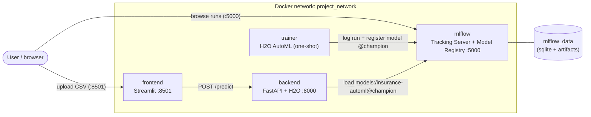
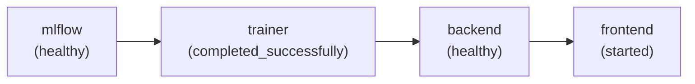
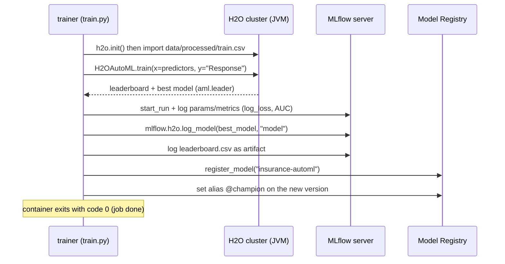
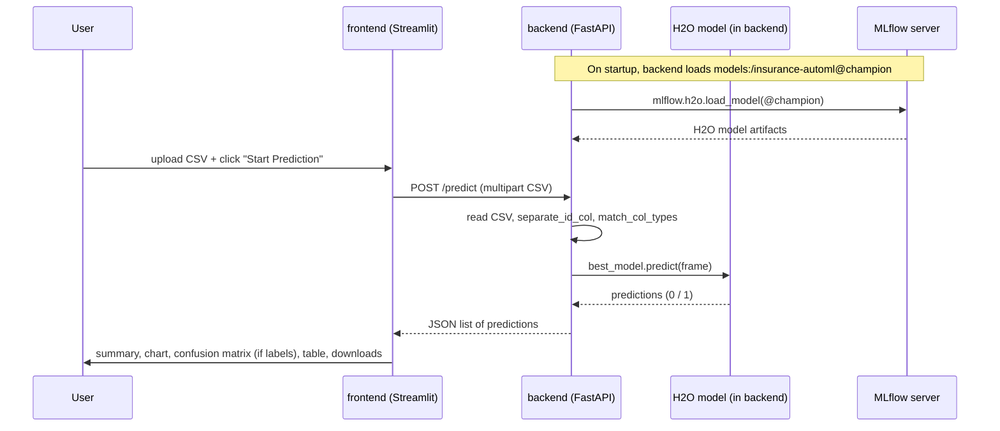
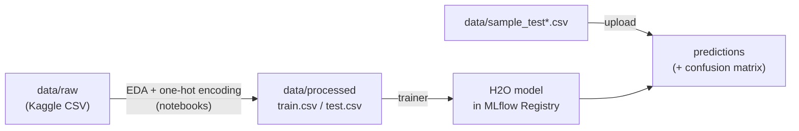

# End-to-End AutoML with H2O, MLflow, FastAPI, and Streamlit (Insurance Cross-Sell)

A complete, containerized MLOps pipeline that trains an H2O AutoML model, tracks and
registers it with an MLflow Tracking Server + Model Registry, serves it through a
FastAPI backend, and exposes a Streamlit UI for predictions. The whole stack starts
with a single `docker compose up --build`.

## Business context
Cross-selling in insurance means offering products that complement what a customer
already owns. This project predicts which health-insurance customers are likely to be
interested in additional vehicle insurance (Health Insurance Cross-Sell dataset), so
campaigns can be more targeted and efficient.

> Yes, this project uses **H2O AutoML**: training runs `H2OAutoML` in
> [`backend/train.py`](backend/train.py), and the backend loads/serves the resulting
> H2O model with `mlflow.h2o.load_model` in [`backend/main.py`](backend/main.py).

## Architecture

Four containers on one Docker network, orchestrated by `docker-compose.yml`:



- **mlflow** - MLflow Tracking Server + Model Registry (sqlite backend, artifacts served by the server, `--serve-artifacts`). UI on `:5000`, data persisted in the `mlflow_data` volume.
- **trainer** - Runs `train.py` once: trains H2O AutoML, logs the run/metrics, and registers the best model as `insurance-automl` with alias `@champion`.
- **backend** - FastAPI (`:8000`) that loads `models:/insurance-automl@champion` from MLflow and serves `/predict` (H2O runs inside this container).
- **frontend** - Streamlit UI (`:8501`) that posts an uploaded CSV to the backend and renders the results.

### Startup order (who waits for whom)

`depends_on` conditions in `docker-compose.yml` guarantee a correct boot sequence:



So `trainer` only starts once `mlflow` is healthy, `backend` only starts after
`trainer` exits successfully (model is registered), and `frontend` only starts once
`backend` is healthy. A single `docker compose up` brings the whole pipeline online.

## How it works (detailed)

### 1) Training pipeline (the `trainer` service)



Key points:
- The model is selected automatically by H2O AutoML (sorted by `logloss`), excluding GLM/DRF.
- For fast Docker Desktop runs, training is light by default (`AUTOML_MAX_MODELS=5`,
  `AUTOML_MAX_RUNTIME_SECS=120`, `AUTOML_SAMPLE_FRAC=0.2`); see the tuning table below.
- Nothing is hard-coded to a local `mlruns/` path anymore: everything goes through the
  MLflow server via `MLFLOW_TRACKING_URI=http://mlflow:5000`.

### 2) Prediction pipeline (the `backend` + `frontend` services)



### 3) Data flow



The model expects inputs in the **processed (one-hot encoded) format**. The provided
`sample_test.csv` (no target) and `sample_test_labeled.csv` (with `Response`) are
already in that format.

## Quickstart

Prerequisites: Docker Desktop with at least ~4-6 GB RAM allocated (H2O runs a JVM in
both the trainer and backend containers).

```bash
docker compose up --build
```

The first run trains the model, so it takes a few minutes. Once the `backend` service
is healthy:

- Streamlit UI: http://localhost:8501
- FastAPI docs: http://localhost:8000/docs
- MLflow UI:    http://localhost:5000

In the Streamlit UI, upload `backend/data/sample_test.csv` and click **Start Prediction**.

### Tuning the training
Training defaults are kept light for a fast Docker Desktop smoke test. Override them in
`docker-compose.yml` (the `trainer` service) for a full run:

| Variable                 | Default | Full run |
|--------------------------|---------|----------|
| `AUTOML_MAX_MODELS`      | `5`     | `10`     |
| `AUTOML_MAX_RUNTIME_SECS`| `120`   | `0` (no limit) |
| `AUTOML_SAMPLE_FRAC`     | `0.2`   | `1.0`    |

## Where is the data?
All data lives under `backend/data/`:
- `raw/health-insurance-cross-sell-prediction/` - original Kaggle dataset
- `processed/` - preprocessed (one-hot encoded) `train.csv`, `test.csv`, and `train_col_types.json`
- `sample_test.csv` - small ready-to-use sample (no target column) for the UI

Training uses `data/processed/train.csv`. Prediction inputs must be in the same
(one-hot encoded) format as the training data.

## Project layout
- `backend/`
  - `train.py` - H2O AutoML training + MLflow logging + model registration
  - `main.py` - FastAPI app that loads the `@champion` model and serves `/predict`
  - `utils/data_processing.py` - helpers (ID separation, column-type matching)
  - `data/` - raw + processed data and the sample test file
  - `Dockerfile`, `requirements-backend.txt`
- `frontend/`
  - `app.py` - Streamlit UI
  - `Dockerfile`, `requirements-frontend.txt`
- `notebooks/` - EDA, XGBoost baseline, and H2O AutoML exploration
- `docker-compose.yml` - the full stack

## Run components manually (without Docker)
```bash
# 1) Start MLflow
mlflow server --backend-store-uri sqlite:///mlflow.db --host 0.0.0.0 --port 5000

# 2) Train (from backend/)
export MLFLOW_TRACKING_URI=http://localhost:5000
python train.py --target Response

# 3) Serve (from backend/)
uvicorn main:app --host 0.0.0.0 --port 8000

# 4) UI (from frontend/)
export BACKEND_URL=http://localhost:8000/predict
streamlit run app.py
```

## Credits and source articles

This project is adapted and modernised from Kenneth Leung's excellent work. The original
design (H2O AutoML + MLflow + FastAPI + Streamlit for insurance cross-sell) and the
Dockerization approach are described in these two articles:

- [End-to-End AutoML Pipeline with H2O AutoML, MLflow, FastAPI, and Streamlit](https://towardsdatascience.com/end-to-end-automl-train-and-serve-with-h2o-mlflow-fastapi-and-streamlit-5d36eedfe606)
- [How to Dockerize Machine Learning Applications Built with H2O, MLflow, FastAPI, and Streamlit](https://towardsdatascience.com/how-to-dockerize-machine-learning-applications-built-with-h2o-mlflow-fastapi-and-streamlit-a56221035eb5/)
- Original repository: [kennethleungty/End-to-End-AutoML-Insurance](https://github.com/kennethleungty/End-to-End-AutoML-Insurance/)

What changed here vs. the original:
- A dedicated **MLflow Tracking Server + Model Registry** (instead of a committed local `mlruns/`).
- Automatic, self-contained training via a one-shot `trainer` service + `depends_on` conditions.
- Modernised dependencies (Python 3.11, MLflow 2.x, recent H2O/pandas/FastAPI/Streamlit).
- Backend loads the model by registry alias `models:/insurance-automl@champion`.
- Richer Streamlit UI: dataset description, plain-language summary, and a confusion matrix.

## References
- https://docs.h2o.ai/h2o/latest-stable/h2o-docs/automl.html
- https://mlflow.org/docs/latest/model-registry.html
- https://fastapi.tiangolo.com/
- https://docs.streamlit.io/
